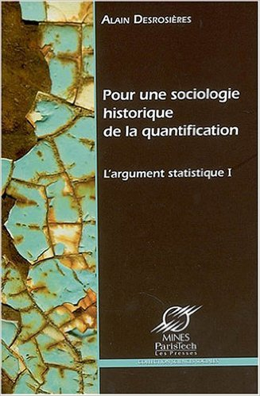
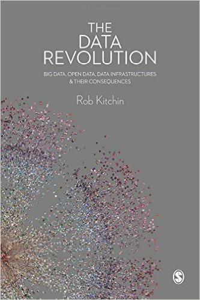
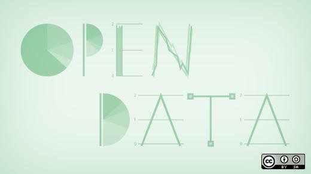
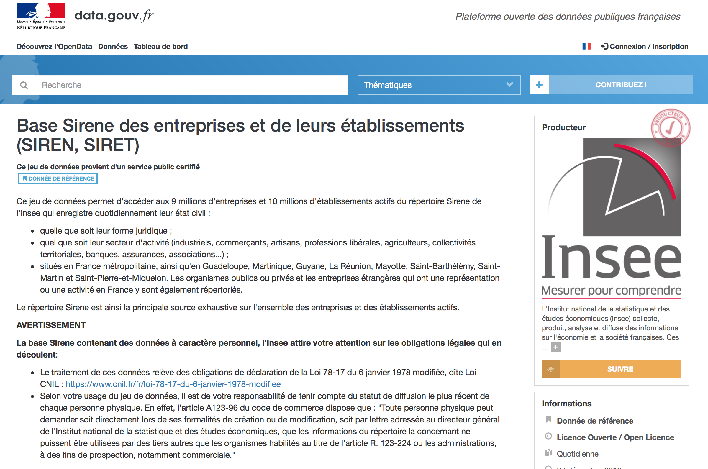
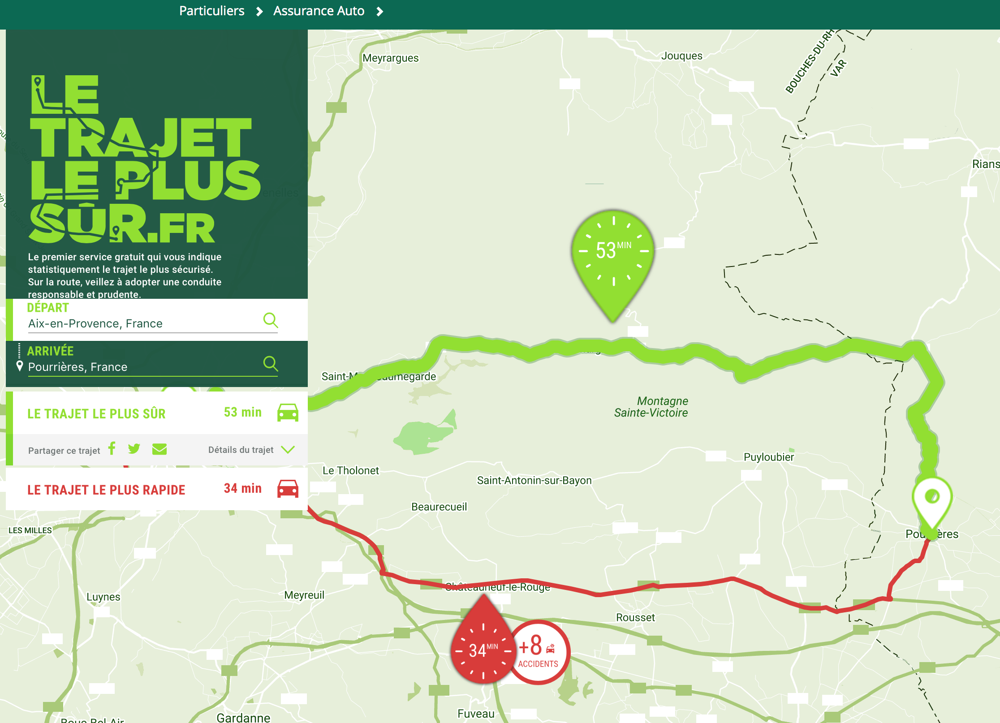
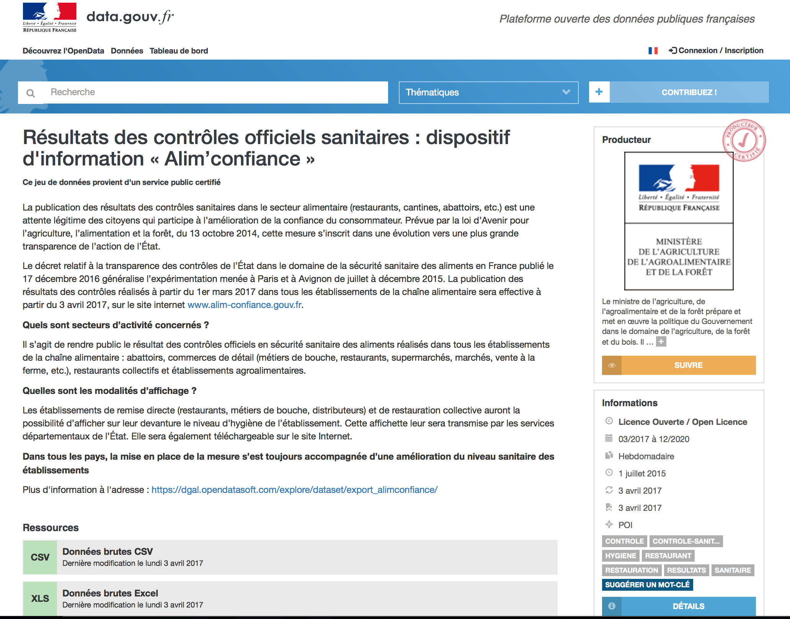

layout: true
  

`r paste0("
", params$event, " 

")` 

---

class: center, middle

Ces slides en ligne : `r paste0("http://datactivist.coop/", params$slug)`

Sources : `r paste0("https://github.com/datactivist/", params$slug)`

Les productions de Datactivist sont librement réutilisables selon les termes de la licence [Creative Commons 4.0 BY-SA](https://creativecommons.org/licenses/by-sa/4.0/legalcode.fr).

 
 

---
## Qui sommes-nous ?

    

### We .red[open data], we make them .red[useful]

---
## Qui sommes-nous ?

---
## Qui sommes nous ?

- Datactivist est un .red[**pure player de l’open data**] créé en 2016, par Samuel Goëta et Joël Gombin.

- Se positionnant sur .red[**toutes les étapes du travail d’ouverture des données**], Datactivist travaille tant avec les producteurs de données qu’avec les réutilisateurs et participe à l’appropriation des données par chacun.

- Nous appliquons nos propres .red[**valeurs**] : nous sommes une coopérative ; nos supports de formation et nos contenus sont librement réutilisables, publiés en licence Creative Commons.

- Une approche issue de la recherche : voir notamment **https://datactivist.coop/these**. 

- Nous animons la communauté [#TeamOpenData](https://teamopendata.org).

---
## Nos activités

- Conseil sur les .red[**stratégies d’ouverture de données**] : nous aidons les organisations dans la conception et la mise en œuvre de leur stratégie d’ouverture de données.

- .red[**Accompagnement dans la réutilisation de données ouvertes**] : nous aidons les organisations à utiliser les données au quotidien. 

- .red[**Sensibilisation et formation à la donnée**] : nous formons à la culture générale des données, nous enseignons les grands principes et bonnes pratiques de l'open data et nous introduisons à la data science. 

- .red[**Médiation de données**] : nous organisons des hackathons, des open data camps, des expéditions de données...

???

La médiation de données est aussi fondamentalement une animation de communauté(s). 

---
## Plan du cours

**Session 1** : culture des données. Data, big data, open data…

**Session 2** : culture des données. Des données aux contenus culturels

**Session 3** : les données de la culture - les modèles d’affaire 

**Session 4** : les données de la culture – sources et diffusion

**Session 5** : les données de la culture – les réutilisations

**Session 6** : les données de la culture – retours d’expérience de projets

---
class: inverse, center, middle

# .red[Culture des données]
## Data, big data, open data…

---
class:middle, center
## Echauffement :
### 5 minutes, 20 données

Vous avez 5 minutes

Vous devez trouver 20 données dans notre environnement immédiat

Pas de recours aux écrans !

.footnote[[source](http://infolabs.io/5-minutes-20-donnees)]

---
class:center,inverse, middle
# Qu'est-ce 
# qu'une donnée ?
---
class:center,inverse, middle
#D'après vous ?
---
# Le censeur à Rome, ancêtre de la statistique
.center[.reduite3[]]

.footnote[Source : *Asterix chez les pictes*, © Albert René 2013]
---
# Le censeur à Rome, ancêtre de la statistique
.center[.reduite3[]]

.footnote[*Asterix chez les pictes*, © Albert René 2013]
---
## La statistique : outil de gouvernement et de preuve
.pull-left[.middle[La statistique est à la fois :

  + **outil de gouvernement** (_Statistik_ - 18e siècle), et
  
  
  + **outil de preuve** (_statistics_ - 19e siècle)]]
.pull-right[.reduite2[]]
---
  
## [Quantifier, c'est convenir puis mesurer](http://www.pressesdesmines.com/media/extrait/PourSocioHistExtr.pdf)

.pull-left[
> Le verbe quantifier est employé ici dans un sens large : **exprimer et
faire exister sous une forme numérique ce qui, auparavant, était exprimé par
des mots et non par des nombres**.]

.pull-right[.reduite2[]]

---
## [Quantifier, c'est convenir puis mesurer](http://www.pressesdesmines.com/media/extrait/PourSocioHistExtr.pdf)

.center[.reduite3[]]

.footnote[*Asterix chez les pictes*, © Albert René 2013]

---
## Quantifier, c'est inscrire et figer une réalité sans cesse mouvante

.center[.reduite3[]]

.footnote[*Asterix chez les pictes*, © Albert René 2013]

---
## Etymologie

### Latin : _dare_ (donner) > _datum_ (donné) > _data_ (donnés)
  
Ce qui est évident, va de soi, est accepté sans discussion

  

> From its first vernacular formulation, the existence of a datum has been independent of any
consideration of corresponding ontological truth. When a fact is proven false, it ceases
to be a fact. False data is data nonetheless.

.footnote[[Rosenberg, 2013](https://mitpress.mit.edu/books/raw-data-oxymoron)]

---
## Usage de "data"

Le sens moderne apparaît à la fin du 18e siècle. 

Renvoie à des expériences, des collectes d'éléments.

---
# "Datafication" : la mise en données du monde
> “L'immense gisement de données numériques découle de la capacité à paramétrer des aspects du monde et de la vie humaine qui n'avaient encore jamais été quantifiés. On peut qualifier ce processus de **« mise en données » (datafication)**. 

> […] “La mise en données désigne autre chose que la numérisation, laquelle consiste à traduire un contenu analogique - texte, film, photographie - en une séquence de 1 et de 0 lisible par un ordinateur. Elle se réfère à une action bien plus vaste, et aux implications encore insoupçonnées : **numériser non plus des documents, mais tous les aspects de la vie**.”

.footnote[[Kenneth Cukier, “Mise en données du monde, le déluge numérique”](https://www.monde-diplomatique.fr/2013/07/CUKIER/49318)]

---

## La "nombrification" du monde

.pull-left[.reduite[]]
.pull-right[
> La numérisation ne serait pas survenue sans une "nombrification" préalable qui consiste à quantifier de plus en plus d'aspects de notre expérience du réel.
> **Au commencement était le verbe, il semble à la fin que tout devient nombre.**
> Personne ne saurait parler sérieusement de l'état de la société et discuter politique sans se référer aux informations quantitatives.]

---
# Le nouveau positivisme des données
> *If you asked me to describe the rising philosophy of the day, I’d say it is **data-ism**. 
We now have the ability to gather huge amounts of data. 
This ability seems to carry with it certain cultural assumptions — that everything that can be measured should be measured; that data is a transparent and reliable lens that allows us to filter out emotionalism and ideology; that data will help us do remarkable things — like foretell the future.*

Jeff Brookes, éditorialiste du New York Times

---

## Aux sources de la mise en données du monde
.pull-left[
- Rencontre, dans la Californie des années 1960, entre la Nouvelle Gauche et les Nouveaux Communalistes sur fond de LSD et de recherche militaire

- L'inspiration de la cybernétique (N. Wiener) : objets techniques et êtres humains constituent un même système sociotechhnique, régulé par l'information

- Exemple de Steward Brand, fondateur du _Whole Earth Catalog_ puis de Wired => ["Forest Gump de l'Internet"](https://questionsdecommunication.revues.org/8619)]
.pull-right[
.reduite2[]]

---

## "Raw data" is an oxymoron

.pull-left[
> Data are always already “cooked” and never entirely “raw.”

> Data need to be imagined _as_ data to exist and function as such, and the imagination of data entails an interpretive base.]
.pull-right[
]

.footnote[[Source](https://mitpress.mit.edu/books/raw-data-oxymoron)]
---
class:inverse, middle, center
# Vers une définition des données
---

## La pyramide Data-Information-Knowledge-Wisdom
.pull-left[

]

.pull-right[Attribuée à [Russell Ackoff](http://en.wikipedia.org/wiki/Russell_L._Ackoff), 1989

Les données peuvent être des :

- faits
- signal/stimulis
- symboles]

---

# Vers une définition

.pull-left[.reduite3[

⏺ enregistrabilité +🏗 briques de base ("*buildings blocks*")]]
.pull-right[
> *Data are commonly understood to be the raw material produced by **abstracting the world** into categories, measures and other representational forms – numbers, characters, symbols, images,sounds, electromagnetic waves, bits – that constitute the **building blocks** from which information and knowledge are created.*]

---

# Data or capta ?

> Technically, then, what we understand as data are actually **capta** (derived from the Latin capere, meaning ‘to take’); those units of data that have been selected and harvested from the sum of all potential data.

[Kitchin, 2014](https://books.google.fr/books?hl=fr&lr=&id=GfOICwAAQBAJ&oi=fnd&pg=PP1&dq=kitchin+data+revolution&ots=pcyfMTZh-V&sig=dQyPTL3AIN_4RdWvtBFw4VjdAa4#v=onepage&q=kitchin%20data%20revolution&f=false)

---

# Données ou obtenues ? 

> Décidément, on ne devrait jamais parler de “données”, mais toujours d’ “obtenues”.

[Bruno Latour, 1993](http://www.bruno-latour.fr/fr/node/255)

---

class:center, middle, inverse
# Données, données... quelles données ?

---

## Données quantitatives
.pull-left[
Différents types de variables : 
- nominale : des catégories que l’on nomme avec un nom (marié/célibataire/divorcé/veuf)

- ordinale : échelle de mesure dotant chaque élément d'une valeur qui permet leur classement par ordre de grandeur (faible, moyen, fort)

- intervalles : l’intervalle entre deux catégories àatoujours la même valeur (12-16°C / 16-20°C / 20-24°C) 
]
.pull-right[

]

---

## Données qualitatives

.pull-left[
Non numérique => texte, image, vidéo, son, musique...

  + peut être convertie en données quantitatives

  + risque de perdre la richesse des données originales
  
  + analyse qualitative de données
  
]
.pull-right[

]

---
## Exemple : les annotations en text mining

.reduite[]

---

## Données structurées

.pull-left[
Des données dotées d'un modèle qui définit les relations entre les composantes de la base de données

  + Ex : base de données relationnelle SQL
  
  + Lisibles machine
  
  + Faciles à analyser, manipuler, visualiser...
]
.pull-right[

]

---

## Données semi-structurées

.pull-left[
Pas de modèle prédéfini : structure irrégulière, implicite... mais données organisées néanmoins, ensemble raisonnable de champs

Exemple : XML, JSON

Possible de trier, ordonner et structurer les données
]
.pull-right[

]

---

## Données non structurées

.pull-left[Pas de structure commune identifiable
Exemple : BDD NoSQL

Généralement qualitatives

Difficilement combinées ou analysées quantitativement

Les données non structurées croitraient 15x plus que les données structurées
 
Machine learning de + en + capable d'analyser ces données.]

.pull-right[

]

---

## Données capturées, échappées, transitoires 

** Données capturées**

Observation, enquête, expérimentation, prise de notes, senseurs... => intention de générer des données

** Données échappées**

Sous-produit d'un engin ou d'un système dont la fonction première est autre

** Données transitoires**

Echappées qui ne sont jamais examinées, transformées ou analysées

---
## Données dérivées

Résultat d'un traitement ou une analyse supplémentaire de données capturées. 

Exemple avec les [données de Google Maps](https://www.justinobeirne.com/google-maps-moat) : 

---

## Données dérivées

.reduite2[]

---

##Index, attributs, métadonnées

**Index**

Des données permettent l'identification et la mise en relation. Essentielles pour enrichir les données. Exemple : SIRET. 

**Attributs**

Des données représentent les aspects d'un phénomène, mais ne sont pas des index (pas identifiants uniques).

**Métadonnées**

Des données sur les données. Peuvent être descriptives, structurelles ou administratives. Exemple de standard : le [Dublin Core](https://fr.wikipedia.org/wiki/Dublin_Core). 

---

## Les données crowdsourcées

.pull-left[Des données produites par des citoyens, des communs partagés et gouvernés par leurs producteurs

Exemple : OpenStreetMap, le wiki de la carte]

.pull-right[
.reduite[]
]

---
class:inverse, middle, center
# De l'open data au big data

---
## Open data : quelques jalons historiques

---

## 07 Décembre 2007 : la rencontre de Sebastopol 

.pull-left[
👥 **Quoi ?** Une rencontre de l'Open Governement Group à Sebastopol (Californie), siège des éditions O'Reilly

🎯 **Pourquoi ?** : Influencer le futur président des Etats Unis pour faire avancer l'open data

📜 **Comment ?** En adoptant une déclaration définissant les grands principes de l'Open Government Data 

]
.pull-right[

]

---
class:middle, center

# Revue des principes

---
class: middle, center

# 1. Des données complètes
### Toutes les données publiques doivent être rendues disponibles dans les limites légales liées à la vie privée ou la sécurité
---
class: center, middle

# BY DEFAULT
---
class: middle, center

# 2. Des données primaires
###  Les données ouvertes sont telles que collectées à la source, non-agrégées avec le plus haut niveau de granularité

---
class: middle, center

# 3. Des données fraiches (*timely*)
### Les données doivent être disponibles dès qu'elles sont produites

---
class: middle, center

# 4. Des données accessibles 
### Les données doivent être utilisables par le plus grand nombre d’usagers potentiels

---
class: middle, center

# 5. Des données exploitables par les machines 
###  Les données peuvent être traitées automatiquement par les machines

---
class: middle, center

# 6.Des données non discriminatoires 
### Elles peuvent être utilisées par tous sans réclamer un enregistrement préalable
---
class: middle, center

# 7. Des données dans un format ouvert
### Ce format ne doit pas être la propriété d'une organisation en particulier (.xls) et doit être gouvernée par ses usagers

---
class: middle, center

# 8. Des données dans une licence ouverte
### Idéalement dans le domaine public sinon dans une licence conforme à l'[Open Definition](www.opendefinition.org) : Licence Ouverte (CC-BY) ou ODBL (CC-BY-SA)

---

## Défi 1 : la découvrabilité des données

.pull-left[
> Data findability is a major challenge. We have data portals and registries, but government agencies under one national government still publish data in different ways and different locations.(…)
**Data findability is a prerequisite for open data to fulfill its potential and currently most data is very hard to find.** 
]

.pull-right[

.footnote[https://index.okfn.org/insights/]
]

---
class:middle, center
 

---

## Défi 2 : le problème de la qualité

.pull-left[
>**Government data is usually incomplete, out of date, of low quality, and fragmented.** In most cases, open data catalogues or portals are manually fed as the result of informal data management approaches. **Procedures, timelines, and responsibilities are frequently unclear among government institutions tasked with this work.**

]
.pull-right[

.footnote[http://opendatabarometer.org/4thedition/report/]
]

---
## Exemple de données ouvertes: la base SIRENE

.center[.reduite2[]]

---

## La base SIRENE : exemple de cas d'utilisation

.reduite[.center[]]
---
##Exemple de données ouvertes : la base adresses
.reduite[.center[]]

---
##Exemple de données ouvertes : les accidents de la route
.reduite[.center[]]

---

## Les accidents de la route
.reduite2[.center[]]
.footnote[Plus d'accidents sur l'A8 mais surtout plus de véhicules…]

---

## Les accidents de la route

.reduite2[.center[]]
.footnote[[Carte par Joël Gombin dans Marsactu](https://joelgombin.github.io/marsactu_accidents/chronique.html)]

---

## Exemple de données ouvertes : les inspections des restaurants

.reduite2[.center[]]
.footnote[[Résultats des contrôles officiels sanitaires : dispositif d'information « Alim’confiance »](https://www.data.gouv.fr/fr/datasets/resultats-des-controles-officiels-sanitaires-dispositif-dinformation-alimconfiance/)]

---

## Les inspections des restaurants

.reduite2[.center[]]
.footnote[[26 établissements au niveau d'hygiène à corriger de manière urgent ](https://dgal.opendatasoft.com/explore/embed/dataset/export_alimconfiance/map/?disjunctive.app_libelle_activite_etablissement&disjunctive.filtre&refine.synthese_eval_sanit=A%20corriger%20de%20mani%C3%A8re%20urgente&location=6,47.24195,5.00977&static=false&datasetcard=true)]

---

## Big data

---

## L'obsession du volume de données

.pull-left[
**Quelques chiffres omniprésents** : 
- le volume de données produit double tous les 3 ans (Gantz & Reisel 2011)
- 90% des données créées dans les deux dernières années (IBM 2012)
- 40% : croissance annuelle de la production de données (Maniyka et al. 2011) 
]
.pull-right[
**Problèmes de cette approche** : 
- Estimations guidées par des intérêts commerciaux
- Ne définit pas ce que sont ces données
- Résume le big data au Volume
-Explique mal la mise en données du monde

]

---

## Les promesses du big data

Kitchin (2014) résume les promesses du big data : 
- **“Governing people”** : dans la continuité de la statistique, améliorer la connaissance de l’administration et prédire les crimes

- **“Managing organisations”** : améliorer le fonctionnement de toutes les composantes de l’organisation par l’exploitation des données

- **“Leveraging value and producing capital”** : micro-ciblage marketing, optimisation des magasins et des opérations, efficience de la chaine

- **“Creating Better places”** : gouverner les villes avec des données (smart city) 

- **Un nouveau paradigme scientifique** : une nouvelle ère guidée par les corrélations

---

## Linked data

.pull-left[
- poussé par le W3C et Tim Berners-Lee

- sémantique / web des données
- RDF / SPARQL
- wikidata => http://projetjourdain.org/network/index.html]

.pull-right[

---
class: middle

---

## API

.pull-left[
- Application programming interface => un programme vu de la surface

- les machines parlent aux machines

- donnée dynamique => ouverture potentiellement limitée et contrôlée 

- un exemple : [overpass turbo](https://overpass-turbo.eu/)]
.pull-right[

]
---
class:inverse, middle, center
# Cadre juridique et protection de la vie privée

### Focus sur le RGPD

---

## Répondre à la faiblesse du cadre juridique antérieur

.center.reduite2[

]

---

## Le RGPD ? 

**Règlement Général de Protection des Données** : adopté à la mi-avril 2016 après 4 années de débat, entré en vigueur le 25 mai 2018, il renforce considérablement le droit européen de protection des données personelles.

3 objectifs : 
- Renforcer les droits des personnes

- Responsabiliser les acteurs traitant des données personnelles

- Crédibiliser la régulation

Le RGPD propose un **cadre unifié pour l'ensemble de l'UE** qui s'applique à chaque fois qu'un résident européen est visé par un traitement de données personnelles. 

---

## Renforcer les droits des personnes

.pull-left[

**Droit à la portabilité des données** : Droit de recevoir ses données "dans un format structuré, couramment utilisé et lisible par machine" et de les transmettre à un autre service si possible de matière automatisée.]
.pull-right[

**Transparence et consentement explicite** : plus de lisibilité sur ce qui est fait de mes données (preuve de consentement explicite dans des termes clairs) et j’exerce mes droits plus facilement (droit d’accès, droit de rectification, droit à l'oubli).
]

---

## Exemple de demande de consentement explicite

.center.reduite2[

]

---

## Renforcer les droits des personnes

.pull-left[

**Protection des mineurs** : Les services en ligne doivent obtenir le consentement des parents des mineurs de moins de 16 ans avant leur inscription.

]
.pull-right[

**Guichet unique** : En cas de problème, je m’adresse à l’autorité de protection des données de mon pays, quelque soit le lieu d’implantation de l’entreprise qui traite mes données.
]
.footnote[Source : [CNIL](https://www.cnil.fr/fr/plus-de-droits-pour-vos-donnees)]

---

## Renforcer les droits des personnes

.pull-left[

**Sanctions renforcées** : En cas de violation de mes droits, l’entreprise responsable encourt une sanction pouvant s’élever à 4% de son chiffre d’affaires mondial.

]
.pull-right[

**Droit à l'oubli** : Je peux demander à ce qu’un lien soit déréférencé d’un moteur de recherche ou qu’une information soit supprimée s’ils portent atteinte à ma vie privée.
]
.footnote[Source : [CNIL](https://www.cnil.fr/fr/plus-de-droits-pour-vos-donnees)]

---

## Responsabiliser les acteurs

.pull-left[
- **Privacy by design** : protection des données personnelles dès la conception du produit et par défaut
- **Minimisation** : limiter la quantité de données personnelles dès le départ
- **Accountability** : mettre en place des mesures de protection des données et démontrer cette conformité à tout moment
- Fin des obligations déclaratives sauf si risque accru pour la vie privée
]
.pull-right[

]

---

## Les 6 étapes de la mise en conformité

.pull-left[

ℹ DPO obligatoire uniquement pour secteur public et entreprises dont le traitement de données sensibles à grande échelle est une activité principale. 
]

.pull-right[
1. **Désigner un pilote** : Délégué à la Protection des Données (Data Protection Officer) exerce une mission d’information, de conseil et de contrôle en interne. 
2. **Cartographier** : élaboration d'un registre des traitements des données personelles
3. **Prioriser** : sur la base du registre, identifiez les actions à mener en priorité pour se conformer aux obligations actuelles et à venir. 
]

---

## Les 6 étapes de la mise en conformité

.pull-left[
4.**Gérer les risques** : Si identification de risques élevés, mener pour chaque traitement concerné une analyse d'impact sur la protection des données (PIA). 

5.**S'organiser** : mise en place de procédures pour l’ensemble des événements qui peuvent survenir au cours de la vie d’un traitement (ex : faille de sécurité, demande de rectification, changement de prestataire…)

6.**Documenter** :  prouver votre conformité au règlement, constituer et regrouper la documentation nécessaire qui doit être réexaminée régulièrement.  
]

.pull-right[

]

---

## Crédibiliser la régulation

⚖️ Les autorités de protection peuvent notamment : limiter temporairement ou définitivement un traitement, suspendre les flux de données, ordonner la rectification, la limitation ou l'effacement des données…

🔫 Amendes : jusqu'à 10 ou 20 millions d’euros, ou, dans le cas d’une entreprise, de **2% jusqu’à 4% du  chiffre d'affaires annuel mondial**, le montant le plus élevé étant retenu.

🇪🇺
Sanction sera **conjointement adoptée entre l’ensemble des autorités concernées**, donc potentiellement pour le territoire de toute l’Union européenne.

---

class:inverse, middle, center

# Modèles économiques 

---

## Les 3 facettes de la valeur des données

.pull-left[
- La donnée comme **matière première** : revendue par celui qui la collecte ou l’agrège.

- la donnée comme **levier** : utilisée sans marchandisation, par exemple pour réduire les coûts ou développer les revenus .

- la donnée comme **actif stratégique** : une arme pour prendre pied sur un marché, ou défendre son positionnement].

.pull-right[.reduite2[]]

---

## Les data brokers : la vie privée comme matière première

- 👻 Des entreprises inconnues du grand public : **Acxiom, Epsilon, Experian**.

- 💰 Un marché estimé par le Congrès américain à 156 milliards de dollars en 2012.

- 🕵 "Data brokers are worse than the NSA" (Sénateur Rockefeller) : aucune transparence ni véritable régulation aux US.

- 🔍 En moyenne, 200 points de données sur chaque individu aux Etats Unis. Plus de 50 000 sources. 

- 🚰 Sources : données publiques (permis de construire, registres des naissances, casiers judiciaires…), cookies, données d'achat, cartes de fidélité, données téléphoniques, recherches en ligne…

---

## Une dépossession de la vie privée

.pull-left[
> *Data brokers take public and private information, aggregate it into products and monetize it. *[…]
> *Through the combination of data possession and innovation, data brokers **claim ownership of our data.**"*
]
.pull-right[
[.reduite2[]](https://books.google.fr/books/about/Healthcare_and_Big_Data.html?id=yOwmDQAAQBAJ&redir_esc=y)
]

---

## La donnée comme levier

.pull-left[- Utiliser les données **pour son propre compte** sans monétisation directe auprès d'un tiers

- Données : leviers pour mieux allouer ressources ou développer le résultat

- Possibilité de compléter ou développer le modèle d'affaires] 
.pull-right[

]

---

## La donnée comme actif stratégique

.pull-left[
Utiliser des données pour soutenir un modèle économique, acquérir ou défendre une position au sein d'un écosystème
]
.pull-right[

]

---

## Pour le prochain cours

Identifiez trois exemples illustrant la manière dont la révolution des données a bouleversé le secteur de la culture, et essayez de documenter et analyser ces exemples.

---
class: inverse, center, middle

# Merci !

Contact : [joel@datactivist.coop](mailto:joel@datactivist.coop)

---
class: inverse, center, middle

# Données de la culture : études de cas

---
class: center, middle

# Netflix : de la distribution à la production de contenus

---
## Brève histoire de Netflix

- création en 1997-1998, par Marc Randolph et Reed Hastings (déjà devenus millionnaire grâce à de précédentes entreprises)
- service initial : location de DVD par correspondance avec réservation en ligne
- modèle d'abonnement mensuel à partir de septembre 1999
- 2000 : 300k abonnés, Netflix perd de l'argent
- 2003 : pour la première fois Netflix est rentable
- 2005 : catalogue de 35k films différents, 1 million de DVD envoyés par jour (!)
- 2006 : Netflix offre 1M$ de récompense pour améliorer son algorithme de recommandation 
- 2007 : Netflix lance un service de visionnage de films en streaming (YT lancé en 2005)
- 2011-2013 : Netflix commence à produire des contenus propres. 1ère série produite : *House of Cards*
- 2018 : 137 millions de clients dans le monde

---
## Brève histoire de Netflix

Capitalisation de Netflix (24/10/2018) : 134 Mds de $
Walt Disney Co : 167 Mds de $
21st Century Fox : 83 Mds de $

En 2018, Netflix aura dépensé de 12 à 13 Mds de $ pour acheter des contenus, dont 85 % originaux (~82 films).

Soit... plus que n'importe quel studio hollywoodien (Warner Bros : 23 films). 

---

## Comment Netflix optimise la qualité du service

.pull-left[
- l'un des secrets du succès dans la nouvelle économie culturelle : une expérience utilisateur impeccable
- le choix, assez tôt, de se reposer sur AWS plutôt que sur des infrastructures propres
- Très grande stabilité : pour accroître l'infra, il suffit de payer plus. 
- Coût marginal plutôt que fixe.
- Tout est répliqué trois fois : redondance = sécurité
]

.pull-right[

[Source](https://www.macg.co/ailleurs/2018/03/que-se-passe-t-il-quand-vous-appuyez-sur-lecture-dans-netflix-101639)
]

---

## Comment Netflix optimise la qualité du service

- Gros travail sur l'architecture technique : "Netflix peut mobiliser jusqu’à 300.000 processeurs en même temps pour transcoder une vidéo"

- Localiser les données à servir au plus près des utilisateurs : chez les FAI

- Au final, Netflix échange de la puissance de calcul (meilleur transcodage des vidéos) contre moins de bande passante 

- Absolument tout ce qui se passe côté utilisateur est loggé, stocké et utilisé pour personnaliser au maximum l'expérience.

- Bien sûr, Netflix utilise des algorithmes de recommandation pour proposer de nouveaux contenus. Mais ce n'est que la partie émergée de l'iceberg... "Tout est recommandation".

---

## Comment Netflix optimise la qualité du service

---

## Comment Netflix optimise la qualité du service

---

## Comment Netflix optimise la qualité du service

> To properly learn how to personalize artwork we need to collect *a lot* of data to find signals that indicate when one piece of artwork is significantly better for a member.

[Source](https://medium.com/netflix-techblog/artwork-personalization-c589f074ad76)

---

## Comment Netflix optimise la qualité du service

---

## Comment Netflix optimise la qualité du service

[Source](https://medium.com/netflix-techblog/learning-a-personalized-homepage-aa8ec670359a)

---

## Comment Netflix optimise la qualité du service

L'algorithme de recommandation repose, notamment, sur :

- des notations par les membres (plusieurs milliards)
- la popularité des contenus (évaluée de multiples manières)
- la lecture des vidéos (durée, heure, matériel...)
- listes d'attente
- métadonnées (acteurs, r&alisateur, genre...)
- présentation et interactions avec la présentation
- données sociales (amis)
- termes de recherche
- données externes
- autres

Des tests en permanence (offline et online) ! 

---

## Comment Netflix optimise la qualité du service

[Source](https://medium.com/netflix-techblog/netflix-recommendations-beyond-the-5-stars-part-2-d9b96aa399f5)

---
## Comment Netflix optimise les choix de production

Dans une industrie historiquement influencée par l'intuition, Netflix revendique de faire du "Data-driven Programming". 

=> La position de distributeur donne ainsi un avantage concurrentiel unique à Netflix *en tant que producteur*. 

Netflix à Kevin Spacey : 

>  “We believe in you. We’ve run our data and it tells us that our audience would watch this series. We don’t need you to do a pilot. How many do you wanna do?” (voir [cet article](https://www.nytimes.com/2013/02/25/business/media/for-house-of-cards-using-big-data-to-guarantee-its-popularity.html?pagewanted=all&_r=1&))

Même si le facteur humain reste significatif, [même chez Netflix](https://www.newyorker.com/business/currency/hollywoods-big-data-big-deal?intcid=mod-most-popular).

---
## Comment Netflix change en profondeur l'industrie cinéma et audiovisuelle

- Amazon par exemple se lance dans la même logique que Netflix (distributeurs devenus producteurs)

- les producteurs et distributeurs historiques veulent concurrencer Netflix sur son terrain (voir Hulu aux USA, Freeview au Royaume-Uni ou [Salto, le "Netflix à la française"](https://teleobs.nouvelobs.com/actualites/20180615.OBS8209/salto-le-netflix-a-la-francaise.html))

- Des films produits par Netflix sortent désormais en salle, dans le circuit traditionnel

---
## Comment Netflix change en profondeur l'industrie cinéma et audiovisuelle

- Le poids de Netflix a une influence significative d'un point de vue artisitique : souvent le dernier recours des réalisateurs face à des producteurs frileux, mais aussi une prise de risque artistique moindre ?

<blockquote class="twitter-tweet" data-lang="fr">
i can&#39;t stop thinking about this quote from Cary Fukanaga&#39;s GQ profile, where he reveals the netflix algorithm caused him to can an episode. it kind of sounds like the data suggested it was too complex and would alienate audiences. <a href="https://t.co/99Sjk6xtYj">pic.twitter.com/99Sjk6xtYj</a>
&mdash; Cynthia Gothrock (@quantum_scumbag) <a href="https://twitter.com/quantum_scumbag/status/1044440839089340416?ref_src=twsrc%5Etfw">25 septembre 2018</a></blockquote>

---
## Si on résume...

Pour une réussite comme Netflix, il faut (notamment !) :

- beaucoup de capital (Netflix a mis huit ans à gagner de l'argent)
- pas mal d'infrastructure technique (mais externalisée chez Amazon)
- beaucoup, beaucoup de données
- l'audace stratégique de changer de métier (distributeur => producteur)

---
class: inverse, center, middle

# Mais encore...

---
## Au musée 

Analyse de http://www.club-innovation-culture.fr/expo-met-inout-oeuvres-new-york-reseau-mediatheques-agglomeration-herault/

http://www.culture.gouv.fr/Thematiques/Musees/Nos-actions/Colloques-Journees-d-etudes/Journee-professionnelle-La-strategie-numerique-dans-les-musees?fbclid=IwAR3YE2i0CXpVqHUekF9eKO8TzbmPZJPUvd2lMi7Q6jqyN2jVY3QNCVZGB3I

https://www.lemonde.fr/idees/article/2018/06/23/open-acess-les-musees-francais-a-la-traine_5320170_3232.html

---
## Dans la musique

https://medium.com/s/story/spotifys-discover-weekly-how-machine-learning-finds-your-new-music-19a41ab76efe

