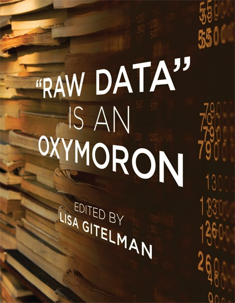

layout: true
  

`r paste0("
", params$event, " 

")` 

---

class: center, middle

Ces slides en ligne : http://datactivist.coop/SPoSGL/

Sources : https://github.com/datactivist/SPoSGL/

Les productions de Datactivist sont librement réutilisables selon les termes de la licence [Creative Commons 4.0 BY-SA](https://creativecommons.org/licenses/by-sa/4.0/legalcode.fr).

 
 

.center[] 

---
## Plan du cours

.center[*Podcast introductif section 2, par Timothée Gidoin*]

#### .red[1- La nombrification du monde]

Ressource complémentaire : lire xxx / écouter xxx / regarder xxx

#### .red[2- Les données "brutes", un oxymore ?]

Ressource complémentaire : lire xxx / écouter xxx / regarder xxx

#### .red[3- L'absence de données : compter pour être pris en compte]

Ressource complémentaire : lire xxx / écouter xxx / regarder xxx

**Bibliographie**

.center[*Quizz*]
---
## Introduction 

#### Ecoutez le .red[podcast introductif] de la section 2 

.center[]

---
class: inverse, center, middle

## 1. La nombrification du monde

---
Class: middle

## La mise en données du monde
> “L'immense gisement de données numériques découle de la capacité à paramétrer des aspects du monde et de la vie humaine qui n'avaient encore jamais été quantifiés. On peut qualifier ce processus de **« mise en données » (datafication)**. 
 
> […] “La mise en données désigne autre chose que la numérisation, laquelle consiste à traduire un contenu analogique - texte, film, photographie - en une séquence de 1 et de 0 lisible par un ordinateur. Elle se réfère à une action bien plus vaste, et aux implications encore insoupçonnées : **numériser non plus des documents, mais tous les aspects de la vie**.”

.footnote[[Kenneth Cukier, “Mise en données du monde, le déluge numérique”](https://www.monde-diplomatique.fr/2013/07/CUKIER/49318)]

---
Class: middle, center

## La mise en données du monde

- Concrètement, aujourd'hui, quels aspects de votre vie sont mis en données ?

- Recherches internet, pratiques sportives, consommation énergie, régime alimentaire, trajets dans les transports en commun...

- Cette mise en donnée est rendue possible par le développement de .red[**capteurs**] qui viennent collecter et agréger ces données 

- Recherches internet .red[(cookies)], pratiques sportives .red[(montres connectées], consommation énergie .red[(compteurs connectés)], régime alimentaire .red[(appli type Yuka)], trajets dans les transports en commun .red[(Pass Navigo)]...

- La question devient peut-être, *quels aspects de votre vie ne sont pas (encore) mis en données ?*

---

## La "nombrification" du monde

.pull-left[.reduite[]]
.pull-right[
> La numérisation ne serait pas survenue sans une "nombrification" préalable qui consiste à quantifier de plus en plus d'aspects de notre expérience du réel.
> **Au commencement était le verbe, il semble à la fin que tout devient nombre.**
> Personne ne saurait parler sérieusement de l'état de la société et discuter politique sans se référer aux informations quantitatives.]

---
## Le nouveau positivisme des données

> If you asked me to describe the rising philosophy of the day, I’d say it is **data-ism**. We now have the ability to gather huge amounts of data.This ability seems to carry with it certain cultural assumptions — **that everything that can be measured should be measured; that data is a transparent and reliable lens that allows us to filter out emotionalism and ideology**; that data will help us do remarkable things — like foretell the future.

David Brooks, éditorialiste du New York Times, ["The Philosophy of Data"](https://www.nytimes.com/2013/02/05/opinion/brooks-the-philosophy-of-data.html)

.center[]
---
## Le nouveau positivisme des données

- Attention, les données, même provenant de sources officielles, ne sont pour autant neutres, irréprochables ou porteuses de "LA" vérité (voir section 5, partie 3 "**Les limites inhérentes aux données et aux indicateurs**" )

.center[] 

---
class: middle

## Aux sources de la mise en données du monde
.pull-left[
- Rencontre, dans la Californie des années 1960, entre la Nouvelle Gauche et les Nouveaux Communalistes sur fond de LSD et de recherche militaire

- L'inspiration de la cybernétique (N. Wiener) : objets techniques et êtres humains constituent un même système sociotechhnique, régulé par l'information

- Exemple de Steward Brand, fondateur du _Whole Earth Catalog_ puis de Wired => ["Forest Gump de l'Internet"](https://questionsdecommunication.revues.org/8619)]

.pull-right[
.reduite2[]]
 
 
 
---
class: inverse, center, middle

## 2. Les données "brutes", un oxymore ?

---
Class:

## "Raw data" is an oxymoron

.pull-left[
> Data are always already “cooked” and never entirely “raw.”

> Data need to be imagined _as_ data to exist and function as such, and the imagination of data entails an interpretive base.]

.pull-right[
]

.footnote[[Source](https://mitpress.mit.edu/books/raw-data-oxymoron)]

---
Class:

## Les données brutes sont un oxymore

.pull-left[
> Les données sont toujours "cuisinées" et jamais tout à fait "brutes"

> Les données ont besoin au préalable d'être imaginées comme données pour exister et fonctionner comme telles. L'imagination de ces données implique une base d'interprétation

]
.pull-right[
]

---
Class:
## La pyramide Data-Information-Knowledge-Wisdom

.pull-left[

]

.pull-right[Attribuée à [Russell Ackoff](http://en.wikipedia.org/wiki/Russell_L._Ackoff), 1989

Les données peuvent être des :

- faits
- signal/stimulis
- symboles]

---
Class:
## La pyramide Data-Information-Knowledge-Wisdom

- Les **.red[données]** sont la matière "brute" d'où naît l'information.

- **.red[L'information]** pourrait être définie comme des données qui ont été consignées,
classées, organisées, raccordées ou interprétées dans un cadre qui en dégage le sens

- En donnant du sens à de l'information, on obtient de la **.red[connaissance]**

- En donnant du sens à la **.red[connaissance]** on obtient du savoir

---
Class:
## La pyramide Data-Information-Knowledge-Wisdom

.center[]

_NB : le haut de la pyramide, est parfois remplacé par "compétence"_

---
Classe:
## Vers une définition des données

.pull-left.reduite2[
]

.pull-right[
> *Data are commonly understood to be the raw material produced by **abstracting the world** into categories, measures and other representational forms – numbers, characters, symbols, images,sounds, electromagnetic waves, bits – that constitute the **building blocks** from which information and knowledge are created.*

⏺ enregistrabilité

🏗> briques de base ("*buildings blocks*")]

---

## Data or capta ?

> *Technically, then, what we understand as data are actually **capta** (derived from the Latin capere, meaning ‘to take’); those units of data that have been selected and harvested from the sum of all potential data.*

> Techniquement, ce que nous nous appelons "donnée" est généralement "capturé" (issu du latin "capere", signifiant "prendre"); ces unités de données qui ont été sélectionnées et collectées parmi l'ensemble de toutes les données possibles

[Kitchin, 2014](https://books.google.fr/books?hl=fr&lr=&id=GfOICwAAQBAJ&oi=fnd&pg=PP1&dq=kitchin+data+revolution&ots=pcyfMTZh-V&sig=dQyPTL3AIN_4RdWvtBFw4VjdAa4#v=onepage&q=kitchin%20data%20revolution&f=false)

---
class:middle
# Données ou obtenues ? 

> « Décidément, on ne devrait jamais parler de “données”, mais toujours d’ “obtenues”. » 

Bruno Latour, 1993

---
class: inverse, center, middle

## 3. L'absence de données : compter pour être pris en compte

---
## 1er sous-titre Grain 3

- 5/6 slides d'accompagnement du grain 3

- Quelques images

---
class: inverse, center, middle

## Bibliographie

---
## Bibliographie

- Ceci est une ressource bibliographique

- Ceci est une 2ème ressource bibliographique

- Ceci est une 3ème ressource bibliographique

.center[]

---
class: inverse, center, middle

## Quizz section 2 : rdv sur votre espace e-campus !

---
class: inverse, center, middle

# Merci !

Contact : [timothee@datactivi.st](mailto:timothee@datactivi.st)