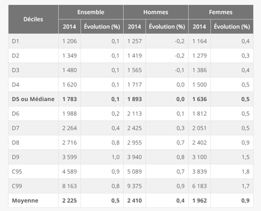

layout: true
  

`r paste0("
", params$event, " 

")`

---

class: center, middle

Ces slides en ligne : http://datactivist.coop/SPoSGL/

Sources : https://github.com/datactivist/SPoSGL/

Les productions de Datactivist sont librement réutilisables selon les termes de la licence [Creative Commons 4.0 BY-SA](https://creativecommons.org/licenses/by-sa/4.0/legalcode.fr).

 
 

 

---
## Plan du cours

.center[*Podcast introductif section 5*]

**1. .red[Les pièges statistiques récurrents]**

**Ressource complémentaire** : lire xxx / écouter xxx / regarder xxx

**2. .red[Représentations graphique et spatiale, attention danger !]**

**Ressource complémentaire** : lire xxx / écouter xxx / regarder xxx

**3. .red[Les limites inhérentes aux indicateurs]**

**Ressource complémentaire** : lire xxx / écouter xxx / regarder xxx

*Bibliographie*

.center[**Quizz section 5**]
---

## Introduction 

#### Ecoutez le .red[podcast introductif] de la section 5 

.center[]

.footnote[© Xavier Gorce]

---
class: inverse, center, middle

## 1. Les pièges statistiques récurrents

---
## Médiane ou Moyenne ?

- Salaire mensuel **.red[moyen]** net en France en 2014 (secteur privé) : **2 225€**
- Salaire mensuel **.red[median]** net en France en 2014 (secteur privé) : **1 783€**
Soit une différence de près de 450€ !

.center[]

---
## Médiane ou Moyenne ?

Rappelez-vous que **la moyenne est très sensible aux .red[valeurs extrêmes]...**

.center[]

---
## Corrélation ou causalité ?

Rappel : une corrélation fortement positive, avec un coefficient de corrélation (r) > 0,5, signifie seulement que deux variables évoluent dans le même sens. Cela ne dit **rien** sur le possible lien entre elles
- Faites attention aux **corrélations fallacieuses** !
- Exemple ici avec la corrélation quasi parfaite entre la consommation de fromage par personne et le nombre de personnes qui décèdent étranglées dans leurs draps

.center[]

---
## Corrélation ou causalité ?

A l'instar du site parodique ["Spurious Correlations"](http://tylervigen.com/spurious-correlations) dont le graph précédent est issu, les Décodeurs du monde ont récemment lancé un [générateur aléatoire de comparaisons](https://www.lemonde.fr/les-decodeurs/article/2019/01/02/correlation-ou-causalite-brillez-en-societe-avec-notre-generateur-aleatoire-de-comparaisons-absurdes_5404286_4355770.html). Un bon moyen pour ne plus jamais faire la confusion entre corrélation ou causalité !

.center[]

---
## Corrélation ou causalité ?

- En ce qui concerne les corrélations, il faut être attentif au **.red[nombre d'unités observées]** : moins il y a d'observations, plus la corrélation est forte. Ce n'est pas pareil de regarder la corrélation entre 2 variables sur 13 régions ou sur 35 000 villes

.center[]

- Il faut également être prudent sur l'échelle spatiale utilisée : la corrélation entre le % d'immigrants et le vote FN est positif à l'échelle du département. Mais à l'intérieur de ces départements, ce sont dans les zones avec la plus faible proportion d'immigrants que les personnes votent FN. Ainsi, au niveau micro la corrélation peut être inversée que ce qui était observé au niveau macro

---
## Corrélation ou causalité ?

---
class: inverse, center, middle

## 2. 1er sous-titre Grain 2

---
## Grain 2

- 5/6 slides d'accompagnement du grain 2

- Quelques images

---
class: inverse, center, middle

## 3. Grain 3

---
## 1er sous-titre Grain 3

- 5/6 slides d'accompagnement du grain 3

- Quelques images

---
class: inverse, center, middle

## Bibliographie

---
## Bibliographie

- Ceci est une ressource bibliographique

- Ceci est une 2ème ressource bibliographique

- Ceci est une 3ème ressource bibliographique

.center[]

---
class: inverse, center, middle

## Quizz section X : rdv sur votre espace e-campus !

---
class: inverse, center, middle

# Merci !

Contact : [timothee@datactivi.st](mailto:timothee@datactivi.st)