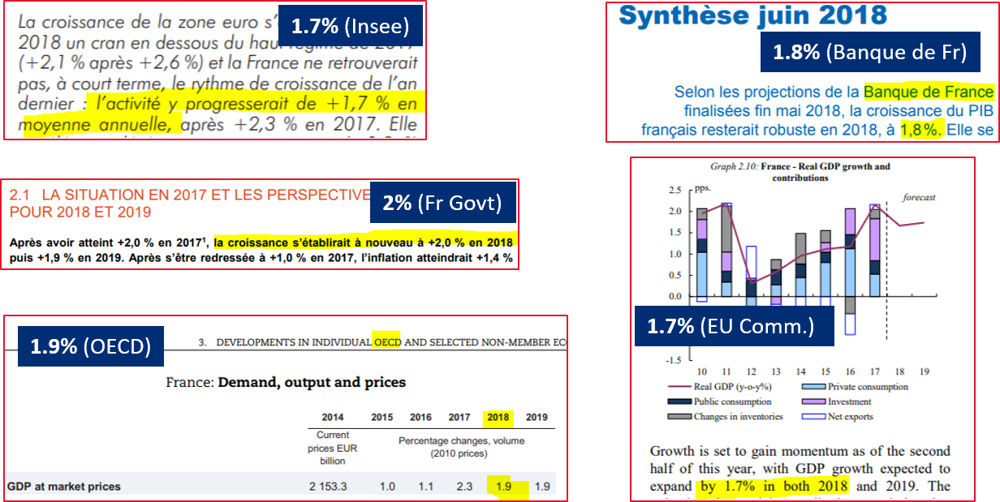

layout: true
  

`r paste0("
", params$event, " 

")` 

---

class: center, middle

Ces slides en ligne : `r paste0("http://datactivist.coop/", params$slug)`

Sources : `r paste0("https://github.com/datactivist/", params$slug)`

Les productions de Datactivist sont librement réutilisables selon les termes de la licence [Creative Commons 4.0 BY-SA](https://creativecommons.org/licenses/by-sa/4.0/legalcode.fr).

 
 

---
## Qui sommes-nous ?

    

### We .red[open data], we make them .red[useful]

---
## Qui sommes-nous ?

- Datactivist est un .red[**pure player de l’open data**] créé en 2016, par Samuel Goëta et Joël Gombin.

- Se positionnant sur .red[**toutes les étapes du travail d’ouverture des données**], Datactivist travaille tant avec les producteurs de données qu’avec les réutilisateurs et participe à l’appropriation des données par chacun.

- Nous appliquons nos propres .red[**valeurs**] : nous sommes une coopérative ; nos supports de formation et nos contenus sont librement réutilisables, publiés en licence Creative Commons.

- Une approche issue de la recherche : voir notamment **https://datactivist.coop/these**. 

- Nous animons la communauté [#TeamOpenData](https://teamopendata.org).

---
## Qui sommes-nous ?

---
## Qui je suis

+ Timothée Gidoin (@TGidoin), coordinateur du cours avec Cécile Le Guen (@CecileLG) ainsi que d'autres cours pour les 2A, 4A et 5A

+ Sociétaire Datactivist (@Datactivi_st) et consultant Open Data

+ Cofondateur de Datagora (@Datagora)

+ Diplômé de l'Edhec et Sciences Po

+ Professeur vacataire à Sciences Po (EAP, Master Politiques Publiques)

+ Breton

---
## Let's get schwifty !

.center[]

---
## Objectifs de la séance
   

- Point sur l'organisation du cours
 

- Comprendre ce qu'est une donnée (sections 1 et 2)
 

- L’écosystème des sources de données publiques (section 4)
 

- Manipulation et représentation de données (section 5)

---
class: inverse, center, middle

# .red[Organisation du cours]

---
## Organisation du cours

- **Tous les supports de cours seront sur le e-campus à partir d'avril**

- 10 sections, dont 2 cours en présentiel (prochain : **12 avril**)

- Chaque section représente environ **2 heures** (lectures obligatoires comprises)

- Chaque section - ou presque - contiendra un **podcast**

- Chaque section se finira par un **quiz**, noté !

---
## Plan de cours

**.red[Section 1]** - Introduction : qu’est-ce qu’une donnée ? Petite histoire sociale des données et de leur exploitation 

**.red[Section 2]** - Datafication : les promesses de la mise en données du monde

**.red[Section 3]** - Données, données… quelles données ? Les différents types de données

**.red[Section 4]** - L’écosystème des sources de données publiques 

**.red[Section 5]** - Manipulation et représentation de données : éviter des écueils classiques 

---
## Plan de cours

**.red[Section 6]** - Open data, big data, linked data, data API : les habits neufs de la donnée 

**.red[Section 7]** - Les modèles économiques liés aux données - focus ville intelligente

**.red[Section 8]** - Cadre juridique de l’open data, des données personnelles et protection de la vie privée

**.red[Section 9]** - Qu’est-ce que la data science ? 

**.red[Section 10]** - Qu’est-ce que la data science ? Partie 2

---
class:middle, center
## Echauffement :
### 2 minutes, 10 données

Vous avez 5 minutes

Vous devez trouver 10 données dans notre environnement immédiat

Pas de recours aux écrans !

.footnote[[source](http://infolabs.io/5-minutes-20-donnees)]

---
class:center,inverse, middle
# Qu'est-ce 
# qu'une donnée ?

---
## Qu'est-ce qu'une donnée ?

> *Une donnée correspond à la représentation d'une information sous une forme conventionnelle destinée à faciliter son traitement*

.center[] 

.footnote[[source](https://www.cnil.fr/sites/default/files/atoms/files/guide_open_data.pdf)]
---
## Le censeur à Rome, ancêtre de la statistique
.center[.reduite3[]]

.footnote[Source : *Asterix chez les pictes*, © Albert René 2013]
---
## Le censeur à Rome, ancêtre de la statistique
.center[.reduite3[]]

.footnote[*Asterix chez les pictes*, © Albert René 2013]
---
## La statistique : outil de gouvernement et de preuve
.pull-left[.middle[La statistique est à la fois :

  + **outil de gouvernement** (_Statistik_ - 18e siècle), et
  
  
  + **outil de preuve** (_statistics_ - 19e siècle)]]
.pull-right[.reduite2[]]
---
  
## [Quantifier, c'est convenir puis mesurer](http://www.pressesdesmines.com/media/extrait/PourSocioHistExtr.pdf)

.pull-left[
> Le verbe quantifier est employé ici dans un sens large : **exprimer et
faire exister sous une forme numérique ce qui, auparavant, était exprimé par
des mots et non par des nombres**.]

.pull-right[.reduite2[]]

---
## [Quantifier, c'est convenir puis mesurer](http://www.pressesdesmines.com/media/extrait/PourSocioHistExtr.pdf)

.center[.reduite3[]]

.footnote[*Asterix chez les pictes*, © Albert René 2013]

---
## Quantifier, c'est inscrire et figer une réalité sans cesse mouvante

.center[.reduite3[]]

.footnote[*Asterix chez les pictes*, © Albert René 2013]

---
class:inverse, middle, center
# Vers une définition des données

---
## Etymologie

### Latin : _dare_ (donner) > _datum_ (donné) > _data_ (donnés)
  
Ce qui est évident, va de soi, est accepté sans discussion

  

> L'existence d'une donnée est indépendante de toute considération de la vérité ontologique correspondante. Lorsqu'un fait s'avère être faux, il cesse d'être un fait. 
Les fausses données n'en restent pas moins des données.

.footnote[[Rosenberg, 2013](https://mitpress.mit.edu/books/raw-data-oxymoron)]

---

## Vers une définition

.pull-left[.reduite3[

⏺ enregistrabilité +🏗 briques de base ("*buildings blocks*")]]
.pull-right[
> *Les données sont généralement comprises comme étant la matière première produite par la synthèse du monde en catégories, mesures et autres formes de représentation - nombres, caractères, symboles, images, sons, ondes électromagnétiques, bits - qui constituent les éléments de base à partir desquels l'information et le savoir sont créés. *]

---
Class:
## La pyramide Data-Information-Knowledge-Wisdom

.pull-left[

]

.pull-right[Attribuée à [Russell Ackoff](http://en.wikipedia.org/wiki/Russell_L._Ackoff), 1989

Les données peuvent être des :

- faits
- signal/stimulis
- symboles]

---
Class:
## La pyramide Data-Information-Knowledge-Wisdom

- Les **.red[données]** sont la matière "brute" d'où naît l'information.

- **.red[L'information]** pourrait être définie comme des données qui ont été consignées,
classées, organisées, raccordées ou interprétées dans un cadre qui en dégage le sens

- En donnant du sens à de l'information, on obtient de la **.red[connaissance]**

- En donnant du sens à la **.red[connaissance]** on obtient du savoir

---
Class:
## La pyramide Data-Information-Knowledge-Wisdom

.center[]

_NB : le haut de la pyramide, est parfois remplacé par "compétence"_

---
class: inverse, center, middle

## La mise en données du monde

---
## "Datafication" : la mise en données du monde
> “L'immense gisement de données numériques découle de la capacité à paramétrer des aspects du monde et de la vie humaine qui n'avaient encore jamais été quantifiés. On peut qualifier ce processus de **« mise en données » (datafication)**. 

> […] “La mise en données désigne autre chose que la numérisation, laquelle consiste à traduire un contenu analogique - texte, film, photographie - en une séquence de 1 et de 0 lisible par un ordinateur. Elle se réfère à une action bien plus vaste, et aux implications encore insoupçonnées : **numériser non plus des documents, mais tous les aspects de la vie**.”

.footnote[[Kenneth Cukier, “Mise en données du monde, le déluge numérique”](https://www.monde-diplomatique.fr/2013/07/CUKIER/49318)]

---

## La "nombrification" du monde

.pull-left[.reduite[]]
.pull-right[
> La numérisation ne serait pas survenue sans une "nombrification" préalable qui consiste à quantifier de plus en plus d'aspects de notre expérience du réel.
> **Au commencement était le verbe, il semble à la fin que tout devient nombre.**
> Personne ne saurait parler sérieusement de l'état de la société et discuter politique sans se référer aux informations quantitatives.]

---
Class: middle, center

## La mise en données du monde

- **Concrètement, aujourd'hui, quels aspects de votre vie sont mis en données ?**

--

- Recherches internet, pratiques sportives, consommation énergie, régime alimentaire, trajets dans les transports en commun...

- Cette mise en donnée est rendue possible par le développement de .red[**capteurs**] qui viennent collecter et agréger ces données. **Avez-vous des exemples de capteurs ?**

--

- Recherches internet .red[(cookies)], pratiques sportives .red[(montres connectées)], consommation énergie .red[(compteurs connectés)], régime alimentaire .red[(appli type Yuka)], trajets dans les transports en commun .red[(Pass Navigo)]...

- La question devient peut-être, *quels aspects de votre vie ne sont pas (encore) mis en données ?*

---
## Le nouveau positivisme des données

> Si vous me demandiez de décrire la philosophie naissante du jour, je dirais que c’est du **data-isme**. Nous sommes maintenant en mesure de collecter d'énormes quantités de données. Cette capacité semble comporter certaines hypothèses culturelles - à savoir que **tout ce qui peut être mesuré doit être mesuré; que les données constituent un filtre transparent et fiable nous permettant de mettre côté les émotions et l'idéologie**; ou encore que les données nous aideront à faire des choses remarquables - comme prédire l'avenir

David Brooks, éditorialiste du New York Times, ["The Philosophy of Data"](https://www.nytimes.com/2013/02/05/opinion/brooks-the-philosophy-of-data.html)

.center[]

---
## Le nouveau positivisme des données

- Attention, les données, même provenant de sources officielles, ne sont pour autant neutres, irréprochables ou porteuses de "LA" vérité

.center[]

- **Avez-vous des exemples de données officielles pouvant qui peuvent faire l'objet de critiques ?**
--

- Délinquance, immigration, SDF...

.footnote[© Scott Adams]

---
Class:

## Les données brutes sont un oxymore

.pull-left[
> Les données sont toujours "cuisinées" et jamais tout à fait "brutes"

> Les données ont besoin au préalable d'être imaginées comme données pour exister et fonctionner comme telles. L'imagination de ces données implique une base d'interprétation

]
.pull-right[

.footnote[© Xavier Gorce 2018]]

.footnote[[Source](https://mitpress.mit.edu/books/raw-data-oxymoron)]
---

## Data or capta ?

> Techniquement, ce que nous nous appelons "donnée" est généralement **"capturé"** (issu du latin "capere", signifiant "prendre"); ces unités de données qui ont été sélectionnées et collectées parmi l'ensemble de toutes les données possibles

[Kitchin, 2014](https://books.google.fr/books?hl=fr&lr=&id=GfOICwAAQBAJ&oi=fnd&pg=PP1&dq=kitchin+data+revolution&ots=pcyfMTZh-V&sig=dQyPTL3AIN_4RdWvtBFw4VjdAa4#v=onepage&q=kitchin%20data%20revolution&f=false)

.center[] 

---

## Données ou obtenues ? 

> Décidément, on ne devrait jamais parler de “données”, mais toujours d’ “obtenues”.

[Bruno Latour, 1993](http://www.bruno-latour.fr/fr/node/255)

.center[] 

---
class:center, middle, inverse
##Pause café : 5 minutes

---
Class: middle, center
## .red[Section 2 : Les multiples sources et producteurs de données publiques]

---
## Plan du cours

.center[*Podcast introductif section 4, par Timothée Gidoin*]

#### .red[**1. Les multiples sources et producteurs de données publiques**]

Regarder la vidéo .red[[#DATAGUEULE "Gouvernés par les nombres ? Échecs et maths"](https://www.youtube.com/watch?v=3Xct2cLcsWY)]

#### .red[**2. Comment bien distinguer les sources ?**]

Ecouter le podcast .red["Section 4 - la jungle d'acronymes"]

#### .red[**3. L’importance de croiser les sources**]

Lire l'article d'Alternatives Economiques .red[["Quel est le « bon » seuil de pauvreté ?"](https://blogs.alternatives-economiques.fr/idies/2018/03/01/quel-est-le-bon-seuil-de-pauvrete)]

*Bibliographie*

.center[**Quizz section 4**]
---

## Introduction 

#### Ecoutez le .red[podcast introductif] de la section 4 

.center[]

.footnote[© Xavier Gorce]

---
class: inverse, center, middle

## 1. Les multiples sources et producteurs de données publiques

---
## Qui produit des données publiques ?

- A quels acteurs pensez-vous naturellement lorsqu'on parle de données ou de statistiques publiques ?

 

.center[]

---
## Qui produit des données publiques ?

- A quels acteurs pensez-vous naturellement lorsqu'on parle de données ou de statistiques publiques ?

##### Généralement, à des producteurs de statistiques ou d'études comme l'Insee, Eurostat ou l'OCDE

.pull-left[]

.pull-right[]

---
## Qui produit des données publiques ?

- Les organismes officiels produisant des **statistiques publiques** sont loin d'être les seuls à produire des données publiques

- **La plupart des administrations ou collectivités produisent des données** dont beaucoup d'entre elles peuvent être ouvertes et réutilisées par tous (cf section 6 et 8 autour de l'*Open data*) et faire l'objet de statistiques. Exemples:
  - Ville de Paris, Région Bretagne, Ministère des armées, Assemblée Nationale, CAF, Pole Emploi, douanes...

**.red[Point définition]** : les statistiques visent d'abord à fournir des renseignements utiles à l'aide de chiffres. La statistique pourrait donc être définie comme de **l'information qu'on peut obtenir à partir d'opérations mathématiques sur des données numériques**. Les statistiques peuvent servir de base à la **prise de décisions**

---

.center[]

.footnote[Liste d'enfants dévorés par les loups sur le territoire de la commune de Malbos en Ardèche au début du XIXème siècle]

---
## Qui produit des données publiques ?

- Il existe des données sur **l'ensemble des sujets de l'action publique**, ces dernières étant consubstantielles à la prise de décisions et à la mise en oeuvre de politiques publiques

- **Ceux qui les produisent** (exemple: une plainte enregistrée par les services de police et de gendarmerie) **ne sont pas toujours ceux qui les exploitent**

- Nous allons nous intéresser dans les prochaines parties à **l'écosystème de ceux qui étudient, analysent et retraitent ces données publiques**, sous la forme de statistiques, d'études, de rapports ou autres publications visant à informer ou influencer le débat public

.footnote[Du grain à moudre : Regardez [la vidéo #DATAGUEULE "Gouvernés par les nombres ? Échecs et maths"](https://www.youtube.com/watch?v=3Xct2cLcsWY) **obligatoire**]

---
class: inverse, center, middle

## 2. L'écosystème des sources : bienvenue dans la jungle des acronymes

---
## La jungle des acronymes

.center[]

.footnote[© Jorge Cham, 2008]

---
## La jungle des acronymes

Beaucoup des producteurs de statistiques ou d'études publiques ont des noms "*jargoneux*" ou des acronymes peu connus du grand public. Par exemple, connaissez-vous les organismes suivants :

.center[]

---
## Distinguer les sources

**Il n'existe pas de .red[classification officielle de ces sources.]** Il est cependant possible d'esquisser une certaine typologie des acteurs :

- **Service statistique public (SSP)** : l'Insee et les services statistiques ministériels. Les membres du SSP ont la particularité de produire des études en toute indépendance de leur ministère de rattachement
  - Ex: Insee, Dares, Drees, Depp...

- **Organismes publics** : 
Certains sont rattachés à des ministères ou au premier ministre (ex: CGET, France Stratégie, Direction Générale du Trésor...)
  
D'autres en sont indépendants (Ex: Défenseur des droits, Ofpra...)

- **Les thinks tanks** : Ce sont des groupes de réflexion privés qui produisent des études sur des thèmes de société
  - Ex: Fondation Jean Jaurès, Terra Nova, Institut Delors...
  
---
## Distinguer les sources
  
- **Les organisations internationales**
  - Ex: OCDE, FMI, Banque Mondiale, HCR...
  
- **Les centres de recherche**

- **Les instituts de sondage ou d'études**
  - Ex: Ifop, Ipsos, Kantar, BVA...
  
Et d'autres acteurs (**ONG**, **cabinets de conseil**, **lobbys**) qui produisent régulièrement des publications pour alimenter ou peser sur le débat public

NB : cette [nomenclature proposée par Datagora](https://datagora.fr/instituts), connait de nombreuses limites, certains acteurs se considérant comme l'un et l'autre ou redéfinissant leur identité et missions. Par exemple l'OFCE, observatoire affilié à Sciences Po, produit des études de conjoncture économique. Il se définissait précédemment comme un think tank et désormais comme un centre de recherche

---
## Distinguer les sources

Au-delà de cette typologie approximative, il y a des **critères objectifs** sur lesquels il peut être intéressant de s'attarder quand on cherche à décrypter une source :

- Est-elle **.red[indépendante du politique]** dans la publication de ses résultats ?

- Est-elle **.red[financée par des fonds privés ou publics]** ?

- Quelle type de **.red[gouvernance]** ? 
  - *Exemple de Rexecode et de l'Ires* : ce sont deux organismes produisant des analyses de conjoncture économique. Cependant, l'un (Rexecode) a dans son [conseil d'administration](http://www.rexecode.fr/public/Qui-sommes-nous/Gouvernance) plusieurs personnalités issues d'organisations patronales comme le Medef ou l'UIMM. L'autre (Ires) a dans son [Assemblée générale](http://www.ires.fr/index.php/institut/l-organisation) de nombreux syndicalistes

- A-t-elle une **.red[orientation idéologique ou défend-elle des intérêts]** ?

- Est-elle constituée de **.red[véritables chercheurs]** ?

---
## Distinguer les sources

#### Distinguer les sources "primaires" des sources "secondaires"

- Il est fréquent de voir dans les media des chiffres qui sont attribués à des sources qui calculent, analysent, comparent, croisent des données. Ces sources "secondaires" (ex: Cour des comptes) peuvent produire de nouveaux résultats ou des analyses pertinentes mais il faut bien garder à l'esprit qu'elles ne sont pas à l'origine des données.
  - Exemple : [Etude "Les dynamiques de population"](http://www.observatoire-des-territoires.gouv.fr/observatoire-des-territoires/sites/default/files/Fiche-OT-Les%20dynamiques%20de%20population_0.pdf) du CGET dont la plupart des données analysées proviennent de l'Insee ou d'Eurostat
  
- Lorsque vous cherchez des données *"brutes"*, il est préférable d'aller directement sur les sites des sources primaires. Exemples :
  - Site de la CAF pour les [données sur les allocataires des APL](http://data.caf.fr/category/statistiques-allocataires-prestations-et-services) ; 
  - Site de Pole Emploi pour les [données sur les demandeurs d'emploi](http://www.pole-emploi.org/opendata/les-demandeurs-demploi-indemnise.html?type=article)

---
## Distinguer les sources

**Ecoutez le .red[podcast "La jungle d'acronymes"] de la section 4**

.center[]

.footnote[© Xavier Gorce 2018]

---
class: inverse, center, middle

## 3. L’importance de croiser les sources de données

---
## Croiser les sources

Même provenant de sources sérieuses et primaires, il n'est pas inutile de croiser les données trouvées avec d'autres sources qui peuvent également avoir des données sur les mêmes sujets mais avec des chiffres... différents.
*Comment expliquer ces écarts ?*

- Les **.red[différences de méthodologie]**
  - Exemple 1 : chiffres du chômage de Pole Emploi vs ceux de l'Insee
  - Exemple 2 : Taux de pauvreté, OCDE vs Eurostat
  
- L'incertitude liée aux **.red[estimations]**
  - Certaines données sont issues d'estimations. Elles sont donc souvent temporaires et en attente de révision ou de confirmation

- **.red[L'interprétation des données]**
  - Souvent les données sont accompagnées de contexte et d'analyse
  - Ces éléments peuvent différer d'une source à une autre

---
## Les différences de méthodologie

Certains producteurs de données ou d'études n'utilisent pas les mêmes conventions statistiques ou méthodologies pour calculer un même indicateur.

Un exemple connu est celui du **.red[taux de chômage]** : même si les tendances sont souvent proches, les chiffres peuvent connaître d'importants écarts entre ceux de l'Insee et de Pole Emploi, pour 2 raisons principalement :

**1) La définition du chômeur** est différente entre celle de l'Insee (qui reprend la définition du BIT) et celle de Pole Emploi (qui comptabilise les personnes inscrites sur ses listes)

Un chômeur, au sens du BIT, n’est donc pas forcément inscrit à Pôle emploi, et l’inverse est aussi vrai.

2) **Les techniques de calcul** différent également (technique du sondage pour l'Insee vs nombre des demandeurs d'inscrits dans les Pole Emploi)

---
## Les différences de méthodologie

.center[]

.footnote[[source](https://www.lemonde.fr/les-decodeurs/article/2017/08/24/chomage-pourquoi-les-chiffres-de-l-insee-et-de-pole-emploi-different_5176176_4355770.html)]

---
## Les différences de méthodologie

Nombre de travailleurs pauvres, Allemagne vs France... Qui a raison ?

.pull-left[]

.pull-right[]

---
## Les différences de méthodologie

Nombre de travailleurs pauvres, Allemagne vs France... Qui a raison ?

Les deux, car ces données ne mesurent pas exactement la même chose ! Cela est dû à des **nuances de paramètres statistiques** :

> Eurostat regarde la part des travailleurs pauvres pris **individuellement** par rapport à l’ensemble des personnes en activité, tandis que l’OCDE mesure le pourcentage des personnes **membres d’un ménage** vivant sous le seuil de pauvreté, et où au moins l’un des adultes travaille. Ici, la composition du foyer entre donc en compte, avec le nombre des adultes en emploi, et une pondération selon le nombre d’enfants. Et cela explique les écarts

.footnote[[source](https://www.lemonde.fr/economie/article/2018/05/12/selon-l-ocde-la-part-des-travailleurs-pauvres-est-deux-fois-plus-elevee-en-france-qu-en-allemagne_5297878_3234.html)]

---
## Les différences de méthodologie

> Tous ces chiffres montrent que la part des travailleurs pauvres est plus élevée en Allemagne qu’en France, lorsqu’ils sont comptabilisés individuellement, mais elle est plus basse si l’on prend en compte la composition du foyer

Stefano Scarpetta, directeur de la division emploi à l’OCDE

Plus largement, on peut aussi parfois se poser la question des seuils retenus pour le calcul de certains indicateurs. Par exemple, est-on pauvre avec moins de 60, 50 ou 40% du revenu médian ?

Lire à ce sujet l'article du blog d'alternatives économiques ["Quel est le « bon » seuil de pauvreté ?"](https://blogs.alternatives-economiques.fr/idies/2018/03/01/quel-est-le-bon-seuil-de-pauvrete) de l'économiste Jean Gadrey (**obligatoire**) en réaction à l'article ["9 millions de pauvres, un chiffre exagéré"](https://blogs.alternatives-economiques.fr/idies/2018/02/27/neuf-millions-depauvres-un-chiffre-exagere) de Louis Maurin, directeur de l'Observatoire des inégalités

---
## L'incertitude liée aux estimations

De nombreux indicateurs économiques font l'objet d'estimations de plusieurs acteurs. Les estimations peuvent varier de manière significative. Exemple ici avec les estimations - *au 31/07/18* - de croissance du PIB Français pour 2018 :

.center[]

.footnote[*NB: en décembre 2018, l'Insee a abaissé ses prévisions de croissance pour 2018 à 1,5%*]

---
## L'interprétation des données

Souvent les données sont accompagnées de **contexte et d'analyse**, qui donnent lieu à une certaine .red[**interprétation**]. Ces éléments peuvent différer d'une source à une autre, il est donc utile de les croiser régulièrement. 

.pull-left[]

.pull-right[Ici un exemple classique des divergences d'interprétation des données mensuelles du chômage (Sept 2017). Essayez de remonter directement aux producteurs de données "primaires", ici Pole Emploi, si vous souhaitez approfondir votre analyse en évitant le *"bruit éditorial"*]

---
class: inverse, center, middle

## Bibliographie

---
## Bibliographie

- Vidéo [#DATAGUEULE "Gouvernés par les nombres ? Échecs et maths"](https://www.youtube.com/watch?v=3Xct2cLcsWY)

- Le Monde, ["Chômage : pourquoi les chiffres de l’Insee et de Pôle emploi diffèrent"](https://www.lemonde.fr/les-decodeurs/article/2017/08/24/chomage-pourquoi-les-chiffres-de-l-insee-et-de-pole-emploi-different_5176176_4355770.html), mis en ligne le 24 août 2017

- Le Monde, ["Selon l’OCDE, la part des travailleurs pauvres est deux fois plus élevée en France qu’en Allemagne"](https://www.lemonde.fr/economie/article/2018/05/12/selon-l-ocde-la-part-des-travailleurs-pauvres-est-deux-fois-plus-elevee-en-france-qu-en-allemagne_5297878_3234.html), mis en ligne le 12 mai 2018

- Jean Gadrey, blog Alternatives Economiques ["Quel est le « bon » seuil de pauvreté ?"](https://blogs.alternatives-economiques.fr/idies/2018/03/01/quel-est-le-bon-seuil-de-pauvrete), mis en ligne le 1er mars 2018

- Louis Maurin, blog Alternatives Economiques ["9 millions de pauvres, un chiffre exagéré"](https://blogs.alternatives-economiques.fr/idies/2018/02/27/neuf-millions-depauvres-un-chiffre-exagere), mis en ligne le 27 février 2018

---
class: inverse, center, middle

# Merci !

Contact : [timothee@datactivi.st](mailto:timothee@datactivi.st)