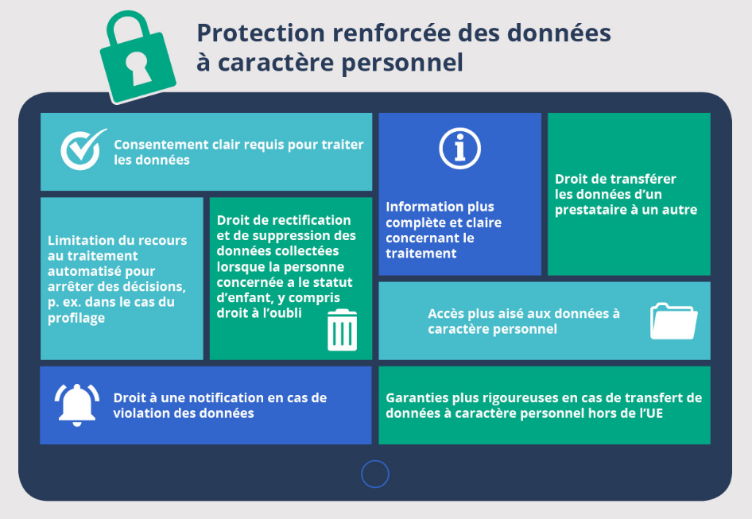
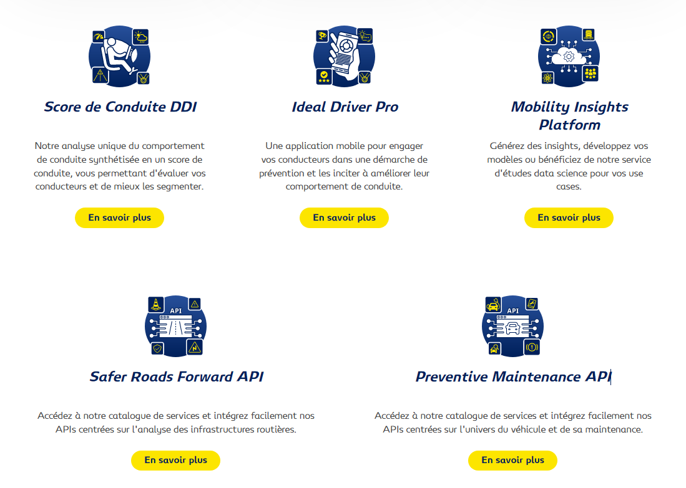
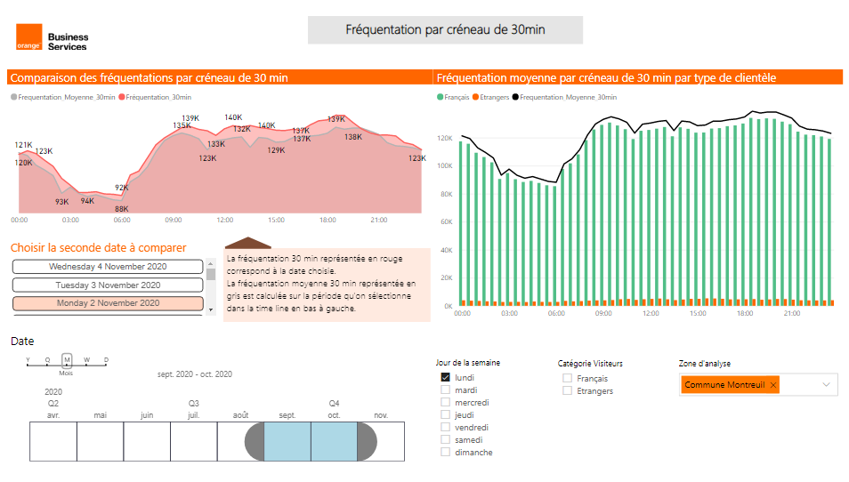
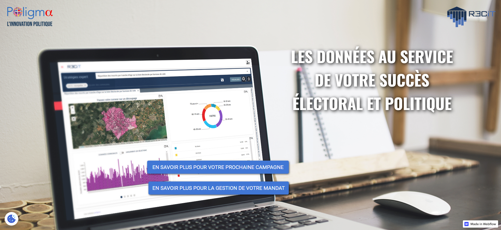
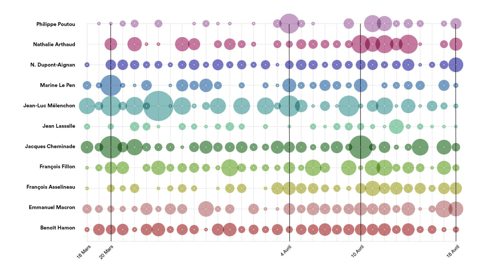
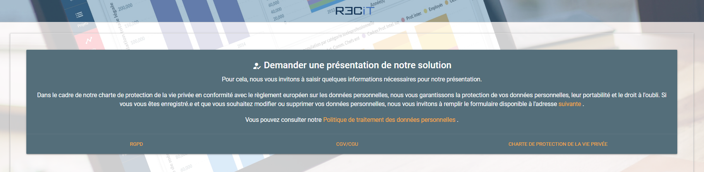

layout: true
  

`r paste0("
", params$event, " 

")` 

---

class: center, middle

Ces slides en ligne : http://datactivist.coop/SPoSGL/sections/5A_module1.html

Sources : https://github.com/datactivist/SPoSGL/

Les productions de Datactivist sont librement réutilisables selon les termes de la licence [Creative Commons 4.0 BY-SA](https://creativecommons.org/licenses/by-sa/4.0/legalcode.fr).

 
 

.center[] 
---

.red[PARTIE 1 : LE MARCHE DES DONNEES]

### 1. Les vendeurs et les acheteurs de données

#### 1.1 Les transactions de données
#### 1.2 Le cas Google
#### 1.3 Les freins du RGPD européen
#### 1.4 Des exemples d'échanges de données
*à lire : Ivan Manokha, Le scandale Cambridge Analytica contextualisé: le capital de plateforme, la surveillance et les données comme nouvelle « marchandise fictive (lire sur [openedition.org](https://journals.openedition.org/conflits/19779))*

#### Etude de cas : Le marketing électoral
*à lire : Anaïs Theviot, « Une économie de la promesse » : mythes et croyances pour vendre du Big data électoral (lire sur [cairn.info](https://www.cairn.info/revue-les-enjeux-de-l-information-et-de-la-communication-2018-2-page-45.htm))*

---
class: inverse, center, middle
# Les vendeurs et les acheteurs de données

Tout comme pour n'importe quel autre produit, il y a un .red[**marché des données**] avec ses **producteurs**, ses **vendeurs**, ses **acheteurs**.

Contrairement aux idées reçues, ce marché n'est pas récent ! Il est vieux comme la presse bien que traditionnellement cantonné aux données de profils clients (avec les ventes de listes d’abonnés).

---

### .red[1.1 Les transactions]

* La vente **en direct** d'entreprise à entreprise (B2B)
* La vente via .red[**data brokers**]

Les **data brokers** sont des **courtiers en données**. Ces entreprises collectent des données auprès de plateformes comme Facebook, Google, des banques ou des assurances, sur le comportement et les habitudes de consommation des utilisateurs. Ces données sont compilées, traitées, analysées et elles deviennent alors des connaissances précieuses pour les entreprises clientes à des fins de ciblage marketing. Les data brokers proposent à leurs clients des analyses très fines et pointues des goûts, habitudes et comportements de leurs clients.
L'une des plus célèbres de ces entreprises, Cambridge Analytica, a obtenu et a exploité les données Facebook de plus de 87 millions d'utilisateurs à leur insu, dans le cadre de la campagne électorale de Donald Trump.

*à lire : Ivan Manokha, [Le scandale Cambridge Analytica contextualisé: le capital de plateforme, la surveillance et les données comme nouvelle « marchandise fictive](https://journals.openedition.org/conflits/19779)*

* La vente via des **plateformes d'échange de données** comme [Dawex](https://www.dawex.com/fr/) facilitant et sécurisant la mise à disposition de données de vendeurs à acheteurs.

---

class: inverse, middle

Pour approfondir sur la question des .red[data brokers] et des conséquences de leurs pratiques sur la vie des personnes, lisez Mary F. E. Ebeling, *Healthcare and big data: digital specters and phantom objects*, 2016.

Un [compte rendu de lecture de cet ouvrage](https://journals.openedition.org/rac/606) est disponible en open édition.

---

### .red[1.2 Le cas Google]

Google n'est pas un data broker. Google ne vend pas de la donnée brute mais de l'accès très ciblé à des utilisateurs extrêmement bien qualifiés aux data brokers, parfois au sein même des ses infrastructures applicatives.

Ces partenariats sont soumis à des règles strictes (par exemple le respect de l'anonymat des données) qui si elles ne sont pas respectées peuvent mettre fin au contrat. Par exemple, en 2021, Google a supprimé les accès accordés à SafeGraph après que l'entreprise a vendu les données de géo-localisation des utilisateurs d’Android. Or la précision de la localisation est incompatible avec l'anonyma : il est possible de retrouver parmis les données celles de personnalités dont on connait les déplacements par exemple.

---

### .red[1.3 Les freins du RGPD européen]

L’Union Européenne a institué le [**RGPD**](https://ec.europa.eu/info/law/law-topic/data-protection/reform/rules-business-and-organisations/principles-gdpr_fr) depuis 2018. Ce dispositif sert à protéger les utilisateurs de la collecte de leurs données par les data brokers via les entreprises.

Pour avoir le droit de récupérer de traiter et de transmettre les informations concernant un internaute, les entreprises doivent obtenir un consentement clair et la gestion des données doit impérativement respecter la confidentialité.

.pull-left[Ceci freine grandement les activités de collecte au point par exemple que [Mark Zuckerberg menace régulièrement l'Europe de supprimer Facebook et Instagram du continent européen](https://www.demotivateur.fr/high-tech/mark-zuckerberg-agite-de-nouveau-la-menace-de-la-fermeture-de-facebook-et-instagram-en-europe-28077).]

.pull-right[]
.pull-right[.center[Voir l'[infographie complète](https://www.consilium.europa.eu/fr/infographics/data-protection-regulation-infographics/)]]

---

### .red[1.4 Des exemples d'échanges de données]

[Michelin Solutions](https://ddi.michelin.com/) vend plusieurs produits de données issus de ces pneus connectés,  dont  les  zones  accidentogènes  et  une  notation  des comportements de conduite pour les flottes d’entreprise.

.center[] 

---

### .red[1.4 Des exemples d'échanges de données]

Les  **opérateurs  mobiles**  proposent  l’accès  payant  à  des  données anonymisées, soit sous la forme de données brutes soit via des plateformes de génération d’insights comme [Orange Flux Vision](https://www.orange-business.com/fr/produits/flux-vision).

.center[]

---

### .red[1.4 Des exemples d'échanges de données]

L’application pour les sportifs [Strava](https://blog.strava.com/press/metro/) vendait depuis 2014 **aux collectivités** et **aménageurs publics** des données détaillées sur la fréquentation et le trafic de chaque point de la ville. .red[Depuis 2020, ce service est devenu gratuit] :

Strava :
> «Les clients Strava Metro pouvaient accéder à un ensemble de données anonymisées moyennant le paiement d’un montant annuel. En novembre 2019, Strava lançait Metro Webview, une interface web clé en main comprenant notamment différents modèles de visualisation des données facilitant considérablement leur lecture et leur interprétation. Pour favoriser le développement d’infrastructures plus pérennes et plus adaptées aux nouveaux usages partout dans le monde et aider les organisme/associations soutenant les athlètes, Strava offre désormais Strava Metro gratuitement aux organisations. »

---

### .red[1.4 Des exemples d'échanges de données]

L’application pour les sportifs [Strava](https://blog.strava.com/press/metro/) vendait depuis 2014 **aux collectivités** et **aménageurs publics** des données détaillées sur la fréquentation et le trafic de chaque point de la ville. .red[Depuis 2020, ce service est devenu gratuit] :

Charlotte Guth, Ville de Paris – Mission aménagements cyclables, Direction de la voirie et des déplacements :
> « S’appuyer sur des données supplémentaires pour amener une meilleure lecture du réseau de pistes cyclables à Paris, qui s’est fortement développé ces dernières années, est évidemment très bienvenu. Nous sommes en train d’étudier comment les données des membres Strava pourraient nous aider à valider certains axes et, analyser éventuellement comment elles pourraient nous orienter vers des améliorations et la création d’autres infrastructures dédiées au vélo.»

---

class: inverse, center, middle

# Etude de cas :
# le marketing électoral

---

**Entreprise** : [Poligma](https://landing.poligma.com/), une start up française basée à Montpellier et créée en 2015 par Stéphane Boisson. Elle compte 3 salariés et réalise 100 000 euros de chiffres d'affaire.

**Son produit** : *R3cit*, un logiciel développé en deux ans de recherche et développement (R&D). Il modélise les profils de chaque bureau de vote du territoire français, par profils socio-économiques. R3cit est vendu entre 1200 et plusieurs dizaines de milliers d'euros (le tarif peut varier si un candidat demande une exclusivité sur une ville par exemple). 

**Ses clients** : Les élus, les candidats et leurs équipes de campagne, les communicants publics, les cabinets de consultants en stratégie politique.

.center[]

---

#### .red[Les données]

* Les données de l'Insee
* Les données de résultats des élections
* Les données de la CAF
* Les données de Pôle Emploi
* ...

Mais aussi de l'**analyse sémantique** à partir de discours, d'articles et des flux des réseaux sociaux comme Twitter. Poligma aide à identifier les mots et les idées qui séduisent le public.

.center[]
.center[*Analyse du nombre de tweets idéologiques par candidat à la campagne présidentielle de 2017 pendant le Sprint [DataPol](https://medialab.github.io/datapol/app/#!/)* organisé à SciencesPo Paris]

---

#### .red[Les arguments commerciaux]

> "En fonction des résultats, nous préconisons de mettre l'accent sur les services de proximité, les activités pour les jeunes enfants, ou d'autres points. Ces données existent déjà, mais elles sont difficilement opérationnelles et interprétables. Les rendre accessibles permet de gagner des heures de travail", Stéphane Boisson.

* le traitement de données éparses 
* des analyses fines pour aider à la prise de décision
* un partenariat pour créer des ponts entre R3cit et les logiciels Microsoft.
* R3cit embarque l'outil [Zecible](https://www.zecible.fr/) qui permet d'envoyer des mails et sms ciblés sur des critères sociodémographique sans avoir accès aux données à caractère personnel (.red[DCP]).
* le respect du RGPD qui rassure les clients

.center[]

---

#### .red[L'avis de la CNIL]

Poligma a subit un contrôle de la [CNIL (la Commission Nationale Informatique et Libertés)](https://www.cnil.fr/) en 2019
L'attention de la CNIL a été attirée par la collecte et la manipulation de données dites sensibles à des fins politiques.

Il n'y a pas de délai légal pour informer les entreprises d'un contrôle : Poligma a été informée un jeudi pour le mercredi suivant.

Le contrôle a donné lieu à une cartographie de toutes les données à caractère personnel présentes dans les systèmes d'informations. Les agents de la CNIL sont restés sur place entre 8 et 22h pour collecter un maximum d'informations techniques et juridiques afin d'étudier les éléments par la suite avec comme objectifs de :

1. Garantir les droits des personnes
2. s'assurer des bases légales des traitements
3. vérifier la chaine de conformité

**Bilan : contrôle satisfaisant** 

---

class: inverse, center, middle

# Merci !

Contact : [joel@datactivist.coop](mailto:joel@datactivist.coop)
