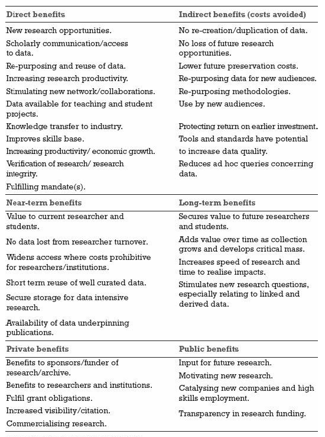
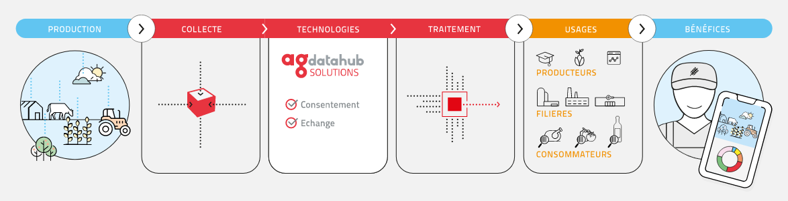
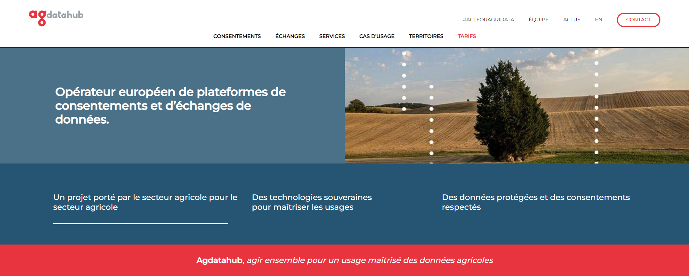

layout: true
  

`r paste0("
", params$event, " 

")` 

---

class: center, middle

Ces slides en ligne : http://datactivist.coop/SPoSGL/5A_module2.html

Sources : https://github.com/datactivist/SPoSGL/

Les productions de Datactivist sont librement réutilisables selon les termes de la licence [Creative Commons 4.0 BY-SA](https://creativecommons.org/licenses/by-sa/4.0/legalcode.fr).

 
 

.center[] 
---

.red[PARTIE 1 : LE MARCHE DES DONNEES]

### 2. Le datasharing

#### 2.1 Les facteurs de développement
#### 2.2 Les opportunités offertes par le datasharing
#### 2.3 Les infrastructures de données

#### Etude de cas : Le AgDataHub

---
class: inverse, center, middle
# Le datasharing

Le .red[datasharing] est un partage de données par une entreprise au sein d'une filière, d'une chaîne de valeur ou d'un éconsystème.
Les conditions d'accès sont précisément définies.

Ce modèle de partage entre entreprises (B2B datasharing) connaît un fort développement en France et en Europe.

---

### .red[2.1 Les facteurs de développement]

Le partage de données se pratiquait déjà entre particuliers, organisations ou gouvernement avant la naissance de l'informatique et des réseaux. Mais il connait un développement important durant cette dernière décennie du fait de 3 types d'évolution :

* **Numérique** : la période connait une augmentation sans précédent du nombre de données produites mais aussi l'amélioration de leur qualité et la simplification des opérations de stockage, de transfert et de traitement. 

* **Culturel** : il y a une meilleure connaissance des données et de leur potentiel et de leurs limites avec des attentes qui se sont précisées. Les données sont vues comme une ressource dans laquelle il faut investir. 

* **Politique** : les décideurs politiques font avancer la réglementation et la législation. Celle-ci tient compte des risques et des opportunités.

---

### .red[2.2 Les opportunités offertes par le datasharing]

Comme l'explique Rob Kitchin dans [*The Data Revolution: Big Data, Open Data, Data Infrastructures and Their Consequences*](https://fr.fr1lib.org/book/2476044/d0039c), les scientifiques argumentent en faveur du datasharing :
* Si un jeu de donnée seul a déjà de la valeur et répond à certaines questions, le croisement de plusieurs jeu de données permet de nouveaux questionnements et offrent donc de nouvelles réponses.
* Combiner des données de même nature et de multiple producteurs permet de changer d'échelle, améliorer la précision et accélère la production du savoir.
* Conserver les données dans la durée permet de construire des modèles et des simulations de plus en plus fiables.

De plus, si une infrastructure commune réalise les traitements de .red[**normalisation**] nécessaires au croisement des données, cela permet des économies d'échelle. Si chaque acteur doit réaliser les mêmes opérations de préparation des données de son côté, c'est plusieurs fois le même temps perdu. Mutualiser les efforts de traitement représente un gain significatif pour chacun.

---

### .red[2.2 Les opportunités offertes par le datasharing]

.center[]
.center[*Source : Beagrie et al. 2010 ; Fry et al. 2008*]

---

### .red[2.3 Les infrastructures de données]

Les infrastructures de données sont diverses et peuvent être classées selon leur complexité et leur ambition :
* Un simple **dossier** contenant des données sur un ordinateur personnel
* Des **archives** de données
* Des **catalogues** de jeux de données dans lequels les données ne sont pas accessibles, seulement les métadonnées les concernant (producteurs, étendue temporelle, spaitale...)
* Des **repertoires** de données avec un accès aux données.
* Des **répertoires multisites et multisources** intégrant des jeux de données de producteurs variés n'appartement pas forcément au même domaine, à la même filière, au même pays...
* Des **plateformes** plus complètes permettant l'accès à des jeux de données mais aussi des échanges entre utilisateurs, la génération des vues analytiques comme des tableaux de bord...

---

class: inverse, center, middle

# Etude de cas :
# le Agdatahub, le datasharing dans l'agriculture

---

#### .red[Présentation]

Le [Agdatahub](https://agdatahub.eu/) est un opérateur européen de plateformes de consentements et d’échanges de données porté par le secteur agricole.

L'objectif est de permettre la création de nouveaux services innovants par l'analyse des données et la production de savoir qu'elle induit, et d'aller vers une agriculture plus performante et durable.
> "Il fédère les acteurs publics et privés du secteur agricole autour d'une même ambition : doter l'agriculture d'une infrastructure technologique mutualisée et souvenraine pour garantir le développement du numérique agricole en France et en Europe."

.center[]

---

#### .red[Les données]

Au sein du .red[[Agdatahub](https://agdatahub.eu/)], la plateforme API-Agro permet d'échanger des données agricoles en open data partagées par le Ministère de l'Agriculture par exemple, mais aussi des données d'exploitations agricoles de toutes filières :
* des données économiques
* des données géologiques
* des données géographiques relatives aux parcelles et aux batiments
* des données d'IoT (capteurs météo, qualité de l'eau, de l'air et engins agricoles connectés)
* des données sur les cultures
* des données sur les produits phytosanitaires
* des données sur les pratiques agricoles (le traitement des maladies par exemple)

.center[]

---

#### .red[Le défi de la normalisation]

Pour pouvoir compiler, croiser et traiter les données provenant de divers producteurs pour en extraire des informations et des connaissances, celles-ci doivent être .red[**normalisées**]. **Cette opération de traitement consiste à redimensionner les variables numériques pour qu'elles soient comparables à une échelle commune** par exemple convertir des prix de vente pour qu'ils soient tous en euros ou uniformiser les formats d'adresses pour mettre dans des colonnes différentes le numéro de rue, le libellé de la voie, le nom de la ville et le code postal (ou mieux le code INSEE)

Le problème de normalisation est important car le Agdatahub regroupe des données de nombreux producteurs et notamment ceux de :
* L'association [Numagri](https://numagri.org/) - des données multiproducteurs qui s'étendent de l'**amont agricole** à la première commercialisation et qui sont des données partagées mais peu normalisées au départ
* La société coopérative [NumAlim](https://www.plateforme-numalim.fr/) - des données multiproducteurs de l'**aval agricole**, de l'agroalimentaire, post commercialisation, et qui sont des données normalisées mais pas partagées.

---

#### .red[L'outillage technologique]

* La plateforme API-Agro repose sur la technologie du français .red[Dawex]. La plateforme permet un contrôle d'accès et gère les permissions pour vérifier qui accède à quoi, qui cède quel accès à qui, etc.

* Les données sont stockées par Orange Cloud for Business avec l'argument du "Cloud de confiance" pour sécuriser les données.

Ainsi, le Agdatahub permet de gérer les **consentements** des producteurs agricoles. En effet, les données d'exploitations agricoles sont assimilées à des données personnelles qui nécessitent donc le consentement de l'exploitant avant tout échange de ses données (à chaque exploitation agricole correspond un exploitant qui vit la plupart du temps sur son exploitation). Les agriculteurs transfèrent leurs données dans la plate-forme et choisissent les usages qu'ils autorisent. Les données peuvent par exemple être échangées avec des organismes publics, des chercheurs ou des entreprises.

---

#### .red[Les usages]

Il y a deux grandes familles d'usage :

* La première concerne **le service à l'agriculteur**
Les décideurs politiques peuvent par exemple mieux comprendre les mécanismes à l'oeuvre et prendre des décisions plus éclairées pour accompagner et aider les agriculteurs Les entreprises dont les produits sont destinés aux exploitations agricoles peuvent proposer des solutions plus efficaces et répondant mieux aux besoins.

Sébastien Picardat, directeur général :
> "pour créer des solutions relatives à l'agriculture de précision, au pilotage ou à la simulation", pour "minimiser l'impact environnemental et dégager un revenu digne". 

* La seconde concerne **la valorisation marketing et les pratiques commerciales**.
Une filère peut par exemple suivre et valoriser les données de ses exploitants pour montrer les évolutions vertueuses en cours.

---

class: inverse, center, middle

# Merci !

Contact : [julia@datactivist.coop](mailto:julia@datactivist.coop)
