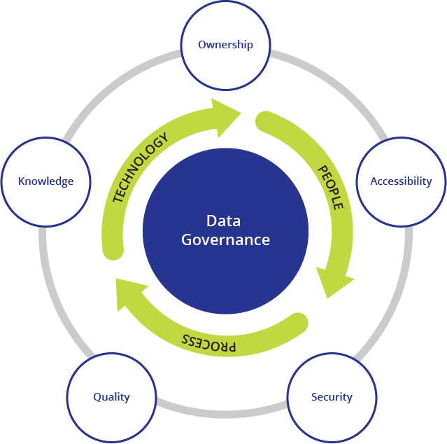
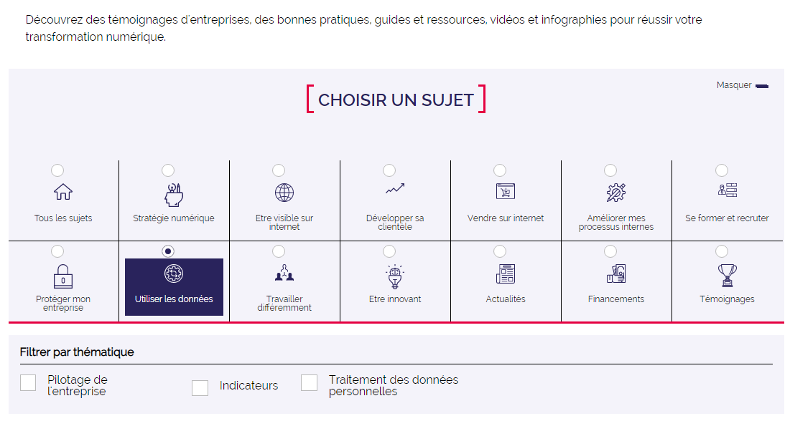

layout: true
  

`r paste0("
", params$event, " 

")` 

---

class: center, middle

Ces slides en ligne : http://datactivist.coop/SPoSGL/5A_module3.html

Sources : https://github.com/datactivist/SPoSGL/

Les productions de Datactivist sont librement réutilisables selon les termes de la licence [Creative Commons 4.0 BY-SA](https://creativecommons.org/licenses/by-sa/4.0/legalcode.fr).

 
 

.center[] 
---

.red[PARTIE 1 : LES DONNEES COMME LEVIERS D'OPPORTUNITES]

### 4. Améliorer les performances

#### 4.1 Créer de la valeur interne
#### 4.2 Utiliser ses propres données
#### 4.3 Prendre le tournant du numérique
*à lire : [Caisse enregistreuse et logiciel de caisse : des solutions numériques indispensables pour gérer son commerce](https://www.francenum.gouv.fr/comprendre-le-numerique/caisse-enregistreuse-et-logiciel-de-caisse-des-solutions-numeriques)*

#### Etude de cas : le ship from store de Caroll

---
class: inverse, center, middle
# Améliorer ses performances

L'usage des données internes démontre des bénéfices réels et concrets.

---

### .red[4.1 Créer de la valeur interne]

Il est question ici de créer de la valeur essentiellement interne, et non de gagner des parts de marché ou de créer de nouveaux produits ou services. Dans ce cadre, l'usage des données de l'entreprise va donc avoir deux objectifs principaux :

* **réduire les coûts** : les données vont par exemple permettre d'analyser les postes de dépenses et de trouver des solutions pour les optimiser (mieux gérer les stocks, améliorer la gestion des ressources humaines, etc.)

* **améliorer l'offre de produits ou de services** : une analyse des tendances et des pratiques de consommation peut par exemple amener à adapter le parcours client en point de vente ou son accompagnement, ou même à adapter des horaires d'ouverture.

---

### .red[4.2 Utiliser ses propres données]

Pour améliorer ses performances, l'entreprise ou la structure concernée va avant tout utiliser ses propres données. C'est pourquoi elle doit réfléchir et organiser la .red[**gouvernance des données**] : 

.pull-left[* identifier les données stratégiques
* s’assurer de la qualité et de la fiabilité des données
* permettre aux salariés d'accéder aux données dont ils ont besoin
* accuturer et former les salariés]

.pull-right[] 

---

class: inverse, middle
# à lire

*[Caisse enregistreuse et logiciel de caisse : des solutions numériques indispensables pour gérer son commerce](https://www.francenum.gouv.fr/comprendre-le-numerique/caisse-enregistreuse-et-logiciel-de-caisse-des-solutions-numeriques), une ressource pour le pilotage des entreprises par les données mise à disposition sur [le portail FranceNum](https://www.francenum.gouv.fr/).*

---

### .red[4.3 Prendre le tournant du numérique]

Dans le contexte de relance actuel, il peut être vital pour une entreprise de prendre le tournant du numérique dont l'usage des données fait partie intégrante. Or, comme le montre [une étude de 2020 de la Direction Général des Entreprises](https://www.francenum.gouv.fr/comprendre-le-numerique/besoins-des-tpe-pme-et-pratiques-numeriques-etude-dge-2020), beaucoup de petites entreprises notamment renoncent au numérique, souvent faute de temps et de connaissances en la matière. En France, 34% des dirigeants de TPE de 1 à 9 salariés déclarent avoir déployé ou être en train de déployer une transformation numérique.

Le gouvernement français a mis en place une initiative de soutien aux entreprises en la matière : [France Num](https://www.francenum.gouv.fr/france-num). L'usage des données y a biensur sa place :

.center[]

---

class: inverse, center, middle

# Etude de cas : Le ship from store de Caroll

---

#### .red[Fonctionnement]

[Caroll](https://www.caroll.com/fr_fr/la-marque/brand-story/) est une marque française de prêt-à-porter féminin avec un réseau d'environ 480 magasins.

Avant la mise en place du ship from store :
* les commandes web sont satisfaites avec le stock de l'entrepot. Lorsqu'un article est en rupture de stock à l'entrepot, il est indiqué en rupture sur le site web.
* la liste des produits achetés en magasin remonte chaque soir à l'entrepot qui expédit les articles manquant vers les magasins jusqu'à épuisement des stocks.

Le .red[**ship from store**] consiste à répondre aux commandes en ligne avec les articles disponibles en magasin lorsque ceux-ci sont indisponibles à l'entrepôt et donc sur le web. Ainsi, on crée du lien entre les différents stocks : ceux des magasins et ceux des entrepôts.

---

#### .red[Optimisation du système]

Pour que le système soit vraiment intéressant, il est important de l'optimiser et par exemple de :

* **limiter le nombre de colis** pour limiter les coûts d'expédition pour l'entreprise : lorsqu'une commande contenant plusieurs articles est passée, le système doit donner la priorité aux magasins qui ont tous les articles en stock.

* **limiter la distance** pour limiter l'empreinte carbone des dépacements d'articles et des expéditions.

* **ne pas solliciter toujours les mêmes magasins** : le personnel de vente a en charge la préparation et l'expédition des colis aussi ils ne doivent pas y consacrer trop de temps au risque de délaisser les clients physiques. De plus, si les mêmes grands magasins avec plus de stock sont sollicités trop souvent, il y a un risque de décevoir les clients qui se déplaceraient en boutique et feraient face à un manque constant de stock, les produits étant mis de côté pour l'expédition.

---

#### .red[Algorithme et données]

Dans les faits, il est nécessaire d'uniformiser les stocks et de relier les données de stock des entrepôts avec les données de l'ensemble des stocks des points de vente pour constituer un stock virtuel unique. C'est ce qu'on appelle une **stratégie omnicanale**.

De plus il faut concevoir un **algorithme de prise de décision** avec un **scoring** pour favoriser certains éléments d'optimisation par rapport à d'autres. Quel magasin sera prioritaire pour répondre à la commande : le plus proche du lieu de livraison ? celui qui a le plus de stock dans le ou les articles commandés ? celui capable de répondre à la commande dans son intégralité ?

---

#### .red[Bénéfices]

La mise en place du ship from store a permis de réduire le nombre de commandes en lignes non servies et de **satisfaire plus de clients**.
.center[]
Ce qui a permis d'améliorer les chiffres des ventes car plus d'articles sont vendus et plus le sont avant les soldes.
.center[]
Il y a de fait une **réduction des stocks** et des coûts qu'ils génèrent.

> *"Les besoins sur les ruptures de stocks en entrepôts, on arrive à les servir. Et par période, on sert jusqu’à 30% de nos commandes du site Web depuis nos magasins."*, Frédéric Mayette, ancien DSI de Caroll

---

class: inverse, center, middle

# Merci !

Contact : [julia@datactivist.coop](mailto:julia@datactivist.coop)