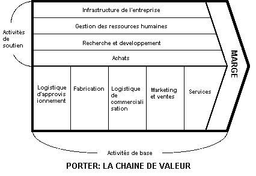

layout: true
  

`r paste0("
", params$event, " 

")` 

---

class: center, middle

Ces slides en ligne : http://datactivist.coop/SPoSGL/5A_module8.html

Sources : https://github.com/datactivist/SPoSGL/

Les productions de Datactivist sont librement réutilisables selon les termes de la licence [Creative Commons 4.0 BY-SA](https://creativecommons.org/licenses/by-sa/4.0/legalcode.fr).

 
 

.center[] 
---

.red[PARTIE 3 : LES DONNEES COMME ACTIFS STRATEGIQUES]

### 8. Changer d'activité

#### 8.1 Se déplacer sur la chaïne de valeur
#### 8.2 
#### 8.3 

#### Etude de cas : 

---
class: inverse, center, middle
# Conquérir et/ou défendre une position stratégique

Les données sont utilisées comme un moyen pour analyser les opportunités et y répondre. A ce titre, elles constituent un actif stratégique de la structure.

---

### .red[8.1 Se déplacer sur la chaîne de valeur]

L’entreprise  utilise  ses  propres  données  pour  se  déplacer  sur  la  .red[**chaîne  de valeur**], un concept par Michael Porter consistant à schématiser l’entreprise comme une suite d’activités interconnectées et productrices de valeur.

Le déplacement sur la chaîne de valeur peut se faire en **amont** ou en **aval** de l'activité première.

.center[]
.center[Adapté de Michael Porter, *L'avantage concurrentiel*, InterEditions, 1986]

---

### .red[8.2 ]

---

### .red[8.3 ]

---

class: inverse, center, middle

# Etude de cas : Netflix, de la distribution à la production de contenu

---

#### .red[Produire les données de sa réussite]

Absolument tout ce qui se passe côté utilisateur est loggé, stocké et utilisé pour personnaliser au maximum l'expérience. Les données sur lesquelles s'appuient les services de Netflix sont d'une grande richesse quantitative mais aussi qualitative.

* notations des contenus par les abonnés
* popularité des contenus (évaluée de multiples manières)
* données de lecture des vidéos (durée, heure, matériel...)
* listes d'attente
* interactions des abonnés avec la présentation d'un contenu
* termes de recherche
...

> *To properly learn how to personalize artwork we need to collect a lot of data to find signals that indicate when one piece of artwork is significantly better for a member.([source](https://medium.com/netflix-techblog/artwork-personalization-c589f074ad76))*

---

#### .red[Un algorithme de recommandation]

La fonction principale de la page d'accueil est d'aider chaque membre à trouver facilement quelque chose à regarder. Le défi consiste à **sélectionner** les contenus les plus pertinents pour l'abonné et de les **organiser** tout aussi pertinemment sur la page d'accueil.

L'algorithme de Netflix compose la page d'accueil de chaque abonné :
* il sélectionne les contenus adaptés parmis des milliers de vidéos
* il sélectionne les groupes thématiques adaptés à afficher (il existe 10000 groupes "rows" possibles)
* il organise l'affichage des groupes thématiques pour optimiser leur agencement dans la page
* il organise les vidéos dans un ordre pertinent au sein des groupes

.center[] 

---

#### .red[Faire des choix]

Chaque algorithme comporte un .red[scoring] qui lui permet de faire des choix. Celui de Netflix doit trouver le juste équilibre entre :
* répondre aux goûts personnels de chaque abonné et veillez à couvrir tous ses centres d'intérêts
* aider chaque abonné à trouver facilement le contenu qui va lui plaire mais aussi l'aider à explorer la diversité du catalogue et peut-être trouver de nouveaux centres d'intérêt
* montrer les nouveautés et la richesse du catalogue tout en maintenant une certaine continuité afin que l'abonné garde des points de repère et puisse retrouver un contenu qu'il se souvient avoir vu su sa page d'accueil.

---
class: inverse, middle
# Article

Pour en savoir plus :
Blog, Netflix Technology. [« Learning a Personalized Homepage »](https://netflixtechblog.com/learning-a-personalized-homepage-aa8ec670359a). Medium, 19 avril 2017.

---

#### .red[Une personnalisation très fine]

Le saviez-vous ? Netflix va jusqu'à personnaliser les visuels qu'il présente à ses abonnés ! Si auparavant la firme recherchait le meilleur visuel d'illustration pour tous ses membres, elle adapte maintenant le visuel à chaque abonné en fonction de ses goûts. 

.center[] 

Les illustrations personnalisées de Stranger Things couvrent toutes les facettes de la série (fantastique, vintage, angoisse, amitié, adolescence...) pour attirer un public plus varié vers ce programme.

---

#### .red[Une personnalisation très fine]

> *Chloé, abonnée Netflix :
"J'avais remarqué que sur le profil de mon copain, le visuel pour Lucifer était une image de combat alors que moi j'avais la version Lucifer torse nu ! Je rigole en imaginant comment l'algorithme m'a catégorisée !"*

Cette personnalisation peut également se faire en fonction des acteurs et actrices que les abonnés apprécient d'après leurs données :

.center[] 

---
class: inverse, middle
# Article

Pour en savoir plus :
Blog, Netflix Technology. [« Artwork Personalization at Netflix »](https://netflixtechblog.com/artwork-personalization-c589f074ad76). Medium, 7 décembre 2017. https://netflixtechblog.com/artwork-personalization-c589f074ad76.

---

### .red[Une production de contenus basée sur les données]

Dans une industrie historiquement influencée par l'intuition, Netflix revendique de faire du **"data driven programming"**.

**La position de distributeur donne ainsi un avantage concurrentiel unique à Netflix en tant que producteur** : Netflix se base sur ses données d'activité de distrubtion pour prendre des décisions dans ses activités de production.

> Netflix à Kevin Spacey :
“We believe in you. We’ve run our data and it tells us that our audience would watch this series. We don’t need you to do a pilot. How many do you wanna do?” ([source](https://www.newyorker.com/business/currency/hollywoods-big-data-big-deal?intcid=mod-most-popular))

(Mais le facteur humain reste significatif, même chez Netflix, d'après [ce meme article](https://www.newyorker.com/business/currency/hollywoods-big-data-big-deal?intcid=mod-most-popular))

---

class: inverse, center, middle
# Video

.center[
<iframe width="560" height="315" src="https://www.youtube.com/embed/cVyXtpJAOIk" frameborder="0" allow="accelerometer; autoplay; encrypted-media; gyroscope; picture-in-picture" allowfullscreen></iframe>
]

---

class: inverse, center, middle

# Merci !

Contact : [julia@datactivist.coop](mailto:julia@datactivist.coop)