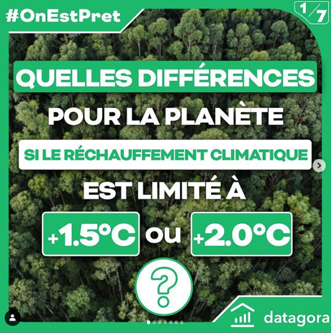
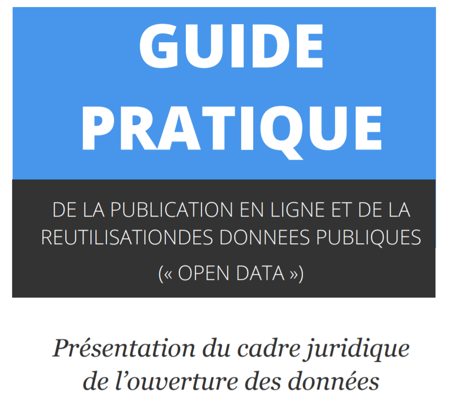
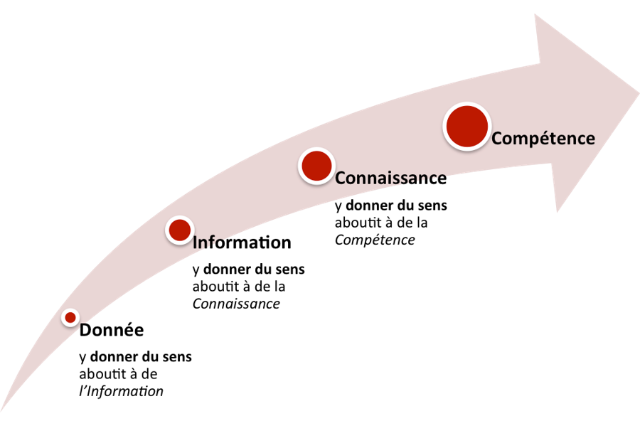

layout: true
  

`r paste0("
", params$event, " 

")` 

---
## Qui sommes-nous ?

    

### We .red[open data], we make them .red[useful]

---
## Qui sommes-nous ?

- Datactivist est un .red[**pure player de l’open data**] créé en 2016, par Samuel Goëta et Joël Gombin.

- Se positionnant sur .red[**toutes les étapes du travail d’ouverture des données**], Datactivist travaille tant avec les producteurs de données qu’avec les réutilisateurs et participe à l’appropriation des données par chacun.

- Nous appliquons nos propres .red[**valeurs**] : nous sommes une coopérative ; nos supports de formation et nos contenus sont librement réutilisables, publiés en licence Creative Commons.

- Une approche issue de la recherche : voir notamment **https://datactivist.coop/these**. 

- Nous animons la communauté [#TeamOpenData](https://teamopendata.org).

---
## Qui sommes-nous ?

---
## Qui je suis

+ Timothée Gidoin (@TGidoin), coordinateur du cours avec Cécile Le Guen (@CecileLG) ainsi que d'autres cours pour les 2A, 4A et 5A

+ Sociétaire Datactivist (@Datactivi_st) et consultant Open Data

+ Cofondateur de Datagora (@Datagora)

+ Diplômé de l'Edhec et Sciences Po

+ Professeur vacataire à Sciences Po (EAP, Master Politiques Publiques)

+ Breton

---
Class:
## Datagora

 

.pull-left[

[Instagram Datagora](https://www.instagram.com/datagora.fr/)]

.pull-right[

[Twitter Datagora](https://twitter.com/Datagora)]

---

##Et vous ?

- Quel Bac ? 

- Région parisienne ?

--

- Notions autour des données ? des statistiques ?

- Développement informatique ?

---
## Allons y gaiement

.center[]

---
## Objectifs de la séance
   

- Point sur l'organisation du cours
 

- Comprendre ce qu'est une donnée (sections 1 et 2)
 

- L’écosystème des sources de données publiques (section 4)
 

- Bonus : manipulation et représentation de données (section 5)

---
class: inverse, center, middle

# .red[Organisation du cours]

---
## Organisation du cours

- **Tous les supports de cours seront sur le e-campus à partir d'ici fin septembre**

- 10 sections, dont 1 cours introductif en présentiel

- 1 séance de questions / réponses via e-campus à déterminer (fin octobre)

- Chaque section représente environ **2 heures** (lectures obligatoires comprises)

- 1 section sur 2 contient un **podcast**

- Chaque section se finira par un **quiz**, noté !

---
## Plan de cours

**.red[Section 1]** - Introduction : qu’est-ce qu’une donnée ? Petite histoire sociale des données et de leur exploitation 

**.red[Section 2]** - Datafication : les promesses de la mise en données du monde

**.red[Section 3]** - Données, données… quelles données ? Les différents types de données

**.red[Section 4]** - L’écosystème des sources de données publiques 

**.red[Section 5]** - Manipulation et représentation de données : éviter des écueils classiques 

---
## Plan de cours

**.red[Section 6]** - Open data, big data, linked data, data API : les habits neufs de la donnée 

**.red[Section 7]** - Les modèles économiques liés aux données - focus ville intelligente

**.red[Section 8]** - Cadre juridique de l’open data, des données personnelles et protection de la vie privée

**.red[Section 9]** - Qu’est-ce que la data science ? 

**.red[Section 10]** - Qu’est-ce que la data science ? Partie 2

---
class:middle, center
## Echauffement :
### 2 minutes, 10 données

Vous avez 2 minutes

Vous devez trouver 10 données dans notre environnement immédiat

Pas de recours aux écrans !

.footnote[[source](http://infolabs.io/5-minutes-20-donnees)]

---
class:center,inverse, middle
# Qu'est-ce 
# qu'une donnée ?

---
## Qu'est-ce qu'une donnée ?

> *Une donnée correspond à la représentation d'une information sous une forme conventionnelle destinée à faciliter son traitement*

.center[] 

.footnote[[source](https://www.cnil.fr/sites/default/files/atoms/files/guide_open_data.pdf)]
---
## Le censeur à Rome, ancêtre de la statistique
.center[.reduite3[]]

.footnote[Source : *Asterix chez les pictes*, © Albert René 2013]
---
## Le censeur à Rome, ancêtre de la statistique
.center[.reduite3[]]

.footnote[*Asterix chez les pictes*, © Albert René 2013]
---
## La statistique : outil de gouvernement et de preuve
.pull-left[.middle[La statistique est à la fois :

  + **outil de gouvernement** (_Statistik_ - 18e siècle), et
  
  
  + **outil de preuve** (_statistics_ - 19e siècle)]]
.pull-right[.reduite2[]]
---
  
## [Quantifier, c'est convenir puis mesurer](http://www.pressesdesmines.com/media/extrait/PourSocioHistExtr.pdf)

.pull-left[
> Le verbe quantifier est employé ici dans un sens large : **exprimer et
faire exister sous une forme numérique ce qui, auparavant, était exprimé par
des mots et non par des nombres**.]

.pull-right[.reduite2[]]

---
## [Quantifier, c'est convenir puis mesurer](http://www.pressesdesmines.com/media/extrait/PourSocioHistExtr.pdf)

.center[.reduite3[]]

.footnote[*Asterix chez les pictes*, © Albert René 2013]

---
## Quantifier, c'est inscrire et figer une réalité sans cesse mouvante

.center[.reduite3[]]

.footnote[*Asterix chez les pictes*, © Albert René 2013]

---
class:inverse, middle, center
# Vers une définition des données

---
## Etymologie

### Latin : _dare_ (donner) > _datum_ (donné) > _data_ (donnés)
  
Ce qui est évident, va de soi, est accepté sans discussion

  

> L'existence d'une donnée est indépendante de toute considération de la vérité ontologique correspondante. Lorsqu'un fait s'avère être faux, il cesse d'être un fait. 
Les fausses données n'en restent pas moins des données.

.footnote[[Rosenberg, 2013](https://mitpress.mit.edu/books/raw-data-oxymoron)]

---

## Vers une définition

.pull-left[.reduite3[

⏺ enregistrabilité +🏗 briques de base ("*buildings blocks*")]]
.pull-right[
> *Les données sont généralement comprises comme étant la matière première produite par la synthèse du monde en catégories, mesures et autres formes de représentation - nombres, caractères, symboles, images, sons, ondes électromagnétiques, bits - qui constituent les éléments de base à partir desquels l'information et le savoir sont créés. *]

---
Class:
## La pyramide Data-Information-Knowledge-Wisdom

.pull-left[

]

.pull-right[Attribuée à [Russell Ackoff](http://en.wikipedia.org/wiki/Russell_L._Ackoff), 1989

Les données peuvent être des :

- faits
- signal/stimulis
- symboles]

---
Class:
## La pyramide Data-Information-Knowledge-Wisdom

- Les **.red[données]** sont la matière "brute" d'où naît l'information.

- **.red[L'information]** pourrait être définie comme des données qui ont été consignées,
classées, organisées, raccordées ou interprétées dans un cadre qui en dégage le sens

- En donnant du sens à de l'information, on obtient de la **.red[connaissance]**

- En donnant du sens à la **.red[connaissance]** on obtient du savoir

---
Class:
## La pyramide Data-Information-Knowledge-Wisdom

.center[]

_NB : le haut de la pyramide, est parfois remplacé par "compétence"_

---
class: inverse, center, middle

## La mise en données du monde

---
## "Datafication" : la mise en données du monde
> “L'immense gisement de données numériques découle de la capacité à paramétrer des aspects du monde et de la vie humaine qui n'avaient encore jamais été quantifiés. On peut qualifier ce processus de **« mise en données » (datafication)**. 

> […] “La mise en données désigne autre chose que la numérisation, laquelle consiste à traduire un contenu analogique - texte, film, photographie - en une séquence de 1 et de 0 lisible par un ordinateur. Elle se réfère à une action bien plus vaste, et aux implications encore insoupçonnées : **numériser non plus des documents, mais tous les aspects de la vie**.”

.footnote[[Kenneth Cukier, “Mise en données du monde, le déluge numérique”](https://www.monde-diplomatique.fr/2013/07/CUKIER/49318)]

---

## La "nombrification" du monde

.pull-left[.reduite[]]
.pull-right[
> La numérisation ne serait pas survenue sans une "nombrification" préalable qui consiste à quantifier de plus en plus d'aspects de notre expérience du réel.
> **Au commencement était le verbe, il semble à la fin que tout devient nombre.**
> Personne ne saurait parler sérieusement de l'état de la société et discuter politique sans se référer aux informations quantitatives.]

---
Class: middle, center

## La mise en données du monde

- **Concrètement, aujourd'hui, quels aspects de votre vie sont mis en données ?**

--

- Recherches internet, pratiques sportives, consommation énergie, régime alimentaire, trajets dans les transports en commun...

- Cette mise en donnée est rendue possible par le développement de .red[**capteurs**] qui viennent collecter et agréger ces données. **Avez-vous des exemples de capteurs ?**

--

- Recherches internet .red[(cookies)], pratiques sportives .red[(montres connectées)], consommation énergie .red[(compteurs connectés)], régime alimentaire .red[(appli type Yuka)], trajets dans les transports en commun .red[(Pass Navigo)]...

- La question devient peut-être, *quels aspects de votre vie ne sont pas (encore) mis en données ?*

---

class: center, middle

Ces slides en ligne : https://datactivist.coop/SPoSGL/sections/index.html

Sources : https://github.com/datactivist/SPoSGL/

Les productions de Datactivist sont librement réutilisables selon les termes de la licence [Creative Commons 4.0 BY-SA](https://creativecommons.org/licenses/by-sa/4.0/legalcode.fr).

 
 

---
## Le nouveau positivisme des données

> Si vous me demandiez de décrire la philosophie naissante du jour, je dirais que c’est du **data-isme**. Nous sommes maintenant en mesure de collecter d'énormes quantités de données. Cette capacité semble comporter certaines hypothèses culturelles - à savoir que **tout ce qui peut être mesuré doit être mesuré; que les données constituent un filtre transparent et fiable nous permettant de mettre côté les émotions et l'idéologie**; ou encore que les données nous aideront à faire des choses remarquables - comme prédire l'avenir

David Brooks, éditorialiste du New York Times, ["The Philosophy of Data"](https://www.nytimes.com/2013/02/05/opinion/brooks-the-philosophy-of-data.html)

.center[]

---
## Le nouveau positivisme des données

- Attention, les données, même provenant de sources officielles, ne sont pour autant neutres, irréprochables ou porteuses de "LA" vérité

.center[]

- **Avez-vous des exemples de données officielles pouvant qui peuvent faire l'objet de critiques ?**
--

- Délinquance, immigration, SDF...

.footnote[© Scott Adams]

---
Class:

## Les données brutes sont un oxymore

.pull-left[
> Les données sont toujours "cuisinées" et jamais tout à fait "brutes"

> Les données ont besoin au préalable d'être imaginées comme données pour exister et fonctionner comme telles. L'imagination de ces données implique une base d'interprétation

]
.pull-right[

.footnote[© Xavier Gorce 2018]]

.footnote[[Source](https://mitpress.mit.edu/books/raw-data-oxymoron)]
---

## Data or capta ?

> Techniquement, ce que nous nous appelons "donnée" est généralement **"capturé"** (issu du latin "capere", signifiant "prendre"); ces unités de données qui ont été sélectionnées et collectées parmi l'ensemble de toutes les données possibles

[Kitchin, 2014](https://books.google.fr/books?hl=fr&lr=&id=GfOICwAAQBAJ&oi=fnd&pg=PP1&dq=kitchin+data+revolution&ots=pcyfMTZh-V&sig=dQyPTL3AIN_4RdWvtBFw4VjdAa4#v=onepage&q=kitchin%20data%20revolution&f=false)

.center[] 

---

## Données ou obtenues ? 

> Décidément, on ne devrait jamais parler de “données”, mais toujours d’ “obtenues”.

[Bruno Latour, 1993](http://www.bruno-latour.fr/fr/node/255)

.center[] 

---
class:center, middle, inverse
##Pause café : 5 minutes
