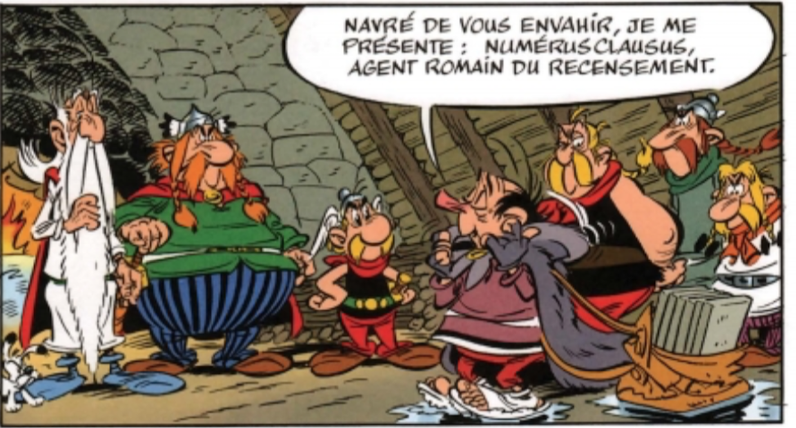

layout: true
  

`r paste0("
", params$event, " 

")` 

---

class: center, middle

Ces slides en ligne : http://datactivist.coop/SPoSGL/

Sources : https://github.com/datactivist/SPoSGL/

Les productions de Datactivist sont librement réutilisables selon les termes de la licence [Creative Commons 4.0 BY-SA](https://creativecommons.org/licenses/by-sa/4.0/legalcode.fr).

 
 

.center[] 

---
## Plan du cours

#### .red[1- "Au fait, c'est quoi une donnée ?"]

Ecouter ["l'interview de Serge Abiteboul, commissaire scientifique de l’exposition Terradata et directeur de recherche à l’Inria"](commissaire scientifique de l’exposition et directeur de recherche à l’Inria)

#### .red[2- L'industrialisation de la production des données]

Ecouter le podcast "Section 1 -"

#### .red[3- La fin de la science ?]

Lire l'article ["
Big Data : est-ce que le déluge de données va rendre la méthode scientifique obsolète ?
"](http://internetactu.blog.lemonde.fr/2011/09/30/big-data-est-ce-que-le-deluge-de-donnees-va-rendre-la-methode-scientifique-obsolete/)

**Bibliographie**

.center[**Quizz section 2**]
---
## Introduction 

#### Ecoutez le .red[podcast introductif] de la section 1 

.center.reduite[]

.footnote[© Editions Albert René]

---
class: inverse, center, middle

## Quizz section 2 : rdv sur votre espace e-campus !

---
class: inverse, center, middle

# Merci !

Contact : [samuel@datactivist.coop](mailto:samuel@datactivist.coop)