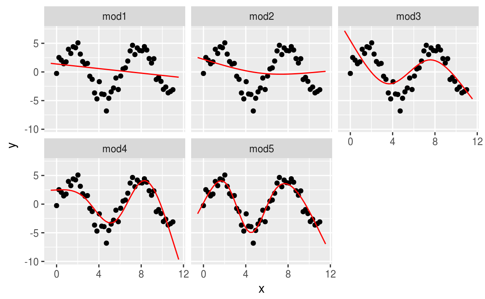
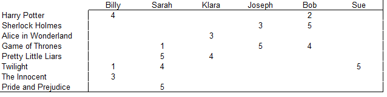
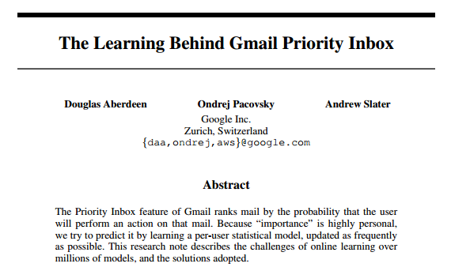
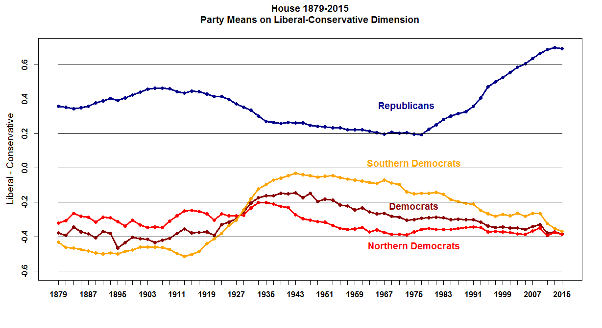

layout: true
  

`r paste0("
", params$event, " 

")`

---

class: center, middle

Ces slides en ligne : https://datactivist.coop/SPoSGL/sections/section10.html

Sources : https://github.com/datactivist/SPoSGL/

Les productions de Datactivist sont librement réutilisables selon les termes de la licence [Creative Commons 4.0 BY-SA](https://creativecommons.org/licenses/by-sa/4.0/legalcode.fr).

 
 

 

---
## Plan du cours

#### 1 - [Pourquoi modéliser ? Analyser ou prédire](#4)

#### 2 - [Les modèles statistiques](#14)

#### 3 - [Et le machine learning alors ?](#20)

---
class:center, middle, inverse

# 1 - Pourquoi modéliser ? Analyser ou prédire

---
## Pourquoi modéliser ?

.reduite[.center[]]

---
## Pourquoi modéliser ?

Ce graphique résume un modèle proposé par l'économiste Douglas Hibbs pour prédire le résultat des élections présidentielles américaines, sur la base d'un modèle très simple, ne prenant en compte que deux variables : la croissance du revenu réel ("bread"), et le nombre de victimes américaines dans des opérations militaires ("peace"). 

Il est évident qu'il existe de meilleurs modèles prédictifs - basés sur les sondages préélectoraux, par exemple. Mais, en se limitant à un petit nombre de variables explicatives, économiquement ou politiquement significatives, ce modèle entend avant tout **fournir des clés d'explication des résultats**, plutôt que la **plus grande précision prédictive possible**. 

---
## Pourquoi modéliser ?

Il y a donc deux ambitions possibles, très différentes, pour un modèle statistique :

- pour analyser et expliquer

- pour prédire

Ces deux dimensions peuvent être présentes dans des proportions variables : ce n'est pas forcément uniquement l'une ou l'autre. Mais il y a une tension entre elles : les modèles les plus prédictifs ne sont généralement les plus explicatifs, et réciproquement.  

---
## Modéliser pour analyser

Dans cette version, on :

- construit un **modèle réduit** de la réalité

- cherche à **isoler le rôle de chaque variable**

- raisonner "**toutes choses égales par ailleurs**" (_ceteris paribus_)

---
## Modéliser pour analyser

Modéliser, c’est mettre en relation une *variable expliquée*
(dépendante / prédite) et une ou plusieurs *variables explicatives*
(indépendantes / prédicteurs). On peut l'écrire mathématiquement de cette manière :

$$ Y = f(X_1, X_2, X_3, ..., X_n) $$

L’**estimation** du modèle consiste à estimer la valeur des paramètres
(ou coefficients). Le cas du modèle linéaire (on connaît $Y$ et les $X$, on cherche à estimer $\alpha$, les $\beta$ et $\epsilon$) :

$$ Y = α + β_1X_1 + β_2X_2 + β_3X_3 + · · · + β_nX_n + \epsilon $$

Ce que fait l'humain, c'est construire ce modèle, en choisir les variables qui semblent pertinentes. Ensuite, c'est l'ordinateur qui procède à l'estimation des paramètres. 

---
## Modéliser pour analyser

Modéliser, dans cette approche, implique donc de faire des hypothèses sur la spécification du modèle :

- quelles sont les variables explicatives pertinentes (cela suppose d'avoir une **théorie**)

- quelle est la distribution des erreurs (aka résidus - i.e., l'écart entre la valeur prédite par le modèle et la valeur observée) (le plus souvent, on choisit la distribution dite "normale" car elle présente des propriétés mathématiques intéressantes et rend le modèle facile à estimer). 

---
## Les distributions

Lorsqu'on parle de distribution (sous-entendu, distribution des erreurs du modèle), on peut en fait parler de deux choses bien distinctes :

- la distribution théorique (ex : distribution "normale" ou gaussienne). Il s'agit d'une notion mathématique abstraite, par exemple la distribution prise par les jets d'un dé si celui-ci était parfaitement équilibré et qu'on tirait le dé un nombre infini de fois. 

- distribution empirique (la distribution observée des valeurs auxquelles on s'intéresse). Il s'agit ici du résultat concret de l'observation d'un phénomène.

http://shiny.calpoly.sh/Prob_View/

La modélisation "classique" consiste à rechercher quelle distribution théorique approxime le mieux la distribution empirique. En effet, on peut résumer une distribution théorique par un petit nombre de paramètres (par exemple, pour la distribution normale, la moyenne et l'écart-type). 

---
## All models are wrong, some are useful

> Since all models are wrong the scientist cannot obtain a "correct" one by excessive elaboration. On the contrary following William of Occam he should seek an economical description of natural phenomena. 

> *Puisque tous les modèles sont faux, le scientifique ne peut pas en obtenir un "correct" en élaborant toujours davantage. Au contraire, en suivant Guillaume d'Ockham, il devrait chercher une description économe des phénomènes naturels.*

[George Box](https://dx.doi.org/10.1080%2F01621459.1976.10480949)

---
## All models are wrong, some are useful

.reduite[.center[]]

---
class: inverse, middle, center

# 2 - Les modèles statistiques

---
## Modèles statistiques

Du fait des deux finalités possibles (comprendre et prédire), tout modèle statistique est un compromis entre intelligibilité et fidélité aux données. Comprendre exige de se concentrer sur un petit nombre de variables, et d'accepter un degré d'erreur relativement élevé. Prédire conduit à minimiser l'erreur, et pour cela inclure un grand nombre de variables, dont certaines peuvent ne fournir aucune valeur ajoutée en termes de compréhension mais être très prédictives.

Par exemple, le meilleur prédicteur de la taille du pied droit d'un individu est la taille... de son pied gauche. Très utile pour prédire, pas du tout pour comprendre !

---
## Estimation d'un modèle

Dans le cas d'un modèle linéaire (les plus courants), on recoure pour l'estimation à la méthode des moindres carrés ordinaires (MCO, ou OLS en anglais). Elle présente l'avantage de ne pas nécessiter de puissance de calcul importante, et permettait ainsi l'estimation de modèles avant l'invention de l'ordinateur.

Cette page propose un exemple interactif pour comprendre la méthode des moindres carrés : http://setosa.io/ev/ordinary-least-squares-regression/

---
## Underfitting et overfitting

Dans un modèle il faut trouver un équilibre entre le risque d'une part de ne pas assez "coller" aux données (underfitting), et celui d'autre part de trop y coller (overfitting). Dans le premier cas on ignore de l'information, dans le second on prend pour de l'information ce qui n'est que du bruit.   

.reduite[.center[]]

---
## Underfitting et overfitting

Pour éviter l'overfitting :

- le principe fondamental est de différencier les données d'apprentissage (sur lesquelles on estime le modèle) et les données de test (sur lesquelles on évalue la qualité prédictive du modèle) 

- En outre, il ne faut utiliser les données de confirmation (test) qu'une fois : en effet une fois qu'on a sélectionné un modèle sur la base de ces données de test, ce sont devenues des données d'apprentissage...

- On peut utiliser des méthodes dites de pénalisation : elles consistent à favoriser des modèles "simples" plutôt que des modèles "complexes" 

---
## Extrapolation

Un modèle underfitté ou overfitté sera très mauvais en extrapolation (prédiction au-delà des valeurs connues du modèle). L'extrapolation est, de toute façon, difficile...

[.reduite[.center[]]](http://r4ds.had.co.nz/model-basics.html)

---
class: inverse, center, middle

# 3 - Et le machine learning alors ?

---
## Et le machine learning alors ?

- Fondamentalement, modélisation et machine learning ne sont pas différents, du point de vue d'un statisticien : il s'agit de modéliser un $Y$ en fonction d'un ensemble de variables/*features* $X_i$

- une des différences principales toutefois : veut-on prévoir (machine learning) ou comprendre/analyser (modélisation statistique traditionelle) ?

- et donc : peut-on, veut-on interpréter les coefficients (modélisation statistique traditionnelle : oui, machine learning : non) ?

- en pratique, le machine learning porte généralement sur des données plus complexes (volumétrie plus importante, données de type image, vidéo, son, langage naturel...) que la modélisation traditionnelle

- Elles comportent aussi souvent beaucoup de valeurs manquantes. 

---
## Et le machine learning alors ?

En *machine learning* on travaille souvent à partir de ce genre de tableau (notes attribuées par des lecteurs à des livres - on veut pouvoir prédire les valeurs des cases vides) :

.reduite[.center[]]

---
## Concepts de machine learning

- Apprentissage **supervisé** (on donne à la machine des données déjà classifiées) vs **non supervisé** (on laisse la machine dégager ses propres classifications)

- Apprentissage supervisé : il faut des données déjà classées/étalonnées. Souvent à la main ! => [*#digitallabour*](https://fr.wikipedia.org/wiki/Travail_num%C3%A9rique)

---
## Apprentissage supervisé 

Par exemple, les *reCaptcha* permettent à Google d'améliorer ses algorithmes d'OCR (pour Google Books ou Google Street View, notamment). 

[.reduite[.center[]]](https://fakecaptcha.com)

---
## Apprentissage supervisé

On peut par exemple détecter automatiquement l'orientation d'un toit, pour déterminer son potentiel de production d'électricité photovoltaïque. 

[.reduite[.center[]]](https://opensolarmap.org)

---
## Apprentissage supervisé

Ou encore prédire si un email est prioritaire ou non. 

[.reduite[.center[]]](https://static.googleusercontent.com/media/research.google.com/en//pubs/archive/36955.pdf)

---
## Apprentissage non supervisé 

- Le problème majeur auquel répond l'apprentissage non supervisé est celui de la réduction de la dimensionnalité : on a des données caractérisées par des dizaines/centaines/milliers/millions de variables, et donc difficiles à explorer. 

- Ces jeux de données à très haute dimensionnalité sont impossibles à explorer visuellement. Comment simplifier l'information et la résumer ?

---
## Apprentissage non supervisé 

Exemple de l'ensemble des votes au Congrès américain de 1879 à 2015 : des milliers de variables, résumées en une seule dimension ("liberal" vs "conservative"). 

.reduite[.center[]]

---
## Apprentissage non supervisé 

Il est notamment beaucoup utilisé sur de vastes corpus textuels, pour identifier des sujets par exemple.

L'exemple d'un algorithme largement utilisé (LDA) de détection de sujets dans un vaste corpus textuel : https://gallery.shinyapps.io/LDAelife/

---
## Quelques familles d'algorithmes notoires

- la régression (linéaire, logistique, LOESS...), éventuellement régularisée (Ridge, LASSO...)

- les arbres de décision

- Naive Bayes (indépendance des attributs)

- Réseau bayésien (graphe de corrélation entre variables, inclut des _priors_)

- réseau de neurones (perceptron, back-propagation, Hopfield network...)

- Deep learning

- Random forest, Boosting, Gradient Boosting

- Support vector machine

- etc. 

---
## Apprentissage non supervisé

- clustering : k-means, k-medians, CAH... 

- réduction de la dimensionnalité : ACP, analyse géométrique des données, MDS, LDA topic clustering...

- analyses de réseau

- word2vec

- etc.

---
## Apprentissage non supervisé

Le développement des réseaux de neurone permet le développement assez convaincant de méthodes non supervisées... à condition d'avoir des corpus suffisamment importants ! Voir l'exemple des word embeddings, qui permet de restituer de manière automatique de la sémantique. 

[Word2vec](https://www.tensorflow.org/tutorials/word2vec) :

.reduite[.center[]]

---
## Le cas du deep learning

Le *deep learning* est devenu l'une des méthodes d'apprentissage les plus en vogue. Il s'appuie sur la méthode des "réseaux de neurone", remise au goût du jour par le Français Yann Le Cun (aujourd'hui directeur de la recherche en IA chez Facebook, prix Turing 2019) dans les années 1990. 

Comment apprendre à un ordinateur à lire ? Ce qu'un ordinateur "voit", ce ne sont pas des chiffres, mais des pixels en niveaux de gris. 

---
## Le cas du deep learning

Prenons une centaines de chiffres manuscrits. Comment permettre à l'ordinateur de deviner de quels chiffres il s'agit ? 

.reduite[.center[]]

---
## Le cas du deep learning

Le concept de base des réseaux de neurones est celui du perceptron. D'un point de vue logique, il s'agit d'une cellule (comparable à un neurone) transformant plusieurs inputs en un output.   

.reduite[.center[]]

---
## Le cas du deep learning

On parle de "réseaux de neurones" car on couple plusieurs de ces perceptions, sur plusieurs couches. En articulant ainsi de nombreuses cellules réalisant des opérations simples, on peut au final réaliser des opérations très complexes, par exemple reconnaître un chiffre. 

.reduite[.center[]]

---
## Le cas du deep learning

On parle de "couches cachées" pour évoquer les couches du réseaux de neurones situées entre celle des inputs et celle des outpits. On parle d'apprentissage pprofond du fait de l'empilement de ces couches cachées.  

.reduite[.center[]]

---
## Le cas du deep learning

La valeur des inputs est celle prise par chaque pixel (il y en a 256) de l'image. 

.reduite[.center[]]

---
## Le cas du deep learning

.reduite[.center[]]

---
## Le cas du deep learning

L'estimation des poids (~ coefficients) associés à chaque neurone se fait par une méthode dite du "gradient descent", qui repose sur l'utilisation de la simulation et donc de moyens de calculs très puissants. 

.reduite[.center[]]

---
## Le cas du deep learning

Voici un (petit) réseau de neurones en action. 

http://playground.tensorflow.org/

---
## Le cas du deep learning

Le deep learning permet de décomposer un problème complexe (reconnaissance faciale, par exemple) en un grand nombre de problèmes simples.  

=> beaucoup de couches cachées 

=> permet l'émergence de la notion d'**abstraction** (un visage se décompose en un nez, une bouche, des yeux, des oreilles...)

---
## Les points auxquels prêter attention

- *feature selection* : quels sont les éléments qu'on donne à l'algorithme d'apprentissage, et comment sont-ils qualifiés ?

- régularisation (favorise les modèles simples par rapport aux modèles compliqués, pour éviter l'*overfitting*)

- qualité du critère d'optimisation

- qualité des données d'input (*Garbage in, garbage out !*)

- ...

---
## Quelques champs d'application des réseaux de neurones

- traitement d'image : reconnaissance d'images

- traitement du signal : par exemple de la parole, génération d'un discours avec une voix particulière

- traitement automatique des langues (TAL) : traduction, génération de texte (modèles génératifs comme ChatGPT ou LLama)

- ...

---

## Ressources complémentaires

### 1- [Comment reconnaître un hot dog ?](https://medium.com/@jaimejcheng/hot-dog-or-not-a-lesson-on-image-classification-using-convolutional-neural-networks-a2b92e81f4ad) 

### 2- [Ce qui se cache derrière le fonctionnement de ChatGPT - ScienceEtonnante](https://www.youtube.com/watch?v=7ell8KEbhJo) 

---
class: inverse, center, middle

## Quiz section 10 (le dernier) : rdv sur le campus numérique

---
class: inverse, center, middle

# Merci !

Contact : [clement@datactivist.coop](mailto:clement@datactivist.coop)