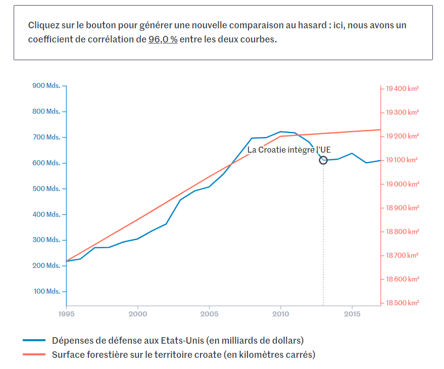
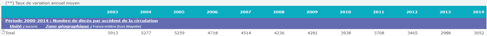
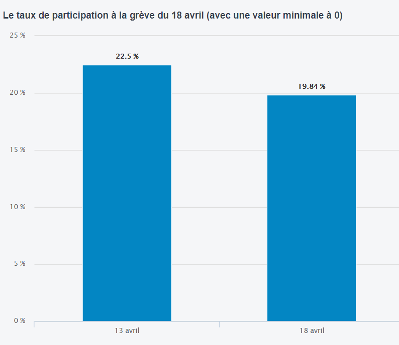
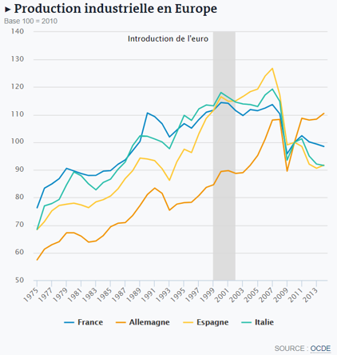
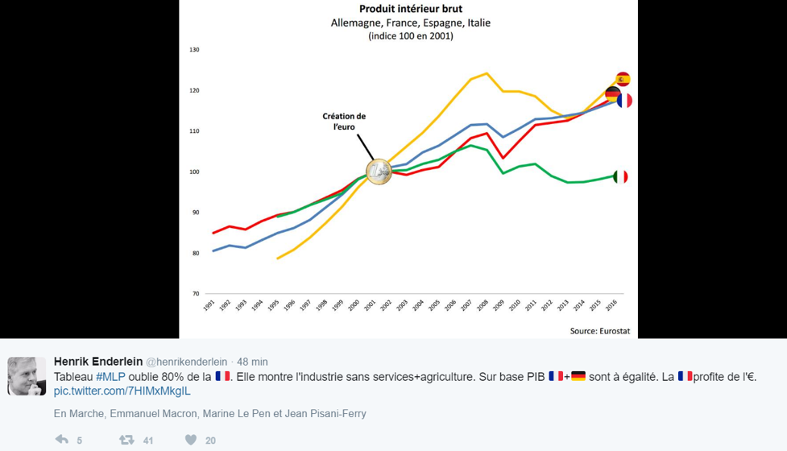
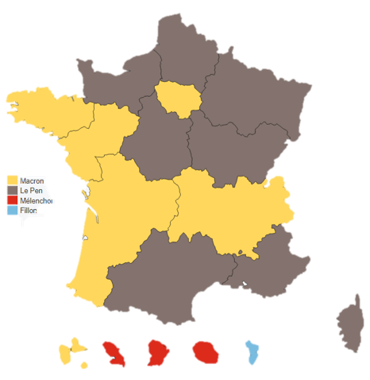
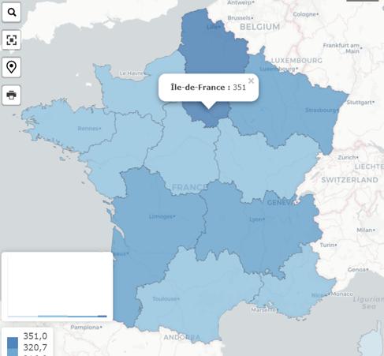
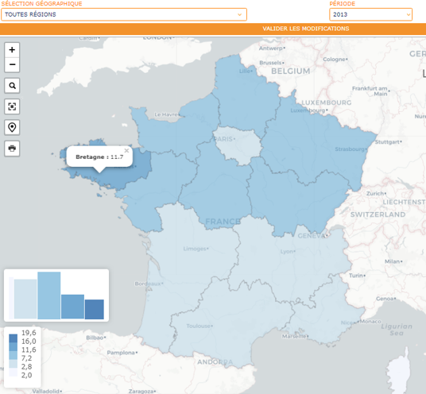

layout: true
  

`r paste0("
", params$event, " 

")`

---

class: center, middle

Ces slides en ligne : https://datactivist.coop/SPoSGL/sections/section5.html

Sources : https://github.com/datactivist/SPoSGL/

Les productions de Datactivist sont librement réutilisables selon les termes de la licence [Creative Commons 4.0 BY-SA](https://creativecommons.org/licenses/by-sa/4.0/legalcode.fr).

 
 

 

---
## Plan du cours

**1. .red[Les pièges statistiques récurrents]**

Lire l'article d'Hervé le Bras ["La France inégale : Qui vote FN ? Pas forcément ceux à qui l’on pense"](https://theconversation.com/la-france-inegale-qui-vote-fn-pas-forcement-ceux-a-qui-lon-pense-75977)

**2. .red[Représentations graphique et spatiale, attention danger !]**

Jouer avec le [générateur aléatoire de corrélations absurdes](https://www.lemonde.fr/les-decodeurs/article/2019/01/02/correlation-ou-causalite-brillez-en-societe-avec-notre-generateur-aleatoire-de-comparaisons-absurdes_5404286_4355770.html)

**3. .red[Les limites inhérentes aux indicateurs]**

Lire l'article du Monde ["Pourquoi les chiffres sur la délinquance sont à prendre avec précaution"](https://www.lemonde.fr/les-decodeurs/article/2018/08/27/pourquoi-les-chiffres-sur-la-delinquance-sont-a-manipuler-avec-precaution_5346721_4355770.html)

*Bibliographie*

.center[**quiz section 5**]
---

## En guise d'introduction... :)

Rappel sections 1 et 2 : les données sont rarement "neutres"...

.center[]

.footnote[© Xavier Gorce]

---
class: inverse, center, middle

## 1. Les pièges statistiques récurrents

---
## Médiane ou Moyenne ?

- Salaire mensuel **.red[moyen]** net en France en 2014 (secteur privé) : **2 225€**
- Salaire mensuel **.red[median]** net en France en 2014 (secteur privé) : **1 783€**
Soit une différence de près de 450€ !

.center[]

---
## Médiane ou Moyenne ?

Rappelez-vous que **la moyenne est très sensible aux .red[valeurs extrêmes]...**

.center[]

---
## Corrélation ou causalité ?

Rappel : une corrélation fortement positive, avec un coefficient de corrélation (r) > 0,5, signifie seulement que deux variables évoluent dans le même sens. Cela ne dit **rien** sur le possible lien entre elles
- Faites attention aux **corrélations fallacieuses** !
- Exemple ici avec la corrélation quasi parfaite entre la consommation de fromage par personne et le nombre de personnes qui décèdent étranglées dans leurs draps

.center[]

---
## Corrélation ou causalité ?

A l'instar du site parodique ["Spurious Correlations"](http://tylervigen.com/spurious-correlations) dont le graphique précédent est issu, les Décodeurs du monde ont récemment lancé un [générateur aléatoire de comparaisons](https://www.lemonde.fr/les-decodeurs/article/2019/01/02/correlation-ou-causalite-brillez-en-societe-avec-notre-generateur-aleatoire-de-comparaisons-absurdes_5404286_4355770.html). Un bon moyen pour ne plus jamais faire la confusion entre corrélation ou causalité !

.center[]

---
## Corrélation ou causalité ?

- En ce qui concerne les corrélations, il faut être attentif au **.red[nombre d'unités observées]** : moins il y a d'observations, plus la corrélation est facilement élevée. Ce n'est pas pareil de regarder la corrélation entre 2 variables sur 13 régions ou sur 35 000 villes

.center[]

- Il faut également être prudent sur l'échelle spatiale utilisée : la corrélation entre le % d'immigrants et le vote FN est positif à l'échelle du département. Mais à l'intérieur de ces départements, **ce sont dans les zones avec la plus faible proportion d'immigrants que les personnes votent FN**. Ainsi, au niveau micro la corrélation peut être inversée que ce qui était observé au niveau macro

---
## Corrélation ou causalité ?

.center[]

.footnotes[Credits Hervé Le Bras]

---
## Corrélation ou causalité ?

- Les zones combinant le plus de difficultés sont corrélées avec celles ayant une part des suffrages élevée pour Marine Le Pen à la présidentielle de 2012

- Est-ce que cela signifie que les personnes qui ont le plus de difficultés votent FN ?
  - Pas forcément, pourquoi ?
  
> Il serait cependant inexact d’en déduire que ce vote est celui des pauvres et des laissés pour compte. Ces derniers s’abstiennent le plus souvent. On doit plutôt constater que c’est le vote des régions pauvres, celles où beaucoup craignent les accidents de la vie car ils voient leurs proches atteints par eux.

Hervé Le Bras, dans son article pour The Conversation ["La France inégale : Qui vote FN ? Pas forcément ceux à qui l’on pense"](https://theconversation.com/la-france-inegale-qui-vote-fn-pas-forcement-ceux-a-qui-lon-pense-75977) (**obligatoire**)

---
## Corrélation ou causalité ?

   
.center[]

.footnotes[Credits XKCD]

---
## Les facteurs cachés

Il existe des facteurs qu'on ne voit pas ou auxquels on ne pense généralement pas mais qui peuvent fortement influer sur des résultats.
- Exemple ici avec la forte baisse du nombre de décès sur les routes en France entre 2003 et 2014

.center[]

- Est-ce que les politiques actives de lutte contre l'insécurité routière mises en place dans les années 2000 sont la seule explication de cette baisse ? D'autres facteurs "cachés" peuvent aussi avoir eu un rôle significatif

---
## Les facteurs cachés

Quelques exemples :

- Le **taux d'occupation des voitures** a fortement baissé (donc mécaniquement moins de morts  à accidents comparables)
  
- Les **conducteurs "novices"**, i.e avec moins de 12 années de pratique, sont de moins en moins nombreux

- Les personnes blessées dans des accidents de la route sont **mieux pris en charge par les services d'urgence** que par le passé

- La **qualité des voitures** s'est fortement améliorée, et notamment l'aspect sécurité (airbags)

---
## Le périmètre du dénominateur

Lorsqu'il est question de **.red[ratio]**, il est utile de se demander ce que comprend le dénominateur de ce ratio. Le périmètre du dénominateur influence évidemment le résultat obtenu. 

- Exemple avec le taux de chômage des jeunes en France : à la fin 2017, le taux de chômage des 15-24 ans atteignait 23%

- Est-ce que cela signifie que près d'un jeune sur 4 est au chômage ?

.center[]

.footnote[[Source](https://www.huffingtonpost.fr/2012/09/06/taux-chomage-bit-jeunes-dom_n_1860232.html)]

---
## Le périmètre du dénominateur

- Est-ce que cela signifie que près d'un jeune sur 4 est au chômage ?

- Non ! Le dénominateur prend en compte les **"personnes actives"**, c'est-à-dire ayant un emploi ou à la recherche d'un emploi

- Mais **seulement 37% des 15-24 ans sont actifs** ! Beaucoup des autres sont encore en études secondaires ou tertiaires 

- Et ceux qui sont déjà sur le marché du travail sont souvent ceux qui ont quitté tôt le système scolaire et donc **plus susceptible d'éprouver des difficultés pour trouver un travail**

- Si on rapporte le nombre de 15-24 ans à la recherche d'un emploi sur l'ensemble des 15-24 ans (y compris ceux en études), le taux de chômage tombe à 8,5%, soit près d'un jeune sur 12

.footnote[Regarder la vidéo ["Un jeune sur quatre au chômage ?"](https://education.francetv.fr/matiere/economie/premiere/video/un-jeune-sur-quatre-au-chomage)]

---
class: inverse, center, middle

## 2. Les représentations graphiques et spatiales problématiques

---
## Les représentations graphiques problématiques

- Avoir une **.red[échelle discontinue sur les histogrammes]** : il est fréquent de trouver des histogrammes dont l'axe des ordonnées ne démarre pas à 0. Cela a pour conséquence de "tronquer" une partie du graphique et de donner une **présentation biaisée des données**.
Cela est souvent réalisé consciemment pour faire passer un message
  - Exemple avec [le communiqué de presse de la SNCF](https://www.sncf.com/sncv1/ressources/cp_taux_de_participation_4_avril_2018.pdf) durant la grève des cheminots (avril 2018) sur le taux de grévistes :
  
.center[]

---
## Les représentations graphiques problématiques

Voici ce que donne le même graphique mais avec l'axe des ordonnées démarrant à 0 :

.pull-left[]

.pull-right[*Pas le même rendu, n'est-ce pas ? ;)*]

       

.pull-right[*NB: de nombreux exemples cités dans cette partie proviennent de [cet article des Décodeurs*](https://abonnes.lemonde.fr/les-decodeurs/article/2018/05/22/sept-conseils-pour-ne-pas-se-faire-avoir-par-les-representations-graphiques_5302680_4355770.html) du Monde]

---
## Les représentations graphiques problématiques

- Avoir une **.red[échelle discontinue sur les graphiques en courbe]** : même problème que pour les histogrammes. Un autre exemple parlant avec un tract du FN (à gauche) et le même graphique, réalisé par Les Décodeurs, avec l'axe des ordonnées partant de 0 (à droite) :

.center[]

---
## Les représentations graphiques problématiques

- Les **.red[graphiques en camembert]** (pie chart) sont à éviter lorsqu'on souhaite représenter des **proportions** :

.center[]

---
## Les représentations graphiques problématiques

- Les **.red[graphiques avec une "Base 100"]** : en fonction de l'année sélectionnée pour être la base 100, les évolutions peuvent fortement changer

.center[]

##### .center[*Marine Le Pen montre un graphique pendant le 1er débat TV de la présidentielle 2017*]

---
## Les représentations graphiques problématiques

- Les **.red[graphiques avec une "Base 100"]** : en fonction de l'année sélectionnée pour être la base 100, les évolutions peuvent fortement changer
  - A gauche, Production industrielle en Europe, base 100 = **2010**
  - A droite, Production industrielle en Europe, base 100 = **1974**

.pull-left[]

.pull-right[]

---
## Les représentations graphiques problématiques

Et si on ne prend pas en compte que l'évolution de la production industrielle, mais celle de l'ensemble du PIB, le graphique évolue significativement

.center[]

---
## Les représentations spatiales

En fonction de l'**unité spatiale** retenue pour représenter graphiquement les données, les résultats peuvent différer fortement d'une carte à une autre...
- Exemple avec la représentation des résultats du 1er tour de l'élection présidentielle française de 2017. A gauche les résultats par commune, à droite une carte à anamorphose où la superficie des communes est proportionnelle au nombre de leurs habitants

.center[]

---
## Les représentations spatiales

- A gauche les résultats par département, à droite les résultats par région

.pull-left[]

.pull-right[]

.footnote[[source](https://abonnes.lemonde.fr/les-decodeurs/article/2017/04/24/premier-tour-de-la-presidentielle-les-resultats-par-region_5116526_4355770.html)]

---
## Les représentations spatiales

Lorsqu'elles sont representées sur des cartes, les données doivent souvent être représentées **relativement à la population**, et non pas en valeur absolue
- Exemple ici avec, à gauche, le nombre de décès liés à l'alcoolisme en France en 2013. Et à droite, les mêmes données représentées relativement à la population de chaque région

.pull-left[]

.pull-right[]

.footnote[[source](https://www.scoresante.org/sindicateurs.html)]

---
## Les représentations spatiales

Soyez attentifs aux couleurs choisies automatiquement par l'outil de visualisation utilisé. Par défaut, **ils adaptent les échelles et les couleurs associées aux nouvelles données,** ce qui peut brouiller les évolutions d'une année à une autre. Ici le taux de décès liés à l'alcoolisme en Bretagne a été divisé par 3 entre 1980 et 2013

.pull-left[]

.pull-right[]

.footnote[[source](https://www.scoresante.org/sindicateurs.html)]

---
class: inverse, center, middle

## 3. Les limites inhérentes aux indicateurs

---
## Les indicateurs sont-ils neutres ?

- Les indicateurs statistiques sont toujours le fruit de conventions humaines. **Il n'y a pas d'indicateurs .red["purs" ou neutres]**

- Un exemple classique est le PIB. Son calcul provient d'une **convention statistique** pour estimer la valeur économique créée par un pays. Quelles limites ?
  - L'impact sur l'environnement ou les inégalités n'est pas pris en compte
  
  - **La façon dont il est calculé peut changer dans le temps**. Par exemple les revenus tirés de l'activité clandestine de drogues ou de prostitution sont pris en compte dans le calcul du PIB italien depuis 2014, ce qui, mécaniquement, l'a tiré vers le haut
  
  - L'insee vient d'accepter d'intégrer le trafic de stupéfiants dans le calcul du PIB français
  
---
## Les indicateurs ne sont pas neutres

.center[]

.footnote[[Source](http://www.lefigaro.fr/conjoncture/2018/01/30/20002-20180130ARTFIG00342-le-trafic-de-drogue-va-bientot-entrer-dans-le-calcul-du-pib-francais.php)]

---
## Les indicateurs ne sont pas neutres

Exemple avec les **statistiques sur la criminalité**. En France, il y a une base de données dénommée "Etat 4001" qui agrège les faits connus par la police et la gendarmerie, soit parce qu'il y a eu un dépot de plainte, soit parce que le fait a été décelé grâce à l'action des forces de l'ordre. 

*Peut-on déduire l'évolution de la criminalité à partir de cette base de données ?*

**Non** ! Plusieurs raisons pour cela :

- Ce n'est pas une base de données "à jour" : **les faits sont datés en fonction du moment où ils ont été enregistrés dans Etat 4001 et non quand ils ont été commis**. Si quelqu'un dépose une plainte en 2019 pour un fait commis en 2018, le fait sera daté 2019, ce qui brouille évidemment les comparaisons annuelles..

.footnote[Lire l'article du Monde ["Pourquoi les chiffres sur la délinquance sont à prendre avec précaution"](https://www.lemonde.fr/les-decodeurs/article/2018/08/27/pourquoi-les-chiffres-sur-la-delinquance-sont-a-manipuler-avec-precaution_5346721_4355770.html) (**obligatoire**)]

---
## Les indicateurs ne sont pas neutres

- Par ailleurs, qu'en est-il de tous les crimes ou délits commis qui n'aboutissent pas à un dépôt de plainte ? 
- Selon une [étude d'Interstats](https://www.interieur.gouv.fr/content/download/104138/823089/file/IA17.pdf), le service statistique du ministère de l'intérieur, **seulement une victime sur 12 effectue un signalement auprès des forces de sécurité.**

.center[]

- En conclusion, l'Etat 4001 reflète davantage les évolutions de l'activité des forces de l'ordre que de la criminalité à proprement parler

---
## La loi de Goodhart

La **.red[loi de Goodhart]** est un concept qui met en lumière la difficulté de concevoir et mesurer des indicateurs fiables qui sont associés à des enjeux politiques, financiers ou sociaux. Ainsi, **lorsqu'une mesure devient un objectif, elle cesse d'être une bonne mesure**

> Tout indicateur statistique cesse d’être un indicateur statistique fiable dès lors qu’il fait l’objet d’enjeux car il devient sujet à des manipulations

Charles Goodhart, économiste

**Connaissez-vous des exemples d'indicateurs où la loi de Goodhart peut être observée ?**

---
## La loi de Goodhart

La **.red[loi de Goodhart]** est un concept qui met en lumière la difficulté de concevoir et mesurer des indicateurs fiables qui sont associés à des enjeux politiques, financiers ou sociaux. Ainsi, **lorsqu'une mesure devient un objectif, elle cesse d'être une bonne mesure**

> Tout indicateur statistique cesse d’être un indicateur statistique fiable dès lors qu’il fait l’objet d’enjeux car il devient sujet à des manipulations

Charles Goodhart, économiste

**Connaissez-vous des exemples d'indicateurs où la loi de Goodhart peut être observée ?**

Le taux de chômage ! On se concentre la plupart du temps sur **le nombre d'inscrits en catégorie A** (et ce sont ces chiffres qui font les gros titres de la presse généralement).
Mais est-ce bien pertinent ?

---
## La loi de Goodhart

Exemple : le taux de chômage

- En fonction de la catégorie à laquelle on s'intéresse, le taux de chômage peut prendre des directions très différentes... Ici focus **catégorie A**

.center[]

---
## La loi de Goodhart

Exemple : le taux de chômage

- En fonction de la catégorie à laquelle on s'intéresse, le taux de chômage peut prendre des directions très différentes... Ici focus **catégorie A/B/C**

.center[]

---
## La loi de Goodhart

Exemple : le taux de chômage

- En fonction de la catégorie à laquelle on s'intéresse, le taux de chômage peut prendre des directions très différentes... Ici focus **catégorie A/B/C, moins de 25 ans**

.center[]

---
## La loi de Goodhart

Exemple : le taux de chômage

- En fonction de la catégorie à laquelle on s'intéresse, le taux de chômage peut prendre des directions très différentes... Ici focus **catégorie A/B/C, 50 ans ou plus**

.center[]

---
## La loi de Goodhart

Exemple : le taux de chômage

- Qu'en est-il du **.red[taux d'activité]** ? Les chiffres du chômage ne prennent pas en compte les personnes qui sont démotivées et ne recherchant pas ou plus de travail

- **Il peut y avoir des situations où le taux de chômage baisse et le taux d'activité également**. Cela signifie qu'il y a moins de demandeurs d'emplois "officiels" mais de plus en plus de personnes en âge de travailler qui sont inactives 

- C'est la situation que connaît les Etats-Unis : Entre 2009 et 2017, le taux de chômage est passé de 9,2% à 4,4% mais parallèlement le taux d'activité est passée de 70% à 67,5%

---
## La loi de Goodhart

Exemple : le taux de chômage

.center[]

.footnote[Taux de chômage US entre 2009 et 2017]

---
## La loi de Goodhart

Exemple : le taux de chômage

.center[]

.footnote[Taux d'activité US entre 2009 et 2017]

---
## La loi de Goodhart

Exemple : le taux de chômage

- Au-delà du chômage, qu'en est-il du **.red[halo autour du chômage]** ? Comprend le travail occasionnel, le sous-emploi ou les personnes inactives

.center[]

Le taux de chômage (au sens du BIT) en France a plutôt eu tendance à baisser depuis 2015

---
## La loi de Goodhart

Exemple : le taux de chômage

- Au-delà du chômage, qu'en est-il du **.red[halo autour du chômage]** ? Comprend le travail occasionnel, le sous-emploi ou les personnes inactives

.center[]

Alors que le Halo du chômage en France a lui fortement augmenté sur la même période..

---
class: inverse, center, middle

## Bibliographie

---
## Bibliographie

- Desrosières, Alain, 2008, L’argument statistique II. Gouverner par les nombres, Paris, Mines ParisTech, les Presses.

- La statistique dans la cité n°8, Société Française de Statistique, Février 2018

- Hervé le Bras, The Conversation ["La France inégale : Qui vote FN ? Pas forcément ceux à qui l’on pense"](https://theconversation.com/la-france-inegale-qui-vote-fn-pas-forcement-ceux-a-qui-lon-pense-75977) mis en ligne le 30/01/2018

- Le Figaro ["Le trafic de drogue va bientôt entrer dans le calcul du PIB français"](http://www.lefigaro.fr/conjoncture/2018/01/30/20002-20180130ARTFIG00342-le-trafic-de-drogue-va-bientot-entrer-dans-le-calcul-du-pib-francais.php) mis en ligne le 31/01/2018

- Le Monde ["Pourquoi les chiffres sur la délinquance sont à prendre avec précaution"](https://www.lemonde.fr/les-decodeurs/article/2018/08/27/pourquoi-les-chiffres-sur-la-delinquance-sont-a-manipuler-avec-precaution_5346721_4355770.html) mis en ligne le 27/08/2018

- Le Monde ["Présidentielle 2017 : les résultats du premier tour région par région"](https://abonnes.lemonde.fr/les-decodeurs/article/2017/04/24/premier-tour-de-la-presidentielle-les-resultats-par-region_5116526_4355770.html) mis en ligne le 24/04/2017

- Le Monde ["Corrélation ou causalité ? Brillez en société avec notre générateur aléatoire de comparaisons absurdes""](https://www.lemonde.fr/les-decodeurs/article/2019/01/02/correlation-ou-causalite-brillez-en-societe-avec-notre-generateur-aleatoire-de-comparaisons-absurdes_5404286_4355770.html)

---
class: inverse, center, middle

## Quiz section 5 : rdv sur votre espace e-campus !

---
class: inverse, center, middle

# Merci !

Contact : [timothee@datactivi.st](mailto:timothee@datactivi.st)