layout: true
  

`r paste0("
", params$event, " 

")` 

---

class: center, middle

Ces slides en ligne : http://datactivist.coop/SPoSGL/section6.html

Sources : https://github.com/datactivist/SPoSGL/

Les productions de Datactivist sont librement réutilisables selon les termes de la licence [Creative Commons 4.0 BY-SA](https://creativecommons.org/licenses/by-sa/4.0/legalcode.fr).

 
 

.center[] 

---
## Plan du cours

#### .red[1- L'open data ou l'ouverture des données]

Lire ["Guidelines for Open Data Policies"](http://sunlightf.wpengine.com/wp-content/uploads/2016/09/OpenDataGuidelines_v3.pdf) de la Sunlight Foundation

#### .red[2- L'open data dans la pratique?]

Lire l'article Medium [Qui a ouvert quoi ? le recensement des données des villes est maintenant ouvert](https://medium.com/datactivist/qui-a-ouvert-quoi-le-recensement-des-donn%C3%A9es-des-villes-est-maintenant-ouvert-b7f697135c1f)

#### .red[3- Le gouvernement ouvert]

Lire l'article ["La France dévoile son plan d’action 2018-2020 en matière d’Open Government"](https://www.nextinpact.com/news/106406-la-france-devoile-son-plan-daction-2018-2020-en-matiere-dopen-government.htm) de NextInpact 

**Bibliographie**

.center[**Quiz section 6**]

---
class:inverse, middle, center
# 1. L'open Data ou l'ouverture des données

---
## Open data : définition

Selon Wikipedia, une donnée ouverte c'est :
> une donnée numérique, d'origine publique ou privée, publiée de manière structurée selon une méthodologie qui garantit son libre accès et sa réutilisation par tous, sans restriction.
**L'ouverture des données est à la fois un mouvement, une philosophie d'accès à l'information et une pratique de publication de données** librement accessibles et exploitables.

Selon [le gouvernement](https://www.gouvernement.fr/action/l-ouverture-des-donnees-publiques) :
> L'open data désigne l'effort que font les institutions qui partagent les données dont elles disposent. Ce partage doit être **gratuit, dans des formats ouverts, et permettre la réutilisation des données.**

La loi française considère que les données produites ou détenues par les administrations, dans le cadre de leurs missions de service public, doivent être mises à disposition du public. Cela ne concerne ni les informations personnelles, ni celles touchant à la sécurité nationale (cf section 8)

---
## Open data : quelques jalons historiques
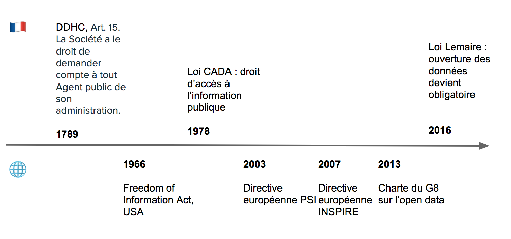

---

## 07 Décembre 2007 : la rencontre de Sebastopol 

.pull-left[
👥 **Quoi ?** Une rencontre de l'Open Governement Group à Sebastopol (Californie), siège des éditions O'Reilly

🎯 **Pourquoi ?** : Influencer le futur président des Etats Unis pour faire avancer l'open data

📜 **Comment ?** En adoptant une déclaration définissant les grands principes de l'Open Government Data 

]
.pull-right[
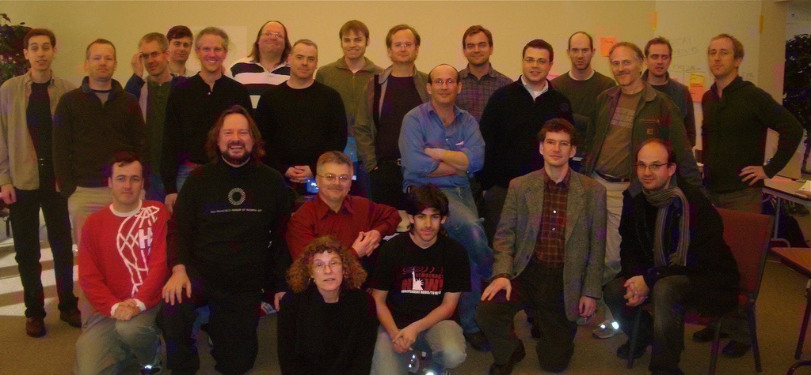
]

---
class:middle, center
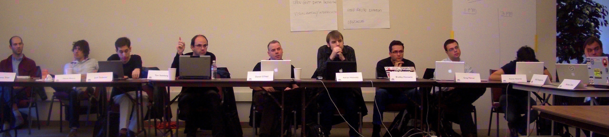
# Revue des principes

---
class: middle, center

# 1. Des données complètes
### Toutes les données publiques doivent être rendues disponibles dans les limites légales liées à la vie privée ou la sécurité
---
class: middle, center

# PAR DEFAUT

#### L'open data par défaut, signifie que, sauf exception (données personnelles, intérêt national), toutes les données peuvent être ouvertes. A minima toutes les données déjà existantes au format numérique

---
class: middle, center

# 2. Des données primaires
###  Les données ouvertes sont telles que collectées à la source, non-agrégées avec le plus haut niveau de granularité

---
class: middle, center

# 3. Des données fraiches (*timely*)
### Les données doivent être disponibles dès qu'elles sont produites

---
class: middle, center

# 4. Des données accessibles 
### Les données doivent être utilisables par le plus grand nombre d’usagers potentiels

---
class: middle, center

# 5. Des données exploitables par les machines 
###  Les données peuvent être traitées automatiquement par les machines

---
class: middle, center

# 6.Des données non discriminatoires 
### Elles peuvent être utilisées par tous sans réclamer un enregistrement préalable
---
class: middle, center

# 7. Des données dans un format ouvert
### Ce format ne doit pas être la propriété d'une organisation en particulier (.xls) et doit être gouvernée par ses usagers

---
class: middle, center

# 8. Des données dans une licence ouverte
### Idéalement dans le domaine public sinon dans une licence conforme à l'[Open Definition](www.opendefinition.org) : Licence Ouverte (CC-BY) ou ODBL (CC-BY-SA)

---
## Open data : pour aller plus loin

Retrouvez [les 8 principes de l'ouverture des données publiques ](https://public.resource.org/8_principles.html) qui ont été adoptés au cours du week-end du 7-8 décembre 2007 à Sébastopol, puis soumis à commentaires

.center[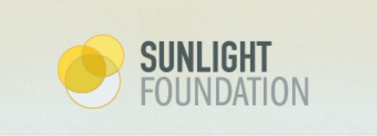]

Cette liste a ensuite été mise à jour et complétée en 2010 ([10 principes](https://sunlightfoundation.com/policy/documents/ten-open-data-principles/)) par la Sunlight Foundation.
En 2013, cette dernière a rédigé des instructions et recommandations pour appliquer l'open data (["Open Data guidelines"](http://sunlightf.wpengine.com/wp-content/uploads/2016/09/OpenDataGuidelines_v3.pdf)) sur la base des 10 principes (**lecture obligatoire**)

---
## Open data : pour aller plus loin

Ecoutez les explications de Larry Lessig sur les raisons de cette conférence :

.center[[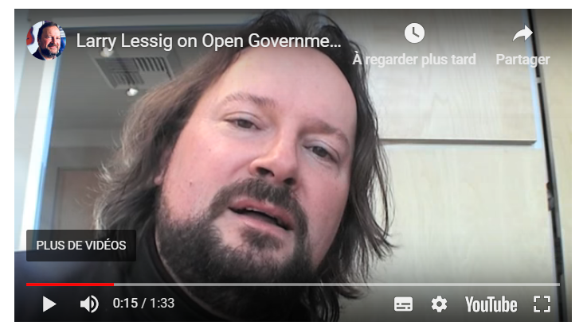](https://youtu.be/AmlzW980i5A)]

---
class:inverse, middle, center
# 2. L'open data dans la pratique

---

## Défi 1 : la découvrabilité des données

> La découvrabilité des données est un défi majeur. Nous avons des portails de données et des registres, mais les agences gouvernementales appartenant à un gouvernement national publient toujours des données de différentes manières et à différents endroits. (…) 
**La découverte des données est une condition préalable pour que les données ouvertes atteignent leur potentiel et la plupart des données sont actuellement difficiles à trouver.**

.center[] 

.footnote[https://index.okfn.org/insights/]

---

## Défi 1 : la découvrabilité des données

Pour faciliter la découvrabilité des données, **il est indispensable de renseigner correctement les métadonnées**, i.e les données descriptives des données ouvertes. Notamment : 
+ Nom du producteur de données
+ Date de publication
+ Fréquence d'actualisation
+ Dernière date de mise à jour
+ Description des données
+ Détails des variables
+ Thématique / tags
+ Couverture (années, zone géographique concernée)

(*liste non exhaustive*)

---

## Défi 1 : la découvrabilité des données

L'équipe Datactivist a réalisé au cours de l'été 2017 un recensement des données ouvertures par 15 grandes villes françaises (Paris, Lyon, Lille, Rennes...). Plus de 400 jeux de données ouvertes ont été recensés, mais les identifier n'a pas toujours été simple...

.center[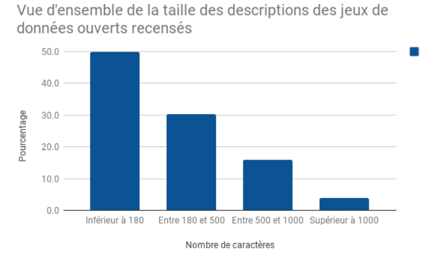] 

.footnote[Lire l'article Medium [Qui a ouvert quoi ? le recensement des données des villes est maintenant ouvert](https://medium.com/datactivist/qui-a-ouvert-quoi-le-recensement-des-donn%C3%A9es-des-villes-est-maintenant-ouvert-b7f697135c1f) (**lecture obligatoire**)] 

---

## Défi 1 : la découvrabilité des données

Ainsi,
> **La moitié des descriptions des jeux de données fait moins de 180 caractères** et
4% des jeux de données ont une description supérieure à 1000 caractères soit moins d’une demi-page

Au-delà des descriptions souvent très lacunaires, un autre enjeu est d'**expliciter le nom des variables**. Celles-ci peuvent parfois contenir des acronymes, qui sont compréhensibles pour les agents publics qui les traitent au quotidien, mais peu lisibles pour le grand public. Il n'est pas rare de trouver des variables comme "**acces_pmr**" qui signifie "est-ce que le site est accessible aux personnes à mobilité réduite" et sans avoir le détail dans les métadonnées associées.

Dans l'exemple ci-après, [l'enquête Etic du Ministère de l'éducation nationale](https://data.education.gouv.fr/explore/dataset/fr-en-etic_1d/table/), plusieurs colonnes ont des intitulés difficilement compréhensibles tels que "SiEquipementInf" ou "Maint_PersEducHEcole" mais celles-ci sont décrites dans les métadonnées du jeu de données

---

## Défi 1 : la découvrabilité des données

.center[[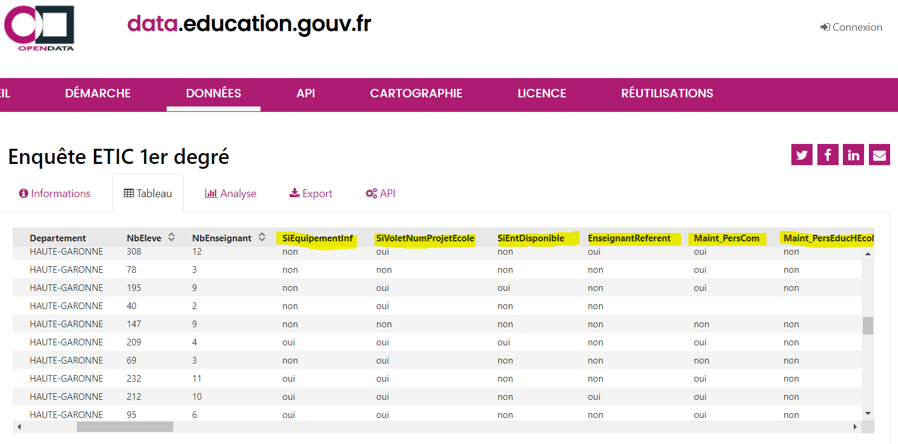](https://data.education.gouv.fr/explore/dataset/fr-en-etic_1d/table/)]

---

## Défi 1 : la découvrabilité des données

.center[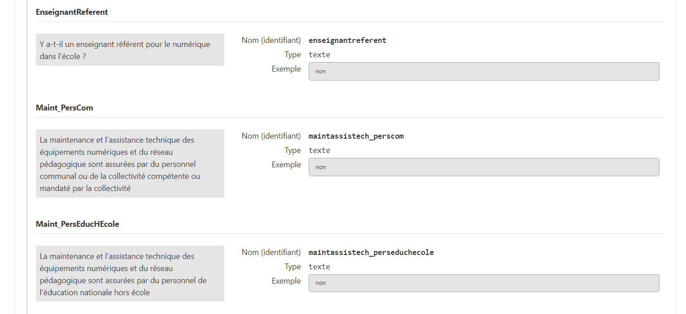]

---

## Défi 2 : le problème de la qualité

>**Les données gouvernementales sont généralement incomplètes, obsolètes, de mauvaise qualité et fragmentées.** Dans la plupart des cas, les catalogues de données ouverts ou les portails sont alimentés manuellement à la suite d'approches informelles de gestion des données. **Les procédures, les délais et les responsabilités sont souvent peu clairs** parmi les institutions gouvernementales chargées de ce travail.

.center[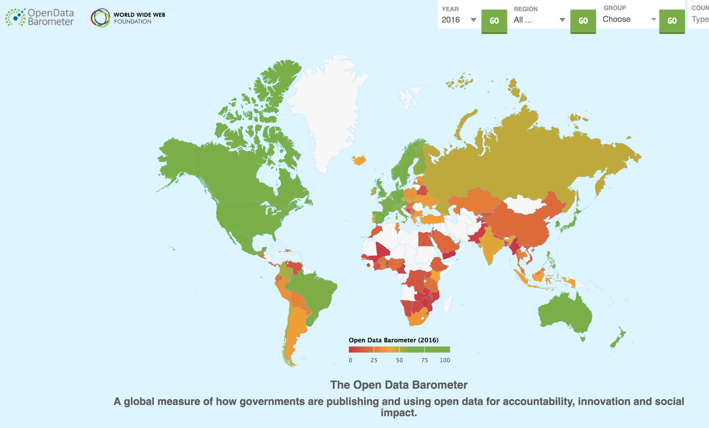] 

.footnote[http://opendatabarometer.org/4thedition/report/]

---

## Défi 2 : le problème de la qualité

Des données parfois très très agrégées...

.center[]

---
## Défi 2 : le problème de la qualité

Ou très difficilement exploitables...

.center[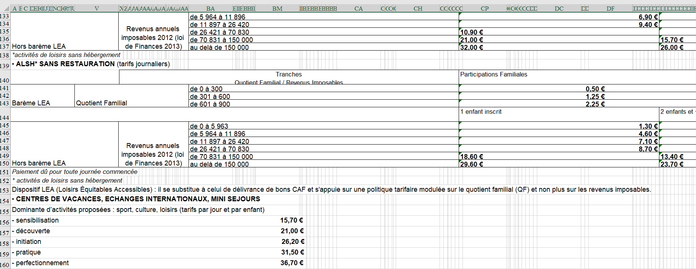] 

.footnote[[Source](https://medium.com/datactivist/qui-a-ouvert-quoi-le-recensement-des-donn%C3%A9es-des-villes-est-maintenant-ouvert-b7f697135c1f)]

---
## Défi 2 : le problème de la qualité

Ou très difficilement exploitables...

.center[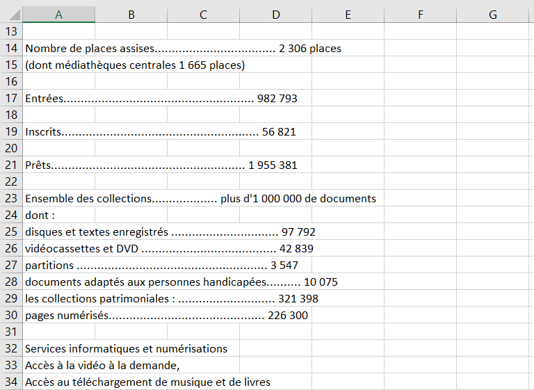] 

.footnote[[Source](https://medium.com/datactivist/qui-a-ouvert-quoi-le-recensement-des-donn%C3%A9es-des-villes-est-maintenant-ouvert-b7f697135c1f)]

---
## Data.gouv.fr ?

Data.gouv est la plateforme nationale ouverte des données publiques françaises.
Elle a été conçue et inaugurée en 2011, par la mission Etalab, puis refondue en 2013.

.center[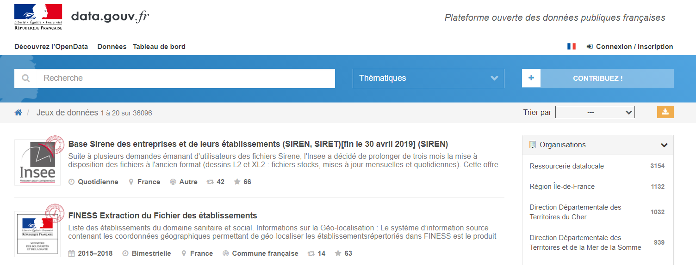] 

On y trouve des milliers de jeux de données, provenant principalement de producteurs publics (Ministère de l'intérieur, Agence française de développement, Insee, Ville de Paris, Région Bretagne, CNIL...) mais aussi de producteurs tiers (OpenStreetMap, OpenFoodFacts...)

---
## Au-delà de data.gouv.fr

Data.gouv.fr est la plateforme **nationale** d'open data mais ce n'est pas la seule plateforme publique qui met à disposition des données ouvertes. Il existe :

+ Des plateformes open data gérées par les **collectivités territoriales**. Par exemple, [Paris Data](https://opendata.paris.fr/explore/?sort=modified), [la Région Occitanie](https://data.laregion.fr/pages/accueil/), [l'agglomération de Saint-Malo](https://data.stmalo-agglomeration.fr/page/accueil/)...

+ Des plateformes open data gérées par des **ministères**. Exemple : [data.education.gouv.fr](https://data.education.gouv.fr/pages/accueil/)

+ Des plateformes open data gérées par des **entreprises**. Exemple [DataNova](https://datanova.laposte.fr/page/accueil/) (La Poste)

+ Des jeux de données directement publiés sur le site des producteurs de données, sans plateforme dédiée. Exemple : Insee

---
## Exemple de données ouvertes: la base SIRENE

.center[.reduite2[]]

---
##Exemple de données ouvertes : les accidents de la route
.reduite[.center[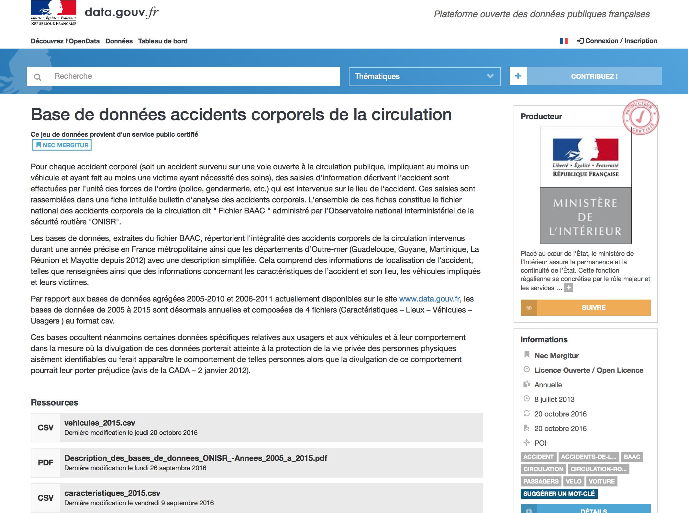]]

---

## Exemple de données ouvertes : les contrôles sanitaires

.reduite2[.center[]]
.footnote[[Résultats des contrôles officiels sanitaires : dispositif d'information « Alim’confiance »](https://www.data.gouv.fr/fr/datasets/resultats-des-controles-officiels-sanitaires-dispositif-dinformation-alimconfiance/)]

---

## Exemple de données ouvertes : les contrôles sanitaires

.reduite2[.center[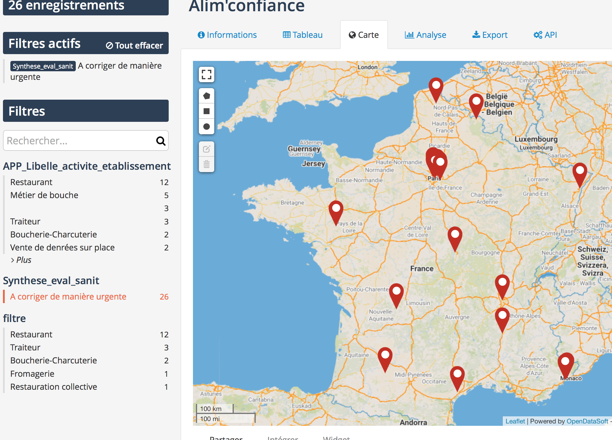]]
.footnote[[26 établissements au niveau d'hygiène à corriger de manière urgente ](https://dgal.opendatasoft.com/explore/embed/dataset/export_alimconfiance/map/?disjunctive.app_libelle_activite_etablissement&disjunctive.filtre&refine.synthese_eval_sanit=A%20corriger%20de%20mani%C3%A8re%20urgente&location=6,47.24195,5.00977&static=false&datasetcard=true)]

---
class: inverse, center, middle

## 3. Gouvernement ouvert

---
## Gouvernement Ouvert et Open Data

Rappel du Grain 1 : l'open data n'est pas qu'une pratique d'ouverture et de publication de données, c'est également un **mouvement et une philosophie relatif à un meilleur accès à  l'information publique**.

Plus largement, l'open data s'inscrit dans le mouvement du **gouvernement ouvert**, aussi appelé **OpenGov** en anglais. Celui-ci promeut :

+ La plus grande .red[**transparence de l'information**] (notamment à travers l'open data), pour permettre entre autre le suivi des politiques publiques

+ Une plus forte .red[**participation des citoyens**] dans l'élaboration des politiques publiques : à la fois en étant davantage consulté mais aussi en étant acteur dans la construction de celles-ci

+ Une plus forte .red[**collaboration**] au sein des administrations publiques (casser les silos) et à l'extérieur (travailler avec des acteurs associatifs, privés) pour concevoir et mettre en oeuvre les politiques publiques

---
## Gouvernement Ouvert

Ce schéma, réalisé par l'association [DémocratieOuverte](https://democratieouverte.org/), résume bien les différents enjeux autour du gouvernement ouvert :

.center[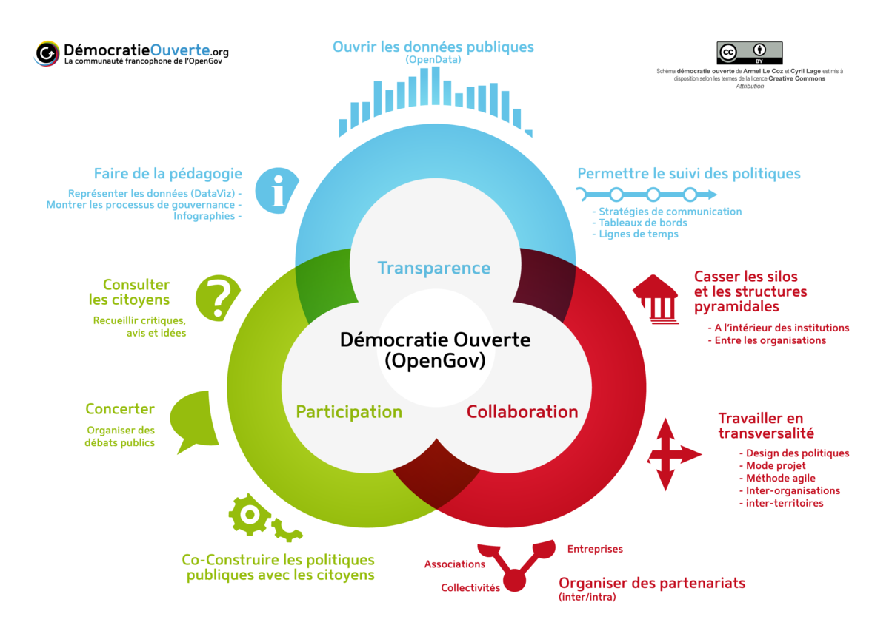] 

---
## OGP/PGO : Partenariat pour un Gouvernement Ouvert

.center[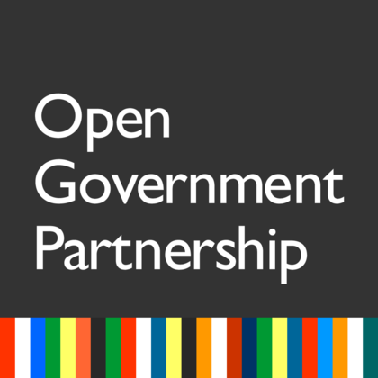] 

En septembre 2011, un partenariat multilatéral s'est créé afin de promouvoir le gouvernement ouvert et traduire ses valeurs en des actions gouvernementales concrètes : **le partenariat pour un gouvernement ouvert** (PGO), aussi appelé **Open Government Partnership** (OGP)

Initialement fondé par 8 pays (Brésil, Indonésie, Mexique, Norvège, Philippines, Afrique du Sud, Royaume-Uni et États-Unis), le PGO en compte désormais 70, dont la France

---
## OGP/PGO : Partenariat pour un Gouvernement Ouvert

Pour rejoindre le partenariat, il faut avoir été "coopté" par des acteurs de la société civile (ex: association type Amnesty International) qui viennent témoigner de la bonne volonté du gouvernement.

Une fois rejoint, les pays doivent rédiger, en concertation avec la société civile, un .red[**plan d'action**] de deux ans dans lequel plusieurs engagements sont inscrits. Ces engagements publics doivent avoir trait à la transparence de l'information, la participation citoyenne et la redevabilité (accountability) de l'action publique.
Par exemple : 
+ Développer un budget participatif représentant X % du budget d'une CT
+ Entamer une démarche open data qui permettent de libérer des données
+ Concerter les citoyens dans le cadre d'un projet de loi...

Ces engagements font ensuite **l'objet de vérifications et d'audit de la part de chercheurs indépendants** (IRM) tant sur la manière dont ils ont été rédigés/conçus que sur leur efficacité et niveau d'avancement réel

---
## OGP/PGO : Partenariat pour un Gouvernement Ouvert

.center[]

.footnote[[Lire le Plan d'action national pour la France 2018-2020](https://www.etalab.gouv.fr/wp-content/uploads/2018/04/PlanOGP-FR-2018-2020-VF-FR.pdf)]

---
class: inverse, center, middle

## Bibliographie

---
## Bibliographie

- Danièle Bourcier, Primavera De Filippi ["L'Open Data: universalité du principe et diversité des expériences?"](https://hal.archives-ouvertes.fr/hal-01026106/document) La semaine juridique - édition générale , LexisNexis, 2013, pp.1-9

- 

---
class: inverse, center, middle

## quiz section 6 : rdv sur votre espace e-campus !

---
class: inverse, center, middle

# Merci !

Contact : [timothee@datactivi.st](mailto:timothee@datactivi.st)