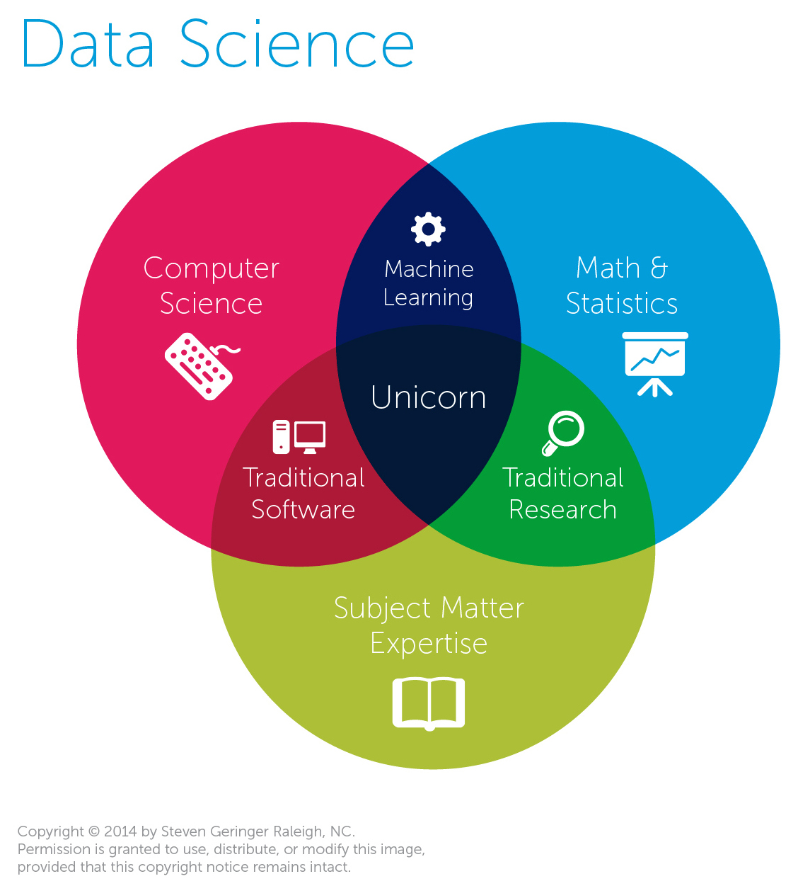
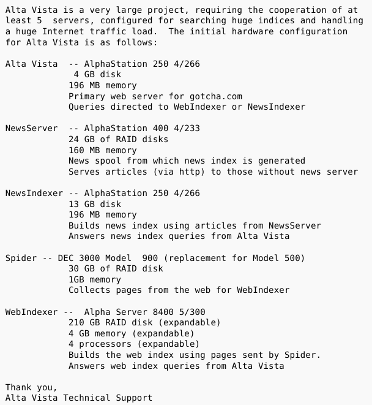
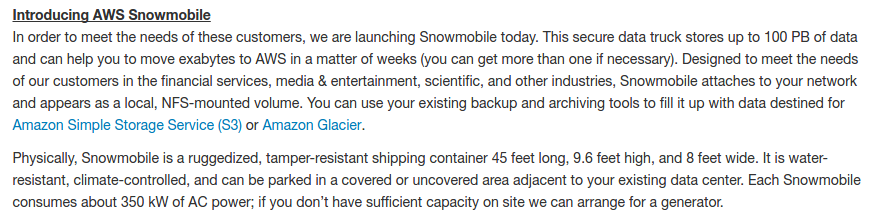
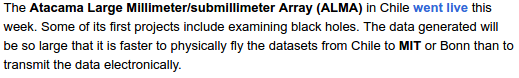
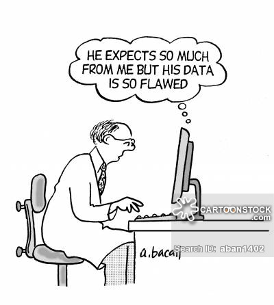

layout: true
  

`r paste0("
", params$event, " 

")`

---

class: center, middle

Ces slides en ligne : https://datactivist.coop/SPoSGL/sections/section9.html

Sources : https://github.com/datactivist/SPoSGL/

Les productions de Datactivist sont librement réutilisables selon les termes de la licence [Creative Commons 4.0 BY-SA](https://creativecommons.org/licenses/by-sa/4.0/legalcode.fr).

 
 

 

---
## Plan du cours

#### 1 - [Data science is the new statistics?](#4)

#### 2 - [Le rôle de l'informatique dans le développement de la data science](#13)

#### 3 - [Les étapes de l'analyse de données](#22)

---
class:center, middle, inverse

# 1 - Data science is the new statistics?

---
## Au commencement était la statistique

- la statistique est une relativement vieille science (développement au 18e siècle), pour aider les États (_Statistik_) à compter (les contribuables, les soldats potentiels...) mais aussi des entreprises privées (au départ, les assureurs => actuariat)

- la statistique repose sur une branche des mathématiques, les probabilités, qui émerge au milieu du 17e siècle, avec Pascal et Fermat notamment.

- c'est pourquoi la statistique est une discipline pratiquée par des mathématiciens, avec une importante formalisation mathématique.

- la pratique de la statistique recouvre une forte dimension théorique : on part de problèmes théoriques, et de données d'illustrations, plutôt que de données et de problèmes réels. 

---
## Au commencement était la statistique

<iframe src="https://giphy.com/embed/9ADoZQgs0tyww" width="100%" height="100%" style="position:absolute" frameBorder="0" class="giphy-embed" allowFullScreen></iframe>

<a href="https://giphy.com/gifs/obama-awesome-statistics-9ADoZQgs0tyww">via GIPHY</a>

---
## Au commencement était la statistique

> I keep saying the sexy job in the next ten years will be statisticians. People think I’m joking, but who would’ve guessed that computer engineers would’ve been the sexy job of the 1990s?

> *Je dis tout le temps que le métier sexy dans les dix ans à venir sera celui de statisticien. Les gens pensent que je plaisante, mais qui aurait pu deviner que les ingénieurs informatiques auraient été le métier sexy des années 1990 ?*

Hal Varian (économiste en chef, Google), _The McKinsey Quarterly_, January 2009

---
## Data science is the new statistics?

> I think data-scientist is a sexed up term for a statistician

> *Je pense que data scientist est un terme sexy pour dire statisticien*

[Nate Silver](http://www.statisticsviews.com/details/feature/5133141/Nate-Silver-What-I-need-from-statisticians.html)

---
## Data science is the new statistics?

[.reduite[.center[]]](http://www.prooffreader.com/2016/09/battle-of-data-science-venn-diagrams.html)

---
## Data science is the new statistics?

La data science, comparativement à la statistique "traditionnelle", est un métier de praticien, presque de bidouilleur : elle nécessite des compétences mathématiques et statistiques, certes, mais aussi une compétence "métier" (compréhension du domaine d'application) et une solide maîtrise de l'informatique. 

---
## Un essor lié à l'accroissement du volume de données disponibles

"Big data" : un label devenu omniprésent

- l'expression émerge vers 2007/2008 (même si on en trouve des occurrences anciennes)

- se définit par les trois V (selon la société Gartner) : "volume", "velocity", "variety" (+ "veracity" ?)

- Kitchin ajoute l'exhaustivité, la résolution, la *scalability*

---
## Un essor lié à l'accroissement du volume de données disponibles

- promesse d'efficience, de prédiction, de nouvelles formes de savoir
 
- données généralement fermées et privées

- techniquement, se traduit (notamment) par :
  + le NoSQL (le terme apparaît en 2009 ; il s'agit de bases de données non-structurées, par opposition aux bases de données SQL traditionnelles)
  + le recours à des architectures de calcul distribuées (par exemple clusters Hadoop) : on utilise plusieurs machines qui travaillent en parallèle pour analyser les données

---
class:inverse, center, middle

# 2 - Le rôle de l'informatique dans le développement de la data science

---
## Le rôle de l'informatique

- statistique classique : les problèmes doivent pouvoir être résolus de manière analytique, sans puissance de calcul particulière (d'où le succès du fréquentisme)

- le développement de la puissance de calcul permet de résoudre des problèmes statistiques par la simulation ([MCMC](https://fr.wikipedia.org/wiki/M%C3%A9thode_de_Monte-Carlo_par_cha%C3%AEnes_de_Markov)) : on n'a pas besoin de connaître la solution mathématique, il "suffit" de faire de nombreuses simulations aléatoires.

---
## Développement de la puissance de calcul

[.reduite[.center[]]](http://visual.ly/infographic-about-computers)

---
## Développement de la capacité de stockage

1996... 
[.reduite[.center[]]](https://twitter.com/alicemazzy/status/655306196128280576?ref_src=twsrc%5Etfw)

---
## Développement de la capacité de stockage
2016...

[.reduite[.center[]]](https://aws.amazon.com/blogs/aws/aws-snowmobile-move-exabytes-of-data-to-the-cloud-in-weeks/)

---
## Développement de la capacité de stockage

2016... 

.reduite[.center[]]

---
## Développement de la capacité de stockage

[.reduite[.center[]]](https://aws.amazon.com/blogs/aws/aws-snowmobile-move-exabytes-of-data-to-the-cloud-in-weeks/)

---
## La simulation, méthode reine d'estimation statistique 

L'intuition est assez ancienne, et contemporaine de l'apparition des premiers ordinateurs : lorsqu'on ne sait pas résoudre de manière algébrique un problème statistique, il suffit de faire des tirages au sort (comme au casino... d'où la référence à Monte Carlo !) pour connaître les propriétés d'une distribution quelconque. 

La référence séminale porte sur les Monte Carlo Markov Chain (MCMC) : papier de [Metropolis et Ulam (1949)](http://hedibert.org/wp-content/uploads/2013/12/1949MetropolisUlam.pdf)

https://chi-feng.github.io/mcmc-demo/app.html#RandomWalkMH,banana

---
## Pour résumer

Autrefois, on travaillait sur :

- de "petits" jeux de données (aussi bien en termes de nombre de lignes que de colonnes)

- avec des valeurs numériques ou transformées en nombres

- des modèles simples, voire simplistes, pour pouvoir facilement être estimés

Aujourd'hui, on travaille avec :

- des données parfois massives

- qui peuvent porter sur des nombres, mais aussi du texte, des images, des vidéos...

- et des modèles aussi complexes qu'on veut, qui peuvent être estimés grâce à des méthodes de simulation dans un contexte de disponibilité massive de la puissance de calcul. 

---
class: inverse, center, middle

## 3 - Les étapes de l'analyse des données

### Le data pipeline

---

Formalisé par la [School of data](https://schoolofdata.org/methodology/), il vise à modéliser les différentes étapes d'un projet d'analyse de donnée (se lit de haut en bas).

.reduite[.center[]]

---
## Le data pipeline

Il a également été formalisé, de manière légèrement différente, par Hadley Wickham (Chief Scientist Officer chez Rstudio) dans un contexte de data 

Il est intéressant de noter que cette version met en évidence la dimension itérative : on essaie, on corrige, on recommence...jusqu'à ce que le résultat soit stabilisé et donc communicable.

[.reduite[.center[]]](https://r4ds.had.co.nz/introduction.html)

---
## Définir les données dont on a besoin

.center[]

Cette étape est essentielle. Il s'agit de traduire une problématique concrète, en identifiant quelles données permettraient de la résoudre. Idéalement, c'est elle qui détermine les données mobilisées... mais parfois, on n'a pas le choix et on doit être opportuniste. 

---
## Trouver les données

.center[]

Une fois les données qu'on recherche identifiées, encore faut-il effectivement les trouver !
À l'avenir, assistera-t-on au développement d'un nouveau métier de "conciergerie de données" ?

Où chercher ?
- portails open data
- dépôts divers (internes aux organisations ou publics)
- data brokers
- s'adresser au chief data officer
- etc.

---
## Acquérir les données

.center[]

Il s'agit d'importer les données dans son outil d'analyse (Excel, logiciel spécialisé, langage de programmation...).

Des outils dédiés, souvent qualifiés d'ETL (extract / transform / load), existent (ex : Talend).

???

Connecteurs
ETL : ex Talend, Logstash

---
## Vérifier les données

.center[]

La qualité des données est-elle correcte ? Les données sont-elles à jour ? Bien documentées ? Exhaustives ? 

Il est important de pratiquer un "sanity check" : vérifier sur un échantillon de données qu'elles n'ont pas l'air aberrantes par rapport à ce qu'on sait déjà.

???

Importance d'un sanity check

---
## Vérifier les données

.center[]

---
## Nettoyer les données

.center[]

Les données sont rarement dans la forme dont on a besoin pour pouvoir les analyser... Il faut donc les nettoyer, les mettre en forme. 

On peut pour se faire par exemple s'appuyer sur le paradigme du [*tidy data*](https://r4ds.had.co.nz/tidy-data.html) (données "bien rangées") : une ligne par observation, une colonne par variable, une valeur par case.

---
## Analyser les données

.center[]

C'est la partie à laquelle on pense spontanément quand on parle de *data science*, qui fait fantasmer les scénaristes et les professionnels du marketing... mais qui représente environ 20 % du temps consacré à un projet de *data science*. 

C'est à cette phase que se fait la modélisation, sur laquelle nous revenons dans la dernière section. 

---
## Communiquer les résultats

.center[]

L'analyse une fois stabilisée, il faut la communiquer à son audience (public, chercheurs, décideur...). De multiples formes sont possibles, on parlera parfois de *data science product* :

- rapport
- [recherche reproductible](https://r4ds.had.co.nz/r-markdown.html)
- datavisualisation
- dashboard
- [application interactive](http://shiny.rstudio.com/)
- etc.

---

class: inverse, center, middle

# Ressource complémentaire

## [Introduction à la data visualisation](https://datactivist.coop/odl_paca)

---
class: inverse, center, middle

## Quiz section 9 : rdv sur le campus numérique !

---
class: inverse, center, middle

# Merci !

Contact : [clement@datactivist.coop](mailto:clement@datactivist.coop)